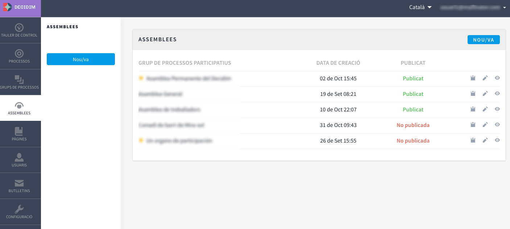
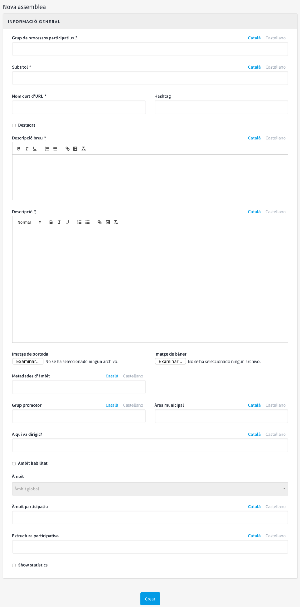
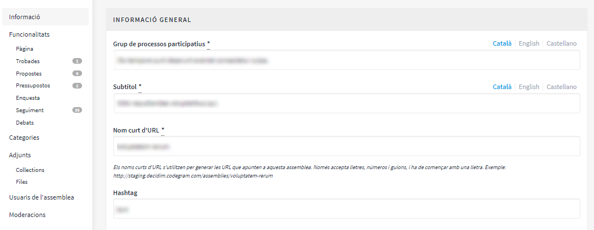
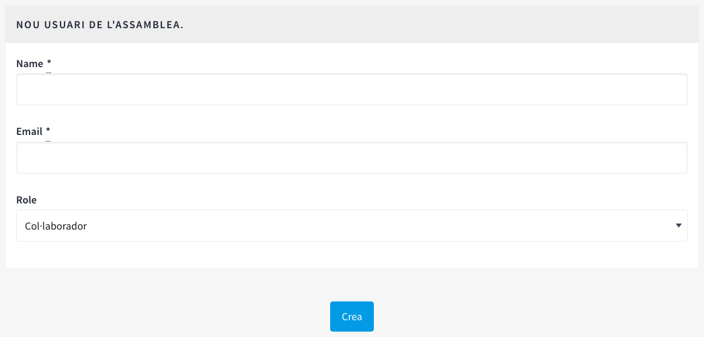

[[h.36ei31r]]
== Assemblees

Per a configurar els òrgans com per exemple els Consells municipals o les Assemblees de ciutat,  clicar ASSEMBLEES en el menú de l’esquerra del TAULER DE CONTROL (Figura 69).

Figura 69 - Assemblees

A continuació clicar NOU/VA. S’obre la finestra NOVA ASSEMBLEA (Figura 70), on cal escriure la Informació general sobre l’assemblea. Vegeu 2.5.1 (Informació processos participatius) per a omplir la informació que cal posar-hi.

Des del llistat de les assembles, clicant les icones que corresponen a cadascuna de les assemblees, es pot duplicar l‘assemblea, configurar-la i previsualitzar com quedarà una vegada estigui publicada.

Un cop creats els òrgans/ assemblees, es poden afegir les funcionalitats/ components com les trobades, els documents, les pàgines estàtiques, etc. Per a fer-ho cal seguir els mateixos passos que quan s’afegeixen les funcionalitats/ components als processos participatius (veure 2.5 Processos).

Anar a ASSEMBLEES on, hi ha el llistat de les assembles (Figura 69), i clicar sobre el nom de l’òrgan que es vol configurar. S’obre la finestra INFORMACIÓ GENERAL, a l’esquerra de la qual es troba el submenú de l’òrgan i a través del qual es pot realitzar la configuració.

Les opcions disponibles a través del submenú assemblees són: Informació, Funcionalitats/ Components, Categories, Adjunts, Usuaris de l'assemblea i Moderacions (Figura 71). Per a configurar les diferents opcions, vegeu 2.5 (Processos).

Figura 70 - Nova assemblea

Figura 71 - Submenú Assemblees

Igual que amb els processos, es poden configurar diferents tipus de rol de les persones usuàries. Per a donar d’alta les persones usuàries de l’assemblea, clicar  Usuaris de l'assemblea en el submenú de l’assemblea, i clicar NOU/VA.

Figura 72 - Nou Usuari de l'assemblea

Cal omplir els camps: Nom, Correu electrònic i Rol (seleccionar en el desplegable Administrador, Col·laborador o Moderador). Tot seguit clicar Crear (Figura 72)
