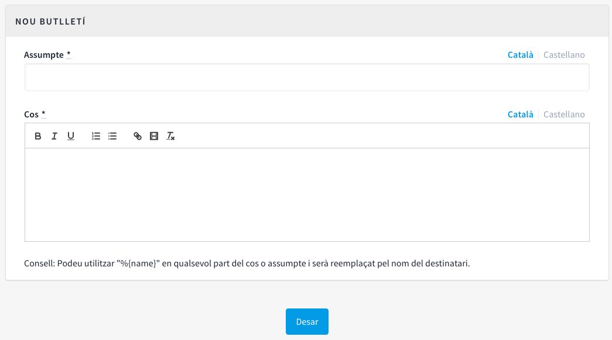

[[h.8omhnwxw9w0d]]
[[h.2ce457m]]
== Butlletins

Els butlletins són correus electrònics amb informació sobre la plataforma (novetats, processos,...) que s’envien a totes les persones que s’han registrat a la plataforma i que han marcat la casella per rebre informació rellevant sobre els processos que hi ha a la plataforma.

Per a crear un butlletí, clicar **BUTLLETINS** en el menú de l’esquerra del **TAULER DE CONTROL**. Tot seguit, clicar **Nou/va** en el submenú de l’esquerra. S’obre la finestra **NOU BUTLLETÍ** (Figura 77), en la qual s’han d’omplir els camps **Assumpte** (Títol del butlletí) i **Cos** (text), ambdós en Català i Castellà. Per finalitzar clicar **Desar** a la part inferior de la finestra.

[#Nou butlletí.fig]
._Nou butlletí_.

Es pot utilitzar "%\{name}" en qualsevol part del cos o assumpte i serà reemplaçat pel nom del destinatari.
