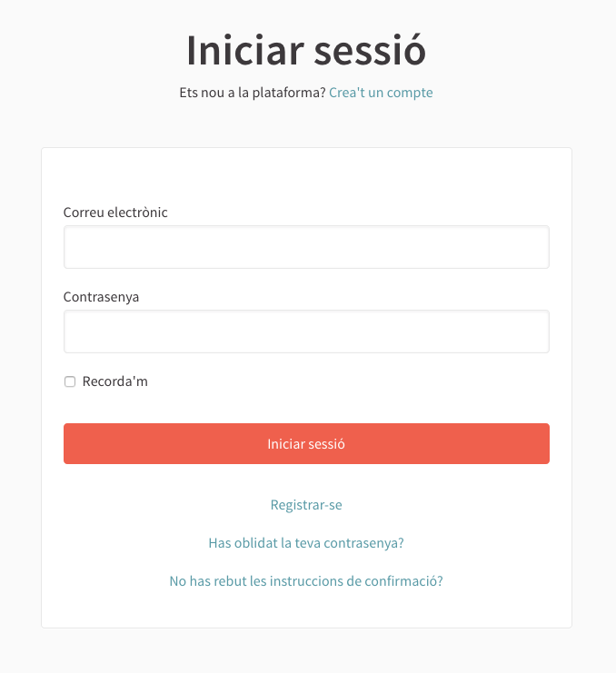

[[h.3whwml4]]
== Com accedir al menú administració

En primer lloc, cal iniciar sessió. Anar a la part superior dreta de la pàgina web del Decidim del municipi (Figura 2) i clicar **Entra**. Només les persones que tenen configurats els permisos d’administrador poden accedir al Tauler d’administració.

[#Pàgina principal Demo Decidim.fig]
._Pàgina principal Demo Decidim_.

S’obre la finestra **Iniciar sessió** (Figura 3), en la qual s’han d’omplir els camps **Correu electrònic** i **Contrassenya**, i clicar **Iniciar sessió**. Cal que abans la persona s’hagi registrat. Alternativament es pot iniciar sessió a través dels comptes de Twitter, Facebook o Google.

Per a registrar-se, es pot fer d’aquesta mateixa finestra (Figura 3), clicant a **Crea't un compte** (en la part superior de la pantalla) o **Registra’t** (en la part inferior), o bé des de la home clicant a **Registra’t**.

[#Entra.fig]
._Entra_.

Un cop dins de la finestra **Registra’t** (Figura 4), cal marcar si es tracta d’un **Individu** o d’una **Organització**/ **Col·lectiu**, escriure el **Nom** (nom públic que apareixerà en les publicacions, a efectes de garantir l'anonimat pot ser qualsevol nom), l’**Email**, la **Contrasenya**, i seleccionar si es vol **Rebre informació ** sobre activitat rellevant.

Per acabar, clicar **En registrar-te acceptes els termes i condicions d'ús** (disponibles clicant l’enllaç), i clicar **Registrar-se**.

[#Registra’t.fig]
._Registra’t_.

Finalitzat el registre, es pot acabar de configurar les opcions de l’usuari com la informació addicional o les notificacions. Clicar sobre el nom d’usuari (en aquest cas **usuari1**) en la part superior dreta de la web. S’obre un desplegable des del què es pot accedir a **El meu compte** (per), veure el **meu ferfil públic**, veure les **Notificacions**, veure les **Converses**, anar al **Tauler d’administració** o sortir clicant **Surt** (Figura 5).

[#Accedir al Tauler d’Administració.fig]
._Accedir al Tauler d’Administració_.

Clicar **El meu compte** per acabar de configurar el compte: afegir un avatar/ imatge , modificar el nom o e-mail o definir el nivell de notificacions que es volen rebre. S’obre la finestra El meu compte: Configuració d’usuari **Configuració d’usuari** (Figura 6).

[#El meu compte: Configuració d’usuari.fig]
._El meu compte: Configuració d’usuari_.

Per a establir el nivell de notificacions, clicar **Configuració de les notificacions** en el menú de l’esquerra d’aquesta pantalla, i seleccionar si es vol rebre un correu electrònic cada cop que es rebi una notificació i si es vol rebre informació sobre activitat rellevant (Figura 7).

[#Configuració de les notificacions.fig]
._Configuració de les notificacions_.

Per a accedir al menú d’administració, clicar sobre el nom a la part superior dreta de la web (en aquest, cas **usuari1**) i seleccionar **Tauler d’administració** en el desplegable. Recordar que per poder accedir al menú d’administració cal tenir configurats els permisos d’administrador.

S’obre el **TAULER DE CONTROL** (Figura 8), des d’on es pot (clicant les opcions que apareixen en el menú de l’esquerra) configurar la plataforma Decidim del municipi, les pàgines estàtiques, els Processos participatius i els grups de processos, les Assemblees o els Consells, les Iniciatives i els butlletins, i fer la gestió dels usuaris.

[#Tauler de Control.fig]
._Tauler de Control_.

