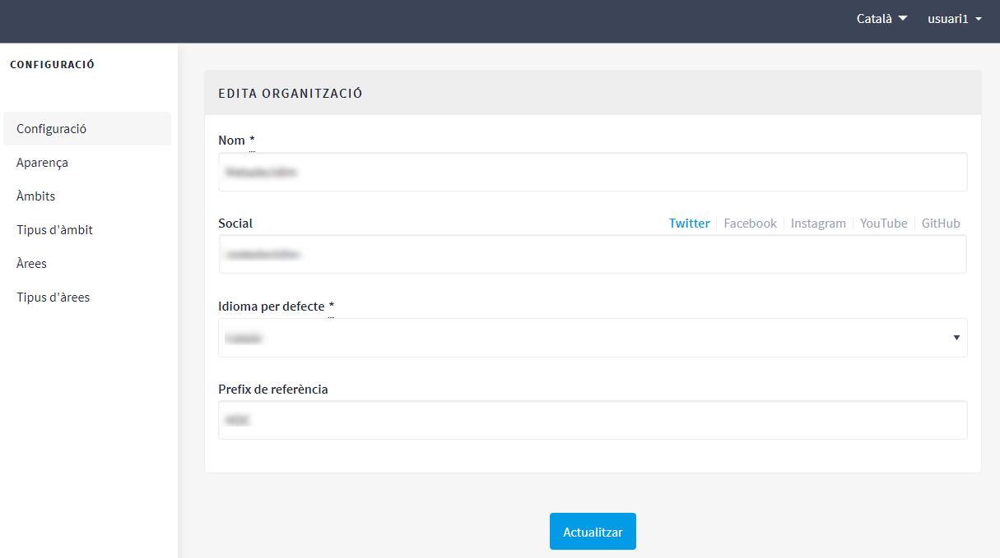
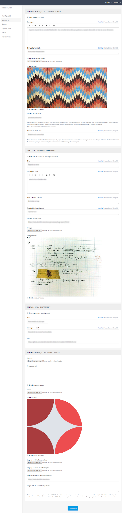
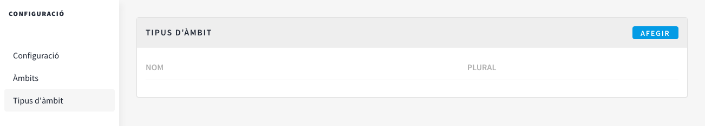
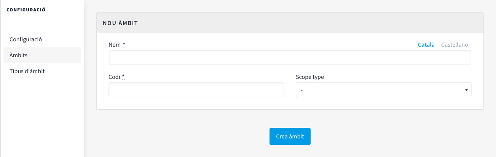
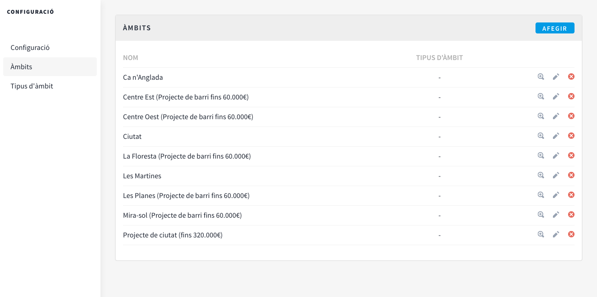

[[h.3o7alnk]]
== Configuració de la plataforma Decidim del municipi

Per configurar la plataforma Decidim del municipi, clicar **CONFIGURACIÓ** a la part inferior del panell d’administració (**TAULER DE CONTROL**). Apareix un formulari amb la informació que cal omplir i les imatges que es poden carregar (Figura 9).

[#Configuració de la plataforma Decidim.fig]
._Configuració de la plataforma Decidim_.

La plataforma és multi-idioma, tot i que la traducció no es realitza automàticament. Si s’ha decidit que la plataforma sigui en dues llengües, per exemple, català i castellà, s’hauran d’omplir els camps en ambdós idiomes. Per a cadascun dels camps de text, caldrà clicar “**CA**” quan s’escrigui en català i “**ES**” per al text en castellà.

Els camps que cal omplir són els següents:

Apartat **Configuració** (Figura 9):

* **Nom**: correspon al nom de la plataforma, en l’ exemple **Formació Decidim**.
* **Social**: Nom del perfil de les xarxes socials (Twitt**er, Facebook, Instagram, Youtube, Github). Només les que s’utilitzen.
* Idioma per defecte**: seleccionar l’idioma per defecte amb el qual s’obrirà la plataforma.
* **Prefix de referència**: identificador únic o acrònim del nom del municipi que apareixerà amb les propostes, en les cites presencials, els resultats, etc.

Apartat **Aparença** (Figura 10):

* Mostra Estadístiques: marcar si es vol mostrar estadístiques.
* Descripció: breu text d’introducció a continuació de la imatge principal.
* Text de benvinguda: eslogan (frase breu) que apareix sobre la imatge principal. En l’ex.: “Benvingut/da a la Formació Decidim!”.
* URL del botó d'acció: Pots sobreescriure a on enllaça el botó d'acció principal de la pàgina d'inici. Utilitza rutes parcials, no URLs completes aquí. Accepta lletres, números, guions i barres, i ha de començar amb una lletra. El botó d'acció principal es mostra a la pàgina d'inici entre el text de benvinguda i la descripció.
* Text del botó d'acció: Pots sobreescriure el text del botó d'acció principal a la pàgina d'inici per cada idioma disponible a la teva organització. Si no s'omple, s'utilitzarà el valor predeterminat. El botó d'acció principal es mostra a la pàgina d'inici entre el text de benvinguda i la descripció.
* Bàner de contingut ressaltat: pots clicar Mostra la pancarta de contingut ressaltat i omplir les següents dades: Títol, Descripció breu, Títol del botó d'acció, Subtítol del botó d'acció, URL del botó d'acció, Imatge, es veurà la imatge actual i podràs eliminar-la clicant Eliminar aquest arxiu.
* Edita bànner omnipresent: clica Mostra pancarta omnipresent i omple les següents dades: Títol, Descripció breu i URL.
* URL oficial de l'organització: adreça web institucional de la institució.
* Fragments de capçalera: utilitza aquest camp per afegir coses al head d'HTML. L'ús més habitual és integrar serveis de tercers que requereixen codi JavaScript o CSS addicional. A més, pots utilitzar-lo per afegir etiquetes meta addicionals a l'HTML. Tingues en compte que això només es mostrarà a les pàgines públiques, no a la secció d'administració.
* **Mostra Estadístiques**: marcar si es vol mostrar estadístiques.
* **Descripció**: breu text d’introducció a continuació de la imatge principal.
* **Text de benvinguda**: eslogan (frase breu) que apareix sobre la imatge principal. En l’ex.: “Benvingut/da a la Formació Decidim!”.
* **URL del botó d'acció**: Pots sobreescriure a on enllaça el botó d'acció principal de la pàgina d'inici. Utilitza rutes parcials, no URLs completes aquí. Accepta lletres, números, guions i barres, i ha de començar amb una lletra. El botó d'acció principal es mostra a la pàgina d'inici entre el text de benvinguda i la descripció.
* **Text del botó d'acció**: Pots sobreescriure el text del botó d'acció principal a la pàgina d'inici per cada idioma disponible a la teva organització. Si no s'omple, s'utilitzarà el valor predeterminat. El botó d'acció principal es mostra a la pàgina d'inici entre el text de benvinguda i la descripció.
* **Bàner de contingut ressaltat**: pots clicar **Mostra la pancarta de contingut ressaltat** i omplir les següents dades: **Títol, Descripció breu, Títol del botó d'acció, Subtítol del botó d'acció, URL del botó d'acció, Imatge**, es veurà la imatge actual i podràs eliminar-la clicant ***Eliminar aquest arxiu**.
* **Edita bànner omnipresent**: clica **Mostra pancarta omnipresent** i omple les següents dades: **Títol, Descripció breu i URL**.
* **URL oficial de l'organització**: adreça web institucional de la institució.
* **Fragments de capçalera**: utilitza aquest camp per afegir coses al head d'HTML. L'ús més habitual és integrar serveis de tercers que requereixen codi JavaScript o CSS addicional. A més, pots utilitzar-lo per afegir etiquetes meta addicionals a l'HTML. Tingues en compte que això només es mostrarà a les pàgines públiques, no a la secció d'administració.

Pel que fa a les imatges, és recomana veure abans la disposició de les imatges en alguna de les plataformes Decidim. S’han de carregar les següents imatges:

* **Imatge de la pàgina d'inici**: fotografia/ imatge d**e la homepage, dimensions mínimes 2880px d’amplada x 1800px d’alçada.
* **Logotip**: imatge corporativa de la plataforma Decidim, dimensions mínimes 456px d’amplada x 148px d’alçada.
* **Icona: favicon o icona de pàgina que permet identificar la pàgina web, , dimensions mínimes 80px d’amplada x 74px d’alçada.
* **Logotip oficial de la capçalera**: correspon a l’isotip de l’ajuntament, sortirà a la part superior dreta de totes les pàgines de la plataforma, dimensions mínimes 271px d’amplada x 88px d’alçada.
* **Logotip oficial del peu de pàgina**: isotip de l’ajuntament, surt a la part inferior esquerra de totes les pàgines, dimensions 64px d’amplada x 64px de alçada.

Un cop fet, clicar **Actualitzar**.

[#Aparença de la plataforma Decidim.fig]
._Aparença de la plataforma Decidim_.

Per acabar de configurar la plataforma, cal especificar els àmbits, és a dir, les àrees territorials d’organització (districtes, barris, etc.) i/o sectorials a les quals es podran vincular els processos participatius. Els àmbits es poden classificar segons **tipus d’àmbit** si es considera oportú.

Per a configurar els tipus d’àmbit, en el submenú **CONFIGURACIÓ**, clicar **Tipus d’àmbit** i a continuació clicar **AFEGIR**. Omplir els camps **Nom** i **Plural** (en català i en castellà) i clicar **Crea Tipus d’Àmbit** (Figura 11).

[#Tipus d’Àmbit.fig]
._Tipus d’Àmbit_.

Per a configurar els àmbits, en el submenú **CONFIGURACIÓ** clicar **Àmbits**, i afegir els àmbits un per un clicant **AFEGIR**. Per a cadascun dels àmbits cal omplir els camps **Nom** i **Codi** (en català i en castellà), i seleccionar el tipus d’àmbit en el desplegable **Scope type**. A continuació clicar **Crea àmbit** (Figura 12).

[#Nou Àmbit.fig]
._Nou Àmbit_.

Un cop creats , apareix el llistat dels àmbits que han estat configurats (nom i tipus d’àmbit). Des d’aquest llistat, clicant les icones de la dreta, es pot **Veure, Editar** i **Eliminar** cadascun dels àmbits (Figura 13).

[#Àmbits.fig]
._Àmbits_.

