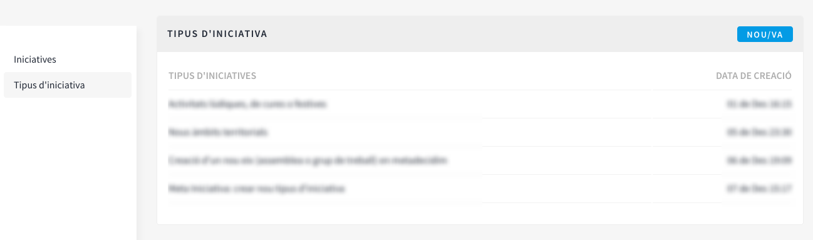
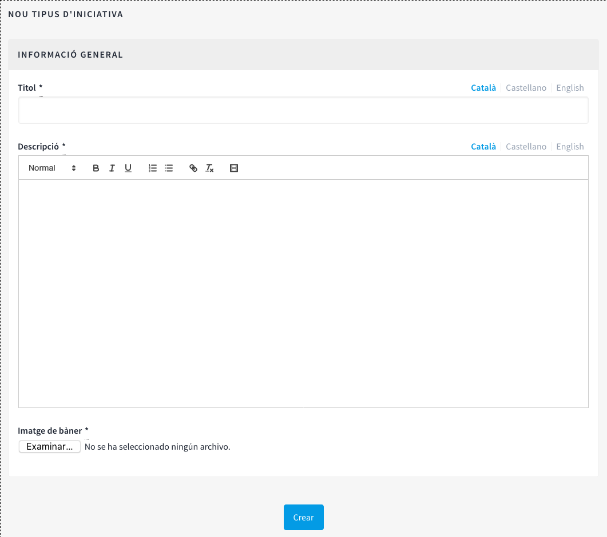
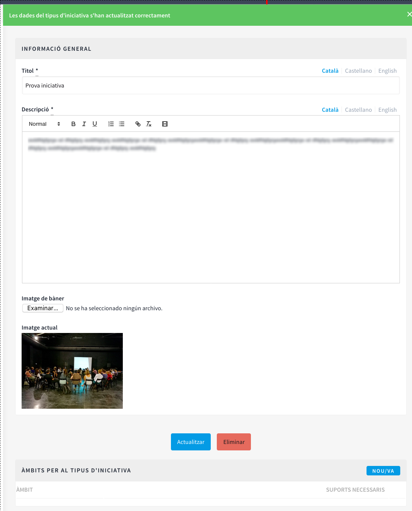
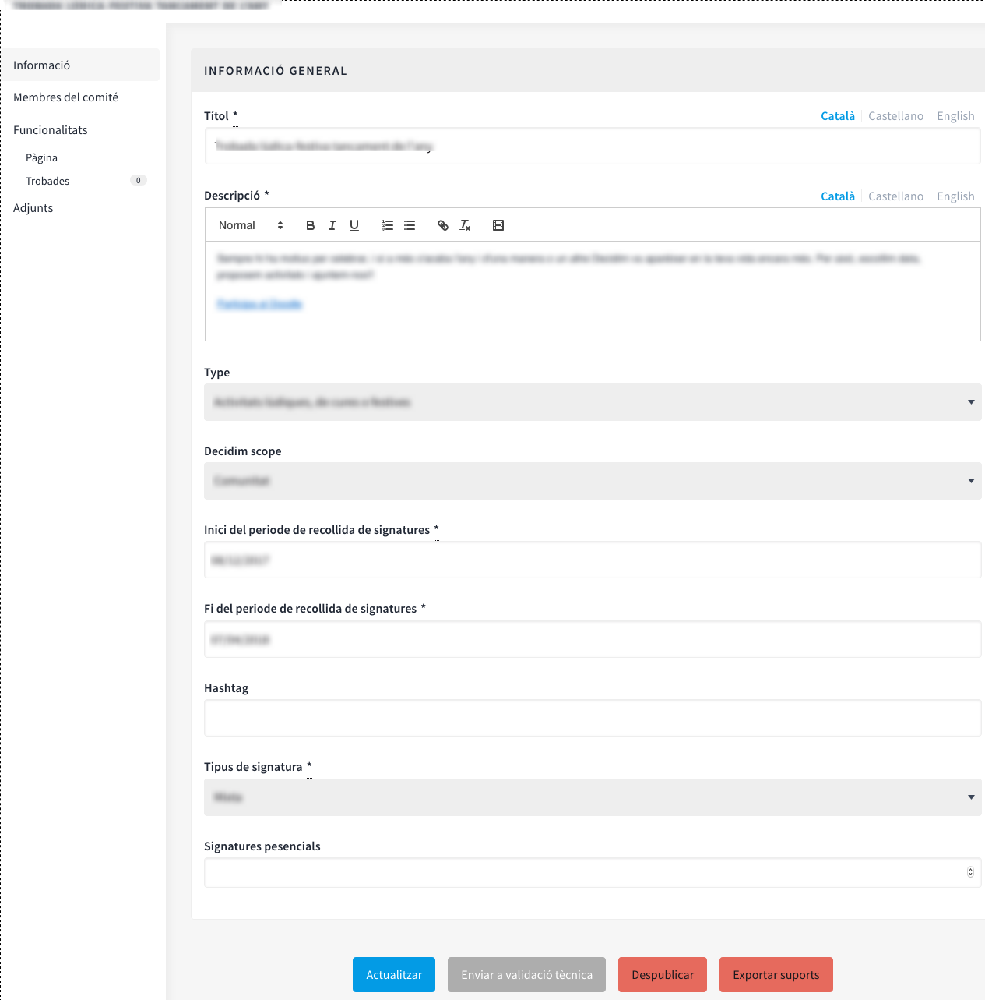

[[h.3jtnz0s]]
== Iniciatives

Les iniciatives (en el cas de les administracions públiques, ciutadanes o populars) es diferencien de la resta d'espais de participació perquè són instruments o mecanismes de participació promoguts per la ciutadania. És a dir, les iniciatives són mecanismes de democràcia semidirecta mitjançant els quals les ciutadanes poden promoure una determinada actuació d'interès comú per part de l'administració, a partir de la recollida d'un nombre de signatures específic.

En aquest cas, el que ha de fer l'administració és facilitar que es puguin promoure les iniciatives i oferir el suport tècnic i assessorament necessaris a les persones interessades. Per tant, el rol de l'administrador de la plataforma, és quelcom diferent de la resta dels espais de participació. En primer lloc, cal configurar les diferents modalitats d'iniciatives previstes per la normativa (reglament municipal), especificant el nombre de signatures necessàries per a la tramitació dels diferents tipus d'iniciativa ciutadana. És evident que una iniciativa que consisteix en la incorporació d'un o diversos punts a tractar en l'ordre del dia del Consell Municipal requereix menys signatures que una altra iniciativa dirigida a promoure la celebració d'una consulta ciutadana.

Per a configurar el tipus d’iniciatives, clicar INICIATIVES en el menú de l'esquerra del TAULER DE CONTROL, a continuació clicar Tipus d'iniciativa en el submenú d'Iniciatives i NOU/VA (Figura 73).

Figura 73 - Submenú Iniciatives

S’obre la finestra Nou tipus d'iniciativa (Figura 74), on cal escriure el Títol, la Descripció de la iniciativa i carregar una imatge. Per finalitzar clicar Crear.

Figura 74 - Nou tipus d'iniciativa

Tot seguit  s’obre una finestra amb la informació que s’acaba de crear sobre el tipus d’iniciativa, en la qual s’ha d’especificar el nombre de signatures que requereix en funció dels possibles àmbits (ciutat, barri/ districte). (Veure Figura 75 a baix de tot)

Figura 75 - Nombre de suports d’Iniciatives

En segon lloc, l'administrador haurà de fer el seguiment de les iniciatives creades per les persones usuàries i revisar que tota la informació presentada estigui correcte. En el submenú d'Iniciatives (Figura 73), clicar Iniciatives i clicar la iniciativa que correspongui. A l'esquerra sobre el submenú d'aquella iniciativa (Figura 76), des d'on es pot: configurar els Membres del comitè, les Trobades i crear una Pàgina i Adjunts. El procediment per a configurar aquestes funcionalitats/ components és idèntic a quan es fa en altres espais de participació com poden ser els processos participatius o les assemblees.

[[h.1d96cc0]]

Figura 76 - Submenú d’una iniciativa concreta

Per a fer les accions de seguiment de la iniciativa, clicar Informació en el submenú de la iniciativa. A baix de tot apareixen els botons: Actualitzar, Enviar a validació tècnica, Publicar (Despublicar, en el cas que ja hagi estat publicada), Descartar la iniciativa i Exportar suports (en .csv, visible quan la iniciativa ha estat publicada).

Per exemple, una iniciativa es pot descartar quan limita o restringeix els drets i llibertats fonamentals i, en el cas dels ajuntaments, quan no és refereix a matèries de competència municipal.
