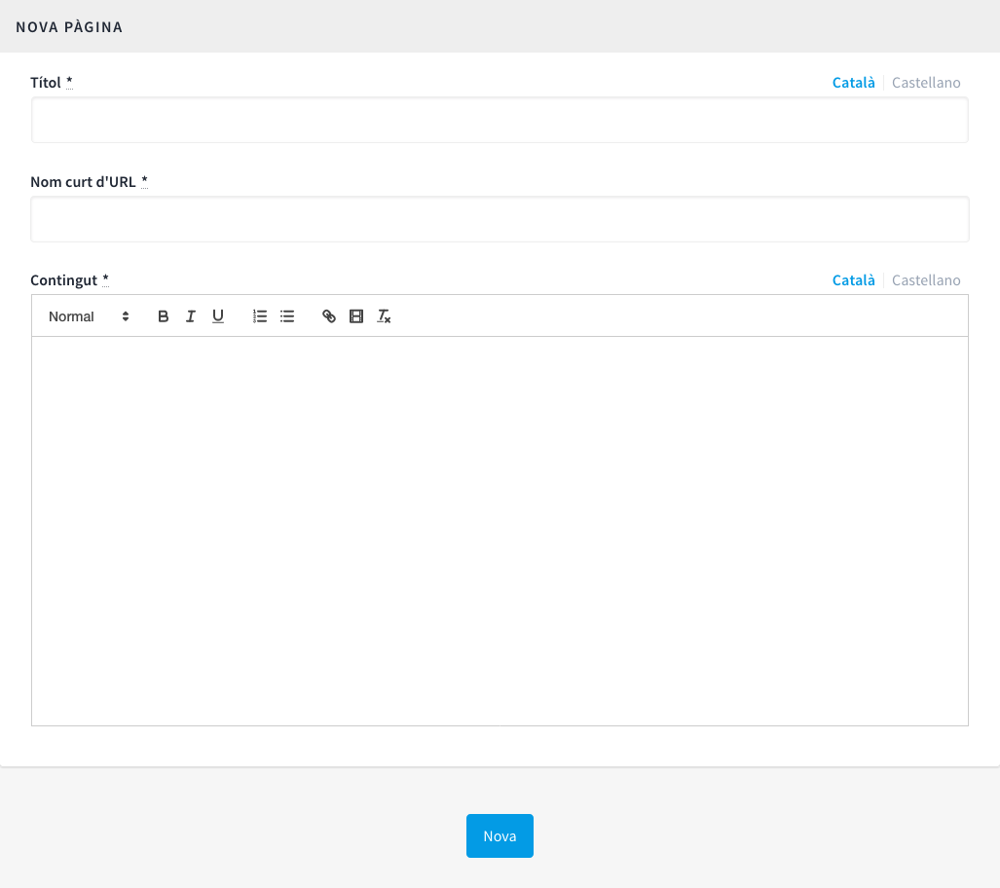

[[h.41mghml]]
== Pàgines

Fa referència a les pàgines estàtiques que contenen la informació general sobre la plataforma Decidim com les preguntes freqüents/ FAQ (Què és decidim? Com puc participar? Com creo i verifico el meu compte? Què són els processos participatius? etc.), els termes i les condicions d’ús (informacions legals i d’utilització) i els aspectes relacionats amb l’accessibilitat de la plataforma. Els usuaris o participants podran accedir a aquestes informacions des de la pestanya Més informació (al menú principal), i des del footer (a peu de pàgina).

Per a crear i editar les pàgines estàtiques, clicar PÀGINES en el menú del TAULER DE CONTROL. A continuació clicar Crea en el submenú PÀGINES o directament en la finestra que s’obre i on apareixerà el llistat de pàgines estàtiques un cop hagin estat creades (Figura 14).

 Figura 14 - Pàgines

Des d’aquest llistat, clicant les icones de la dreta, també es pot Visualitzar com quedaran les pàgines, Editar i Eliminar cadascuna d’elles.

Quan es configura una pàgina s’han d’omplir els camps (Figura 15): el Títol de la pàgina, el Contingut (el text a què fa referència la pàgina) i el Nom curt d'URL que identificarà la pàgina (per exemple, si la pàgina és sobre accessibilitat, “accessibility”: la paraula accessibility apareixerà al final de l’adreça web de la pàgina, https://decidim.municipi.cat/pages/accessibility). En acabar, clicar Nova.

Per a la redacció del contingut de les pàgines estàtiques, es poden veure i utilitzar lliurement els texts que hi ha a l’Annex I.

Figura 15 - Nova pàgina
