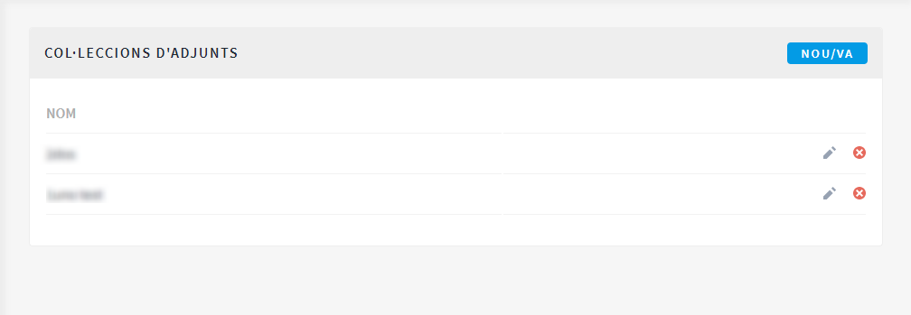
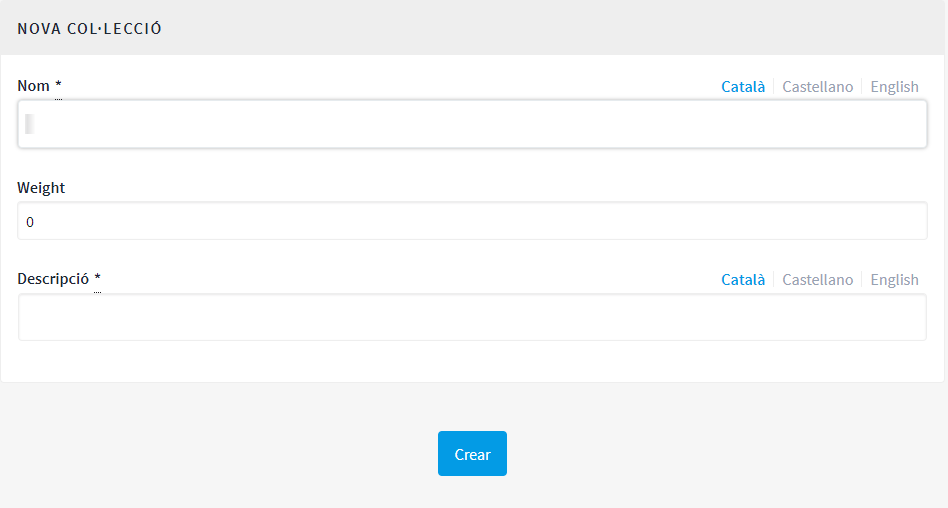

[[h.28h4qwu]]
== Processos

Per a configurar els processos participatius a la plataforma Decidim, clicar **PROCESSOS** en el **TAULER DE CONTROL**. Apareixerà un llistat amb els processos existents, si n’hi ha (Figura 21).

[#Processos participatius.fig]
._Processos participatius_.

Per a cadascun dels processos es mostra la data de creació, si està publicat o no, i es permet realitzar les següents accions, clicant les icones corresponents: duplicar el procés, **configurar** i previsualitzar com quedarà un cop publicat.

Es pot editar la informació sobre els processos clicant la icona Configurar o bé clicant sobre el nom del procés.

Per a crear un nou procés, clicar **Nou/va** en el submenú de **PROCESSOS PARTICIPATIUS** o en la part superior dreta de la finestra (Figura 21). S'obre la pantalla on cal escriure la Informació general sobre el procés (vegeu 5.1 Informació). La configuració del procés (fases, usuaris, funcionalitats/ components, etc.) es realitza a través del submenú del procés que apareix quan es clica sobre un procés en la pantalla del llistat de processos (Figura 22). Aquest submenú es troba a l'esquerra de la finestra del procés.

[#Submenú procés participatiu.fig]
._Submenú procés participatiu_.

[[h.1mrcu09]]
=== Informació

En primer lloc, cal omplir els camps amb la informació general sobre el procés. Clicar **PROCESSOS** en el **TAULER DE CONTROL** i clicar **Nou/va** en el submenú de **PROCESSOS PARTICIPATIUS** o en la part superior dreta de la finestra on hi ha el llistat de processos. S’obre la finestra **NOU PROCÉS PARTICIPATIU** (Figura 23).

[#Nou procés participatiu.fig]
._Nou procés participatiu_.
image::images/image47.png[nou procés.png]

Omplir els següents camps (recordar que en cas que la plataforma sigui en dos idiomes o més, cal omplir la informació en els diferents idiomes):

* **Títol**: posar el nom del procés participatiu.
* **Subtítol**:  escriure el nom del subtítol.
* **Nom curt d'URL**: mot que identifica la pàgina web on hi haurà la informació general sobre el procés. Per exemple, “nomdelprocés”, https://decidim.nomdelmunicipi.com/processes/**nomdelprocés**.
* **Hashtag**: etiqueta per a xarxes socials. La mateixa que s’utilitzarà a les campanyes de xarxes, a Twitter, Facebook, Instagram, etc. (una sola paraula).
* **Data d’inici**: seleccionar la data corresponent en el calendari que apareix quan es clica el quadre Data d’inici.
* **Data de finalització**: seleccionar la data corresponent en el calendari.
* **Destacat**: marcar si es vol destacar el procés en la home de la plataforma.
* **Descripció breu**: màxim 600 caràcters, explicant les accions de participació.
* **Descripció**: a partir de 1600 caràcters es mostra un “llegir més”.
* **Imatge de portada**: imatge associada al procés participatiu que surt a la pàgina general de processos (Figura 24) i a la homepage del Decidim, si s’ha marcat l’opció de **destacat** (Figura 25). Dimensions mínimes: 1015 px. d'amplada x 667 px. d'alçada.
* **Imatge de bàner**: imatge per a totes les pàgines del procés, es publica en la part superior de les pàgines, d’esquerra a dreta (Figura 26). Dimensions mínimes: 1200 px. d’amplada x 300 px. d’alçada.
* **Grup promotor**: gestor/a i responsable polític del procés participatiu, pot ser només l’Ajuntament, o un grup format per tècnics/ polítics de l’Ajuntament i associacions, empreses, ciutadans o altres entitats.
* **Àrea municipal**: àrees de l’Ajuntament involucrades en el procés participatiu.
* **Metadades d'àmbit**: no es mostrarà però és informació interna sobre a quin àmbit de la ciutat va dirigit el procés.
* **A qui va dirigit?**: persones a qui està destinat el procés participatiu.
* **Àmbit habilitat**: marcar si es vol identificar amb un àmbit d’actuació (municipal, districte 1, districte 2…).
* **Àmbit**: seleccionar l’àmbit corresponent en el desplegable. Prèviament s’hauran d’haver creat els àmbits footnote:[Sobre com crear els àmbits, veure el punt 2.].
* **Àmbit participatiu**: explicació del marge o límits de decisió que tindrà la ciutadania en aquest procés.
* **Estructura participativa**: grup promotor, comissió de seguiment, grup de treball, entitats que participaran en els diversos tallers i reunions del procés participatiu.
* **Grup de processos**: en el cas que es tracti d’un procés dintre d’un grup, seleccionar el grup de processos corresponent en el desplegable. Per exemple, un Pla d’Acció per Districte, dins un Pla d’Acció Municipal. Prèviament s’ha d’haver creat el grup. Si no forma part de cap grup, cal seleccionar **Cap** en el desplegable.
* **Mostra estadístiques**: marcar si es vol mostrar les estadístiques del procés (Número de trobades, propostes,...) a la pàgina prinicipal del procés .
* **Anunci**: En el cas de que vulguem que aparegui un paràgraf amb un anunci específic (per exemple si comença una nova fase en algun procés de participació).

[#Imatge de portada pàgina general de processos.fig]
._Imatge de portada pàgina general de processos_.

[#Imatge de portada homepage Decidim.fig]
._Imatge de portada homepage Decidim_.

[#Imatge de bàner.fig]
._Imatge de bàner_.

Per finalitzar, clicar **Crear**. Es pot veure com es visualitzarà tota aquesta informació clicant la icona **Previsualitzar** que correspon al procés.

Per acabar de configurar el procés, en la finestra on hi ha el llistat de processos, clicar sobre el nom del projecte. S'obre la finestra amb la Informació general sobre el procés i, a l'esquerra, apareix el submenú del procés a través del qual es poden configurar les fases del procés, les funcionalitats/ components, les categories, les usuàries, del procés, les moderacions i la informació adjunta.

[[h.206ipza]]
=== Fases del procés

Un procés participatiu es veurà reflectit en la plataforma Decidim en fases diferents, cadascuna amb una data d’inici i una de finalització predefinides al començament, amb l’objectiu que la ciutadania tingui clar en quin moment del procés es troba i com hi pot participar en cada moment.

A títol orientatiu, l’estructura estàndard d’un procés participatiu pot ser aquesta: Fase 1: presentació; Fase 2: diagnosi; Fase 3: creació de propostes i debat; Fase 4: priorització de propostes; Fase 5: selecció de resultats; Fase 6: avaluació; Fase 7: seguiment.

Per a configurar les fases del procés, clicar **Fases del procés** en el submenú del **PROCÉS PARTICIPATIU**, a continuació clicar **NOU/VA**. S’obre la finestra **NOVA FASE DE PROCÉS PARTICIPATIU** (Figura 27).

Per a cadascuna de les fases, cal escriure:

* **Títol**
* **Descripció**
* **Data d'inici i Data de finalització**

Un cop fet, clicar **Crear**.

[#Nova fase de procés participatiu.fig]
._Nova fase de procés participatiu_.

Per activar la fase en què es troba el procés, en el submenú del **PROCÉS PARTICIPATIU** clicar **Fases del procés**. S’obre la finestra on hi ha totes les fases del procés que han estat configurades i les icones que permeten d’**Activar, Editar** i **Eliminar** cadascuna d’elles. Clicar **Activar** en la fase que correspon (Figura 28).

[#Fases del procés.fig]
._Fases del procés_.

Les persones usuàries podran visualitzar les diferents fases i descripcions que han estat configurades, clicant **Veure les fases** (en la Imatge de bandera, a la dreta). La fase que es troba activa s'evidenciarà marcada en vermell (Figura 29).

[#Visualització fases del procés usuari participant.fig]
._Visualització fases del procés usuari participant_.

[[h.841ie2tkqox]]
[[h.3ygebqi]]
=== Categories

Les categories (i subcategories) serveixen per classificar continguts dins dels diferents espais/ processos de participació, també faciliten a les persones usuàries filtrar els continguts. Es defineixen per a cadascuna de les instàncies dels espais.  Per exemple, un procés de participació pot incloure diverses categories i subcategories i les trobades, enquestes, propostes o altres components del procés es poden classificar sota aquestes categories. Una categoria podria ser “Medi Ambient” i dues subcategories d’aquesta “Mobilitat” i “Qualitat de l’Aire”. En la Figura 30 es poden veure les categories i subcategories que es van utilitzar en el procés participatiu per a l’elaboració del Pla d’actuació municipal (PAM) de Barcelona de 2016.

[#Categories i subcategories al PAM de Barcelona de 2016.fig]
._Categories i subcategories al PAM de Barcelona de 2016_.
image::images/image54.png[Captura de pantalla 2017-07-11 a las 13.25.32.png]

És important tenir en compte que un cop definides les categories, no convé canviar-les perquè esdevenen l’índex que estructura els continguts dins d’un espai de participació. Per exemple, en el cas d’un procés participatiu per l’elecció de candidats, les categories podrien identificar llistes o tipus de candidatures. I en el cas que el procés fos per definir un Pla, les categories coincidirien amb l’índex d’aquest Pla.

També s’ha de tenir en compte que pel que fa a la classificació de continguts, Decidim també permet diferenciar i configurar àmbits i  etiquetes (o tags). A diferència de les categories, els àmbits (territorials o temàtics) són generals a tota la plataforma i es defineixen durant la configuració de la plataforma Decidim del municipi/ entitat footnote:[Sobre com crear els àmbits, veure punt 3.2.].Mentre les etiquetas (o tags)  les defineixen lliurement les persones participants i es poden aplicar a qualsevol instància o component. Des del panell d'administració també es poden crear etiquetes i niar-les.

Per a configurar les categories, clicar **Categories** al submenú del **PROCÉS PARTICIPATIU**. A continuació clicar **NOU/VA**. Per a cada una de les categories/ subcategories cal escriure (Figura 31): **Nom, Descripció**, i en el cas que es tracti d’una subcategoria, seleccionar la categoria a què correspon en el desplegable **Superior**. En acabar, clicar **Crea una categoria**.

[#Nova categoria.fig]
._Nova categoria_.

[[h.x2opelapxzom]]
[[h.3cqmetx]]
=== Adjunts: Col·leccions i Fitxers

Quan es posa en marxa un procés participatiu és important facilitar a la ciutadania el màxim d'informació possible sobre el mateix perquè puguin participar amb coneixement. Per això resulta útil poder afegir fitxers (Adjunts) amb la informació que es consideri rellevant.

Aquests documents es poden classificar/ agrupar en **Col·leccions**. Per exemple per un procés de remodelació d'una plaça, es podrien crear les col·leccions amb informació sobre els possibles usos, amb els plànols, amb informació econòmica, etc.

En primer lloc caldrà crear les col·leccions per poder col·locar els adjunts més endavant. Clicar **Col·leccions** en el submenú del PROCÉS PARTICIPATIU, s’obre la finestra **COL·LECCIONS D’ADJUNTS** (Figura 32).

[#Col·leccions d’adjunts.fig]
._Col·leccions d’adjunts_.

A continuació clicar **NOU/VA** per crear una nova col·lecció. Afegir **Nom, Pes** (Weight) i una Descripció. Per finalitzar, clicar Crear (Figura 33).

[#Nova Col·lecció.fig]
._Nova Col·lecció_.

Un cop s’han creat les col·leccions, es poden afegir els fitxers adjunts. Clicar **Fitxers** en el submenú del PROCÉS PARTICIPATIU i clicar **NOU/VA** per afegir els arxius.  S'obrirà la finestra NOU ARXIU ADJUNT (Figura 34). Escriure el  **Títol** i la **Descripció**, seleccionar el **Pes** (_Weight_) i la **Col·lecció** a la qual es vol associar el fitxer, i carregar el fitxer fent clic a **Arxiu**/ **Examinar**. Per finalitzar clicar **Crea arxiu adjunt**.

Els fitxers adjunts han de ser documents en formats oberts (.odt, .rtf, .pdf, etc.). El sistema no permet pujar textos en formats com .doc (sortiria un missatge sol·licitant el canvi de format perquè s’ha intentat pujar un text en format no lliure ni interoperable).

La persona usuària veurà aquests documents en la pantalla d’informació sobre el projecte (a la part de baix).

[#Nou arxiu adjunt.fig]
._Nou arxiu adjunt_.

[[h.4bvk7pj]]
=== Usuaris del procés

A més dels administradors generals de la plataforma, es poden donar permisos a altres persones perquè administrin un determinat procés, perquè hi col·laborin o perquè moderin quan hi hagi continguts que han estat denunciats.

Els **administradors** d’un procés poden configurar/ editar el procés, mentre els **col·laboradors** només poden veure el que hi ha al menú administrador del procés però no poden configurar/ editar.

Per a donar d’alta els administradors, col·laboradors i/o moderadors d’un procés, en el submenú del procés, anar a **Usuaris del procés** i clicar **NOU/VA**.

S’obre la pantalla **NOU USUARI DEL PROCÉS PARTICIPATIU** (Figura 35).

[#Nou usuari del procés participatiu.fig]
._Nou usuari del procés participatiu_.

Cal omplir els camps: **Nom**, **Correu electrònic** i **Rol** (seleccionar en el desplegable **Administrador**, **Col·laborador** o **Moderador**). Tot seguit clicar **Crear**.

[[h.1664s55]]
=== Moderacions

La funcionalitat/ component **Moderacions** permet moderar els debats per tal que aquests siguin democràtics i constructius. Fent ús d’aquesta funcionalitat/ component, els administradors, col·laboradors o el moderador d’un procés, poden amagar els continguts/ aportacions que han estat denunciats, quan es consideri pertinent la denúncia, o desfer la denúncia.

En general es consideren continguts denunciables els que  són ofensius, poden ser considerats  spam (posts publicitaris relacionats o no amb el tema de debat, enllaços a pàgines web malicioses, trolling, informació abusiva o no desitjada), o no estan relacionats amb el tema de discussió.

Per la gestió dels continguts denunciats, clicar **Moderacions** en el submenú del procés. Apareix una pantalla amb tots els comentaris que han estat denunciats pendents de moderació i la següent informació per a cadascun d’ells (Figura 36):

* **TIPUS**: si es tracta d’una proposta (***Proposal**) o d’un comentari (**Comment**).
* **URL del contingut reportat**: enllaç on es pot veure el contingut denunciat i les motivacions que han portat a denunciar-lo.
* **DENÚNCIES**: perquè ha estat denunciat. Pot ser: perquè: no està relacionat amb el tema de debat (“_does_not_belong”_), es tracta de spam o és comentari ofensiu (“_offensive_”).
* **RECOMPTE**: Nombre de vegades que ha estat denunciat per usuaris diferents.
* **ACCIONS**: clicant les icones de la dreta es pot **Desfer denúncia** o **Amagar**.

[#Moderacions.fig]
._Moderacions_.

Els continguts denunciats que ja han estat amagats es poden veure clicant **OCULTS** (en la part superior dreta del quadre de moderacions). Apareixerà el llistat dels continguts denunciats ocults i la següent informació per a cadascun d’ells (Figura 37): TIPUS, CONTINGUT, DENÚNCIES, RECOMPTE, DATA D’OCULTACIÓ (la data en que el contingut ha estat amagat), ACCIONS (en aquest cas, l’acció possible és **Desfer denúncia**).

Per tornar als continguts denunciats visibles, clicar **NO OCULTS** en la part superior dreta del quadre de moderacions.

[#Continguts ocults.fig]
._Continguts ocults_.
image::images/image16.png[moderacions OCULTS.png]

[[h.kgcv8k]]
=== Funcionalitats/ Components

Actualment existeixen les següents funcionalitats/ components dels processos participatius:

* **PÀGINA**: Pàgines estàtiques amb suport multi idioma, opcionalment permeten comentaris i agregar iframes.
* **TROBADES**: trobades presencials, és a dir esdeveniments cara a cara inclosos en un procés.
* **PROPOSTES**: contribucions escrites dels usuaris i les usuàries a la plataforma, que poden ser objecte de decisió.
* **PRESSUPOSTOS**: mòdul específic per desplegar un procés de pressupostos participatius. Permet determinar el percentatge mínim sobre el total del pressupost per donar suport als projectes presentats.
* **ENQUESTA**: per dissenyar, realitzar i visualitzar els resultats d'enquestes.
* **SEGUIMENT**: fitxes de seguiment d’actuacions, projectes, plans, etc. Permet l’agregació d’altres components com les propostes o les cites presencials.
* **DEBATS**: Permet obrir debats sobre preguntes o temes específics definits pels administradors o pels participants.
* **SORTEJOS**: Permet determinar les persones que formaran part d’un grup (com un comitè) de forma aleatòria  d’entre un grup més ampli.

Per a configurar les funcionalitats/ components, clicar **Funcionalitats/ Components** en el submenú del **PROCÉS**. Apareix un llistat amb les funcionalitats/ components que ja han estat configurades pel procés el **NOM DE LA FUNCIONALITAT/ COMPONENT** (que se li ha donat) i el **TIPUS DE FUNCIONALITAT/  COMPONENT** que s’ha utilitzat per crear-la (Figura 38).

Des d‘aquest llistat, a través de les icones, es poden realitzar les següents accions: **Gestionar, Publicar**/ **Despublicar, Configurar**, configurar els **Permisos** i **Eliminar la funcionalitat**/ **Component**.

[#Funcionalitats/ components  procés.fig]
._Funcionalitats/ components  procés_.

Per a configurar una nova funcionalitat/ component, clicar Afegir funcionalitat/ component en la part superior dreta de la finestra i seleccionar el tipus de funcionalitat/ component que es vol configurar en el desplegable (Figura 39).

[#Afegir funcionalitat/ component.fig]
._Afegir funcionalitat/ component_.

[[h.43ky6rz]]
==== Pàgina

Es tracta de pàgines amb informació sobre els diferents processos en les quals es pot descriure el procés, les seves fases, com es pot participar en el procés, els seus objectius, etc.

Per afegir una pàgina, clicar **Pàgina** en el desplegable **Afegir funcionalitat**/ **component**. S’obre la finestra **AFEGIR FUNCIONALITAT**/ **COMPONENT**: **PÀGINA** on s’ha d’omplir els següents camps (Figura 40):

* **Nom**: nom de la pàgina.
* **Pes**: Correspon a l’ordre en què els components (en aquest cas la pàgina) es mostren en el menú del procés participatiu.
* A **Configuració global**: només si es vol mostrar un **Avís** en la **Pàgina** (missatge destacat), escriure el contingut del missatge.
* A **Configuració de fase**, només si es vol mostrar un **Avís** en la **Pàgina** (missatge destacat) durant l’execució d’una fase, escriure el contingut del missatge en la fase en en la qual hauria de sortir.

A continuació, clicar **Afegir funcionalitat/ component**.

[#Afegir pàgina.fig]
._Afegir pàgina_.

Per a crear/ editar els continguts de la pàgina configurada, en el submenú de l’esquerra del procés de participació, a **Funcionalitats/ Components**, clicar sobre **Nom pàgina** (el nom que se li ha donat a la pàgina).

S’obre la finestra **Editar pàgina**. Dins el quadre **Cos**, escriure el contingut de la pàgina. Un cop fet, clicar **Actualitzar** (Figura 41).

[#Editar pàgina.fig]
._Editar pàgina_.

També es pot editar la pàgina o canviar la seva configuració des de la finestra **Funcionalitats/ Components** (Figura 38), clicant les icones corresponents (**Gestionar** i **Configurar**). Així mateix, des d’aquesta finestra es pot **Publicar**/ **Despublicar** o **Eliminar** la pàgina.

[[h.3hv69ve]]
==== Trobades

Per a poder afegir els actes presencials, en primer lloc cal configurar la funcionalitat/ component **Trobades**. En el desplegable **Afegir funcionalitat/ component** (Figura 39) clicar **Trobades**, s’obre la finestra **AFEGIR FUNCIONALITAT**/ **COMPONENT: TROBADES** (Figura 42).

Cal donar un **Nom** a la funcionalitat/ component **Trobades**, seleccionar el **Pes** (posició en el menú del procés), i a **Configuració Global** i **Configuració de fase**, escriure els **Avisos** si s’escau, i marcar (clicant) **Comentaris habilitats** per a que els participants del procés puguin fer comentaris en les trobades o **Comentaris bloquejats**.

Tot seguit clicar **Afegir funcionalitat/ components**.

Un cop configurada la funcionalitat/ component **Trobades**, es poden crear les trobades. En el submenú de l’esquerra del procés de participació, a **Funcionalitats/ Components**, clicar **_NomTrobades_** (el nom que se li ha donat a la funcionalitat/ component). S’obre la finestra **TROBADES** amb el llistat de trobades que han estat prèviament creades (Figura 42).

[#Trobades.fig]
._Trobades_.

Des d’aquesta finestra, clicant sobre les icones es poden realitzar les següents accions:

* **Previsualitzar** com quedarà la publicació de la trobada
* **Editar**
* Configuració **Inscripcions**.
* **Tancar** la trobada un cop realitzada.
* **Adjuntar** col·leccions.
* **Adjuntar** arxius.
* **Esborrar** (eliminar la trobada).

Per crear una trobada, clicar **NOVA** en la part superior dreta de la finestra **TROBADES** (Figura 43). S’obre la finestra **AFEGIR FUNCIONALITAT**/ **COMPONENT**: **TROBADES**.

[#Afegir funcionalitat/ component: Trobades.fig]
._Afegir funcionalitat/ component: Trobades_.

La informació que s’ha d’editar quan es crea una trobada és (Figura 44):

* **Títol**
* **Descripció**
* Adreça: Nom de la via, número, codi postal, ciutat)
* Ubicació: Nom de l’edifici, sala on es realitzarà...
* Detalls d’ubicació: si s’escau, com arribar-hi, pis, bloc, etc.
* Hora d’inici: seleccionar la data i els horaris en el calendari que surt clicant dins el camp.
* Hora de finalització: ídem.
* Àmbit: seleccionar l’àmbit en el desplegable (ciutat, barri o districte).
* Categoria: si s’escau, seleccionar la categoria en el desplegable.

Figura 44 - Crear trobada

Per activar les inscripcions de la trobada, en la finestra TROBADES (Figura 42), clicar la icona Inscripcions. S'obre la finestra Inscripcions (Figura 45), en la qual s'ha de clicar Inscripcions obertes, seleccionar en el desplegable Espais disponibles per a aquesta trobada l'aforament disponible (deixar a 0 si els espais disponibles són il·limitats), i escriure els termes d'inscripció a Termes i condicions de l'inscripció. En acabar, clicar Desa. Des d'aquesta finestra es poden exportar les inscripcions en els formats CSV, JSON o EXCEL seleccionant el format en el desplegable Exporta.

Figura 45 - Inscripcions

Si es vol adjuntar un arxiu a la informació sobre la trobada, en la finestra TROBADES (Figura 42), clicar la icona Adjunts. S’obre la finestra ADJUNTS (Figura 46), on sortirà el llistat si hi ha altres arxius adjunts i des de la qual es poden Editar o Eliminar els arxius adjunts.

Figura 46 - Adjunts

Clicar NOU/NOVA per a adjuntar un arxiu. A continuació, en la finestra NOU ARXIU ADJUNT (Figura 47), escriure el Títol, la Descripció, carregar l’arxiu (clicant “Seleccionar archivo”  a Arxiu), per acabar, clicar Crea arxiu adjunt.

Figura 47 - Nou arxiu adjunt

[[h.pkwqa1]]
==== Propostes

Per a configurar la funcionalitat/ el component Propostes, en el submenú del PROCÉS, clicar Funcionalitats/ Components, a continuació clicar Afegir funcionalitat/ component en la part superior dreta de la finestra i seleccionar Propostes. S’obre la finestra AFEGIR FUNCIONALITAT/ COMPONENT: PROPOSTES (Figura 48). La informació que cal escriure quan es configura la funcionalitat/ component propostes és:

* Nom
* Pes: l’ordre en què el component Propostes es mostrarà en el menú del procés participatiu.
* Configuració global:

* Límit de suports per usuari: seleccionar, si s’escau, el límit de suports que pot donar un usuari.
* Límit de propostes per usuari: nombre màxim de propostes que poden realitzar les persones usuàries.
* Longitud màxima del cos de la proposta: seleccionar en el desplegable  el nombre màxim de caràcters que pot tenir el text de la proposta. Per defecte surten 500 caràcters.
* Les propostes poden ser editades pels autors abans que passin aquest nombre de minuts: límit de temps durant el qual els autors de les propostes poden modificar-les. Per defecte surt 5 minuts, és aconsellable no deixar molt temps perquè si algú dóna suport a la proposta o fa algun comentari ja no serà modificable.
* Llindar per proposta/ Suports màxims per proposta: nombre màxim de suports que poden rebre les propostes.
* Marcar les opcions que es desitja activar per a la configuració general de la funcionalitat/ component Propostes: Pot acumular suports més enllà del llindar, Resposta oficial a propostes activades, Propostes oficials habilitades, Comentaris habilitats, Geocodificació habilitada, Permetre arxius adjunts.
* Avís: escriure si es vol mostrar un avís quan l’usuària està navegant pel component proposta.
* Text d'ajuda al crear una nova proposta: escriure si es vol mostrar un text quan la usuària estigui realitzant una proposta.
* Text d'ajuda a la creació de propostes: ídem.
* Text d'ajuda a la comparació de propostes: escriure quan es mostrin propostes semblants.
* Text del pas "Publicar" de l'assistent de propostes: avís que surt abans de publicar la proposta, per si es vol editar.

* Configuració de fase:

* Marcar les opcions que es vol activar per a cadascuna de les fases: Adhesions habilitades, Bloquejar adhesions, Suports habilitats, Suports bloquejats, Suports ocults (si els vots estan habilitats, marcant aquesta opció s’amaga el nombre de vots), Comentaris bloquejats, Habilitar de creació de propostes, Resposta oficial a propostes activades.
* Avís: escriure si es desitja mostrar un avís.

Per acabar, clicar Afegir funcionalitat/ component.

Figura 48 - Afegir funcionalitat/ component: Propostes

Per a la gestió de les propostes, és a dir acceptar/ rebutjar les propostes que han fet els participants durant el procés, clicar PROPOSTES en el submenú del PROCÉS. S’obre la finestra PROPOSTES (Figura 49), on hi ha el llistat amb totes les propostes i per a cadascuna una sèrie d’informació (ID identificador, TÍTOL, CATEGORIA, ESTAT, és a dir si està acceptada, rebutjada, en avaluació o no resposta, SUPORTS, COMENTARIS, NOTES, CREAT EL i les possibles ACCIONS (notes privades, respondre i previsualitzar).

Figura 49 - Propostes

Per respondre les propostes, clicar la icona Resposta, s’obre la finestra RESPONDRE A LA PROPOSTA (Figura 50), en què s’ha de marcar Acceptada, Rebutjada o En avaluació i escriure el motiu o la resposta que es vol donar en el quadre Resposta.

Figura 50 - Respondre a la proposta

També es poden exportar les propostes i/o els comentaris en els formats CSV, JSON o EXCEL, clicant EXPORTA en la part superior dreta.

Per a crear una nova proposta, és a dir, fer propostes oficials, clicar NOVA en la part superior dreta de la finestra PROPOSTES (Figura 49), s’obre la finestra CREAR PROPOSTA (Figura 51), en la que cal posar: Títol, Cos (descripció) i seleccionar si s’escau la Categoria en els desplegable. A continuació clicar Crear. 

Figura 51 - Crear proposta

[[h.ku8d6iqjrjt6]]
[[h.1302m92]]
==== Pressupostos

Per a configurar la funcionalitat/ component de pressupostos participatius, en el submenú del PROCÉS, clicar Funcionalitats/ Components, clicar Afegir funcionalitat/ component en la part superior dreta de la finestra i seleccionar PRESSUPOSTOS. S’obre la finestra AFEGIR FUNCIONALITAT/ COMPONENT: PRESSUPOSTOS (Figura 52). S’han d’omplir els camps:

* Nom: nom de la funcionalitat/ component.
* Pes: l’ordre en què el component Pressupostos es mostrarà en el menú del procés participatiu.
* A Configuració global

* Pressupost total: seleccionar la xifra en el desplegable.
* Percentatge del pressupost mínim per fer el vot: seleccionar el percentatge en el desplegable.
* Comentaris habilitats: marcar per a que es puguin fer comentaris.
* Avís: escriure si es vol mostrar un avís.

* A Configuració per defecte, per cada fase, marcar les opcions oportunes:

* Comentaris bloquejats: marcar si no s’han de poder fer comentaris.
* Suports habilitats: Es permeten recollir suports (vots) als projectes.
* Mostra vots: Es mostra el nombre de vegades que un projecte ha estat seleccionat.
* Avís: escriure si es vol mostrar un avís en alguna fase.

Per finalitzar, clicar Afegir funcionalitat/ component.

Figura 52 - Afegir Funcionalitat/ Component: Pressupostos

Un cop configurada la funcionalitat/ component pressupostos, s’han de crear els projectes que aniran a votació. En el submenú del procés participatiu, a Funcionalitats/ Components seleccionar Nompressupostos (el nom que s’hagi donat a la funcionalitat/ component), i clicar Nou. S’obre la finestra NOU RESULTAT (Figura 53). Els camps que surten a la fitxa són els següents:

* Títol
* Descripció
* Pressupost
* Àmbit: seleccionar l’àmbit en el menú desplegable.
* Categoria: si s’escau, seleccionar la categoria del menú desplegable.
* Propostes relacionades: seleccionar les propostes que tenen relació amb el projecte.

Figura 53 - Nou resultat pressupostos

Per editar el projectes a votació, en el submenú del procés participatiu, a Funcionalitats/ Component seleccionar Nompressupostos (el nom que s’ha donat a la funcionalitat/ component). S’obre la finestra PROJECTES (Figura 54). Clicar les icones corresponents: Previsualitzar per veure com quedarà, Editar, Col·leccions, Adjunts per afegir documents o Esborrar. Des d’aquesta finestra també es poden veure els suports que han rebut els diferents projectes. (Nombre de vots) i els vots totals (Vots finalitzats i Vots en procés, és a dir, que el participant ha començat a votar però encara no ha emès el vot).

Figura 54 - Llistat de projectes a votació

A més de crear els projectes cal especificar qui podrà donar suport als projectes. En el submenú del PROCÉS, clicar Funcionalitats/ Components i clicar la icona Permisos (Figura 55).

Figura 55 - Icona permisos pressupostos

S'obre la finestra Permisos d'edició en què cal seleccionar en el desplegable el criteri perquè les persones puguin votar. Aquests criteris varien en funció de la instància i s'han de definir quan s'instal·la el Decidim, tot i que poden ser modificats posteriorment per un programador. En l'exemple (Figura 56), els criteris són El Padró (podrien votar només les persones inscrites al padró) o Tothom. Altres criteris poden ser: Tothom, Document d'identitat (NIF), Codi per carta postal, Autorització.

Figura 56 - Permisos d’edició suports pressupostos

[[h.kd4zfamkpb4b]]
==== Enquestes

Aquest component permet dissenyar i realitzar enquestes, així com visualitzar els resultats de les enquestes. És útil per poder conèixer l’opinió de la ciutadania.

Per a configurar el component (funcionalitat) d’enquestes, en el submenú del PROCÉS, clicar Funcionalitats/ Components, a continuació clicar Afegir funcionalitat/ component en la part superior dreta de la finestra i seleccionar Enquesta. S’obre la finestra AFEGIR FUNCIONALITAT/ COMPONENT: ENQUESTA (Figura 57).

S’han d’omplir els següents camps:

* Nom:  nom de la enquesta.
* Pes: l’ordre en què el component Enquestes es mostrarà en el menú del procés participatiu.
* Configuració global: serveix per mostrar un Avís (missatge destacat) en totes les pàgines del procés. Escriure el contingut del missatge quan escaigui.
* Configuració de fase: Marcar Permetre respostes quan s’obri l’enquesta. Si es vol mostrar un missatge destacat en alguna de les fases fent referència a l’enquesta, escriure, el contingut del missatge a  Avís en la fase que correspongui.

Finalment fer clic en Afegir funcionalitat/ component.

Figura 57 - Afegir funcionalitat/component: Enquesta

Per editar l’enquesta, clicar Enquesta en el submenú de Funcionalitats/ Components del procés participatiu. S’obre una finestra en la qual s’ha de posar la la informació general sobre l’enquesta  (Figura 58):

* Títol (Title)
* Descripció
* Termes del servei: informació sobre com es tractaran les dades de  l’enquesta, etc.

Des de aquesta finestra també es podran exportar els resultats de l’enquesta en els formats CSV, JSON o EXCEL, clicant EXPORTA en la part superior dreta.

A continuació, clicar Afegir pregunta. Per a cadascuna de les preguntes s’han d’omplir els següents camps:

* Enunciat: Primerament s’omple el camp d’enunciat.
* Obligatori: clicar si la pregunta s’ha de respondre obligatòriament.
* Tipus: seleccionar en el desplegable el tipus de resposta (resposta curta, resposta llarga, única opció, opció múltiple). En el cas d’opció múltiple, caldrà escriure els Enunciats de les diferents OPCIONS DE RESPOSTA clicant  successivament  Agregar Opció de resposta.

Clicar de nou Afegir pregunta per a configurar la resta de preguntes. Es repeteix el mateix procediment per a cadascuna de les preguntes de l’enquesta. En acabar clicar Desar.

image:images/image31.png[image]

Figura 58 - Crear Enquesta

[[h.40ew0vw]]
==== Seguiment de resultats

El component Seguiment de resultats permet a les persones que visiten la plataforma la visualització del nivell d'execució (global, per categories i/o subcategories), dels resultats d’un procés participatiu. És a dir, les propostes que han acabat sent el resultat de la presa de decisió en el Decidim, ja sigui de manera directa (mitjançant el resultat de l'aplicació d'un sistema de vot) o intervinguda per trobades, assemblees o l'equip tècnic o polític, i el seu grau d’execució.

Els resultats es poden convertir en projectes o descompondre en subprojectes, que poden ser descrits amb més detall i per als quals es pot definir l'estat d'execució, en trams que van des de 0% d'execució al 100%. Els resultats, projectes i estats es pot actualitzar mitjançant un CVS i manualment mitjançant la interfície d'administració.

Per a configurar la funcionalitat/ component SEGUIMENT, en el submenú del PROCÉS, clicar Funcionalitats/ Components, a continuació clicar Afegir funcionalitat/ component en la part superior dreta de la finestra i seleccionar Seguiment. S’obre la finestra AFEGIR FUNCIONALITAT/ COMPONENT: SEGUIMENT (Figura 59).

S’han d’omplir els següents camps:

* Nom
* Pes: l’ordre en què el component Seguiment es mostrarà en el menú del procés participatiu.
* Configuració global:

* Marcar Comentaris habilitats si s’han de poder fer comentaris dels resultats
* I omplir els camps: Introducció, Nom per a "Categories", Nom per a "Subcategories", Nom per a "Resultats", Nom per a "Projectes".
* Clicar Mostra el progrés per mostrar l’estat d’execució

* Configuració de fase: clicar Comentaris bloquejats només quan no es permet de fer comentaris en les diferents fases.

Per acabar, clicar Afegir funcionalitat/ component.

Figura 59 - Afegir funcionalitat/ component: Seguiment

Per a crear un nou resultat, clicar NOU/VA RESULTAT en la finestra SEGUIMENT (per accedir-hi clicar Seguiment en el submenú Funcionalitats/ Components del procés participatiu). S’obre la finestra NOU RESULTAT (Figura 60).

Figura 60 - Nou resultat

On hi ha els següents camps:

* Títol
* Descripció
* Àmbit: si s’escau, seleccionar en el desplegable
* Categoria: si s’escau, seleccionar en el desplegable
* Inici: seleccionar la data en que està previst iniciar el projecte
* Fi: seleccionar la data en que està previst finalitzar el projecte
* Estat: seleccionar en el desplegable l’estat
* Progrés: definir el grau d’execució del projecte
* Propostes incloses: Seleccionar en el desplegable les propostes que inclou (utilitzar la funció ctrl per a seleccionar més d’una proposta).
* Projectes inclosos: ídem.

Per a la gestió dels Resultats, clicar NomResultats en el submenú del PROCÉS. S’obre la finestra SEGUIMENT, en la que hi ha el llistat dels resultats i les possibles ACCIONS (Previsualitzar, Nou/va Resultat, Evolució del projecte, Edita i Esborra) (Figura 61).

Figura 61 - Resultats

[[h.nz8ubgcslhcd]]
[[h.a0idi84c1zk9]]
==== Debats

La funcionalitat/ component Debats permet obrir preguntes o debats sobre temes específics definits pels administradors o pels participants.

Per a configurar la funcionalitat/ component Debats, en el submenú de PROCESSOS PARTICIPATIUS, clicar Funcionalitats/ Components. A continuació clica Afegir funcionalitat/ component en la part superior dreta de la finestra i seleccionar Debats. S’obre la finestra AFEGIR FUNCIONALITAT/ COMPONENT: DEBATS (Figura 62).

Figura 62 - Afegir funcionalitat/ component: Debats.

S’han d’omplir els següents camps:

* Nom: Nom del debat
* Pes: l’ordre en què el component Debat es mostrarà en el menú del procés participatiu.
* Configuració global: Marcar Comentaris habilitats per a que es puguin fer comentaris.
* Configuració de fase: per a cada fase, clicar Habilitar la creació de debats pels usuaris (quan es vol que les persones usuàries puguin obrir debats), i només si cal,  clicar Comentaris bloquejats.

Per acabar, clicar Afegir funcionalitat/ component.

Per a obrir un nou debat, clicar NOU DEBAT en la finestra DEBATS (per accedir-hi clicar Debats en el submenú Funcionalitats/ components del procés participatiu). S’obre la finestra NOU DEBAT (Figura 63).

Els camps que cal omplir per a configurar un nou debat són:

* Títol: títol del debat
* Descripció: descripció del debat
* Instruccions per participar: passos a seguir per poder participar en el debat
* Data d'inici: data en la que inicia el debat
* Data de finalització: data en la que finalitza el debat
* Categoria: seleccionar la categoria si s’escau.

Finalment fer clic en Crea un debat.

Figura 63 - Nou Debat.

Un cop creat, per veure la llista de debats s’ha de clicar a Debats dins el menú de Funcionalitats/ Components del Procés participatiu corresponent. D’aquesta manera accedim a la finestra Debats (Figura 64).

Figura 64 - Debats

Per a cadascun dels debats es mostra el títol, la data d’inici, la de finalització i les accions que es poden realitzar amb cada debat (Edita i Suprimeix).

[[h.1tuee74]]
==== Sortejos

La funcionalitat/ component Sortejos permet poder elegir de manera aleatòria un nombre determinat de propostes respecte un conjunt, per exemple determinar les persones que formaran part d’un grup (com un comitè) de forma aleatòria  d’entre un grup més ampli, on cada persona seria una proposta de candidatura.

Per a configurar la funcionalitat/ component Sortejos, en el submenú del PROCESSOS PARTICIPATIUS, clicar Funcionalitats/ Components, a continuació clicar Afegir funcionalitat/ components en la part superior dreta de la finestra i seleccionar Sortejos. S’obre la finestra AFEGIR FUNCIONALITAT/ COMPONENT: SORTEJOS (Figura 65).

Figura 65 - Afegir funcionalitat/ component: Sortejos

S’han d’omplir els següents camps:

* Nom
* Pes: l’ordre en què el component Sorteig es mostrarà en el menú del procés participatiu.
* Configuració global: Marcar Comentaris habilitats si s’han de poder fer comentaris.

Per acabar, clicar Afegir funcionalitat.

Per a realitzar un sorteig, clicar NOU en la finestra SORTEJOS (per accedir-hi clicar Sortejos en el submenú Funcionalitats del procés participatiu). S’obre la finestra NOU SORTEIG (Figura 66).

Els camps que cal omplir per a configurar un nou sorteig són:

* Títol
* Conjunt de propostes: seleccionar el conjunt de propostes (en aquest cas, les persones susceptibles de poder formar part del grup/ comitè) a les que es farà el sorteig.
* Categories: seleccionar si s’escau, les categories del conjunt de propostes en les que es vol aplicar el sorteig.
* Nombre de propostes a seleccionar: seleccionar el nombre de propostes (en el desplegable) que es vol que siguin seleccionades mitjançant sorteig del conjunt de propostes seleccionat prèviament.
* Testimonis: Escriure els noms de les persones que seran testimonis.
* Informació addicional: omplir si es considera rellevant incloure altra informació.
* Resultat de la tirada de dau: Per ampliar les garanties de l'aleatorietat del resultat, s’ha de tirar un dau de 6 cares (o buscar una altra manera aleatòria de generar un número de l'1 al 6) davant dels testimonis i introduir el nombre resultant en el desplegable.

[[h.2szc72q]]
image:images/image34.png[image]

Figura 66 - Nou Sorteig

[[h.3s49zyc]]
=== Grups de processos

Un grup de processos resulta útil per a subdividir grans processos participatius en subprocessos en funció dels àmbits (àrees territorials d’organització com districtes i barris, o àmbits sectorials). Un cas il·lustratiu són els Plans d’Acció Municipals (PAM) que poden agrupar Plans d’Acció per Districte.

Per a configurar grups de processos participatius, clicar GRUPS DE PROCESSOS  en el menú de l’esquerra del TAULER DE CONTROL.

Figura 67 - Grups de processos

A continuació clicar Nou/va en la finestra GRUPS DE PROCESSOS PARTICIPATIUS (Figura 67), on apareixerà el llistat de Grups de processos quan hagin estat creats.

S’obre la finestra NOU GRUP DE PROCESSOS (Figura 68), on s’ha de posar:

* Nom
* Descripció
* Processos relacionats: seleccionar els processos que ha d’agrupar (utilitzar la funció ctrl).
* Imatge (carregar la imatge que es vol associar al grup de processos).

Per finalitzar, clicar Crear.

Figura 68 - Nou Grup de processos

