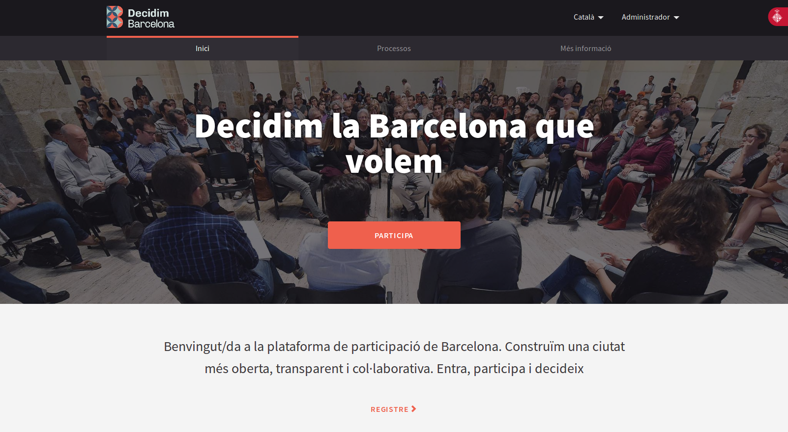

[[h.2et92p0]]
[[h.tyjcwt]]
= QUÈ ÉS EL DECIDIM?

Decidim és un projecte tecnopolític. Una plataforma digital de participació ciutadana per a una ciutat democràtica, feta en codi lliure, de manera oberta i col·laborativa. És una infraestructura público-comuna. Pública perquè té un impuls clarament institucional i comuna perquè el codi és obert i lliure, és a dir que qualsevol el pot veure, utilitzar, copiar o modificar. És una plataforma dissenyada per a l’articulació de processos i espais de participació ciutadana, amb els objectius d’ampliar i facilitar l’accés a la participació ciutadana, obrir nous espais per a la deliberació i la col·laboració  en el co-disseny i la co-producció de polítiques públiques i de nous espais de participació i democràcia directa facilitant així la desintermediació i la cooperació entre ciutadania, institucions i organitzacions de la societat civil.

[#decidim.barcelon.fig]
._decidim.barcelona_.

[[h.1t3h5sf]]
== Principis

La plataforma Decidim està dissenyada i desenvolupada a partir d’una sèrie de principis que promouen l’aprofundiment i la innovació democràtica a l’era digital i les possibilitats de millora, obertura i desenvolupament de les polítiques de participació ciutadana i de les formes de govern democràtiques a diferents escales,  amb especial èmfasi a l’escala municipal. A continuació es llisten aquests principis:

[[h.4d34og8]]
=== Hibridació tecnopolítica

És clau evitar el que podríem definir com a "reduccionisme digital" (Calleja-López, 2017), una variant de tecnocentrisme que posa l'èmfasi principal o exclusivament, en els aspectes i infraestructures digitals de les noves formes de participació, sense atendre a les necessàries i pluripotents innovacions en termes de pràctiques, processos i cultura participativa que resulten de la hibridació del presencial amb el digital. L'aproximació híbrida tracta de connectar espais i activitats que tenen lloc a decidim.barcelona amb espais i activitats presencials, i de pensar les múltiples variants que poden produïr-se a fi de potenciar noves formes d'acció col·lectiva.

[[h.2s8eyo1]]
=== Participació augmentada i multimodal

El resultat del reduccionisme digital és el d'alimentar el "clic-participació" o "participació de clic" (Calleja-López, 2017), en què la participació passa a ser un fenomen definit, en primer lloc, per el seu aspecte digital, i, més específicament, per la comoditat, la rapidesa i la no interacció amb altres actors i idees. En aquest sentit, és necessari potenciar formes enriquides d'interacció entre persones a decidim.barcelona, així com entre aquestes, els continguts de la plataforma, i els processos híbrids de participació en un sentit més ampli. Això implica, d'una banda, enriquir els processos de participació amb funcionalitats més enllà del vot (informació i visualització de dades, deliberació, etc.) i, de l'altra, dissenyar processos híbrids (p.ex .: trobades presencials connectades a la plataforma ), que facin de la participació una participació augmentada, integral i multimodal, en lloc de reduïda i "clicada".

[[h.17dp8vu]]
=== Transparència i traçabilitat

Exceptuant aquelles dades que puguin afectar la privacitat de la persona usuària, els detalls de l'activitat en els processos participatius en mitjans digitals ha de ser absolutament traçable i pública, per potenciar un nou nivell de transparència en la participació. La participació transparent i la traçabilitat són condicions necessàries per la confiança en aquests nous processos.

[[h.3rdcrjn]]
=== Obertura / alliberament

Els principis d'alliberament i obertura fan referència, en primer lloc, al codi i funcionalitats de la plataforma, en segon lloc, a les dades i continguts dels processos i, en tercer lloc, d'una manera més genèrica, als processos mateixos. En els dos primers casos, això implica utilitzar les llicències i estàndards més exigents en matèria de compartició entre iguals (ex. Affero GPLv3 pel codi, CreativeCommons pel contingut, Open Access Database Licences per les dades). Decidim ha de ser una plataforma de programari lliure, que permeti a qualsevol veure, modificar i reutilitzar el codi en què es basa. En el cas dels processos, aquests principis connecten amb alguns altres que esmentem en aquesta llista, com ara el de transparència o el d'accessibilitat, i apunten a fer aquests processos el màxim de participatius i reapropriables en múltiples nivells.

[[h.26in1rg]]
=== Transversalitat de la participació

Atenent a moltes de les claus de l'èxit d'iniciatives recents com les del 15M, les estratègies de desplegament i comunicació de decidim.barcelona i els processos de mitjans per ella han d'orientar-se a aconseguir, en primer, una legitimitat i, en segon, una participació , a l’abast del màxim de grups socials i polítics.

[[h.lnxbz9]]
=== Coneixement, tecnociència i intel·ligència col·lectiva

Les noves formes de participació s'han de beneficiar de les possibilitats que ofereixen tant el coneixement popular com el coneixement expert de la ciutadania i de la ciència de dades (dades, en ocasions, dels propis processos participatius) per millorar la presa de decisions i la participació. Una participació informada i experta,  capaç de catalitzar el coneixement social.

[[h.35nkun2]]
=== Participació col·lectiva i en xarxa

Un repte central d'una participació "augmentada", això és, intervinguda digitalment, és el de potenciar la seva dimensió col·lectiva enfront de les tendències atomitzadores, sovint resultants de les condicions de la participació a distància. Això implica habilitar funcionalitats que potenciïn la interacció entre usuàries en processos col·lectius, siguin en la plataforma o també presencials. Espais de debat i deliberació, digitals o presencials, són necessaris per articular una participació millorada.

[[h.1ksv4uv]]
=== Orientació públic-comú, reapropiació i participació recursiva

Les noves infraestructures digitals de la democràcia han de ser un espai de, per i per al comú. Per avançar la democràcia les infraestructures han de ser, elles mateixes, radicalment democràtiques. Això implica plantejar un model innovador i alternatiu al de la privatització d'allò públic. A aquest efecte, Decidim ha de ser una infraestructura digital de construcció, propietat i ús públic-comú, és a dir, el que definim com un "procomú tecnopolític", tecnologia oberta a la participació de totes i de qualsevol en el seu disseny i gestió, governada de forma distribuïda i amb models de producció col·lectius i entre iguals. Davant de les plataformes tancades privatives, controlades per grans corporacions, Decidim és una infraestructura democràtica per a la democràcia.

[[h.44sinio]]
=== Accessibilitat i formació tecnopolítica

Ha de ser també un servei públic, pel qual és fonamental garantir l'accés i la formació de la ciutadania per participar i explotar tot el seu potencial. Promoure el seu ús empoderat des de baix i per grups socials exclosos és un repte clau. Tant decidim.barcelona com els processos de participatius digitals han de regir-se pels estàndards més exigents d'accessibilitat (p.ex .: els de la Web Accessibility Initiative, WAI).

[[h.2jxsxqh]]
=== Autonomia, empoderament i vinculació

Si alguna cosa han mostrat els moviments socials en els últims anys és la centralitat de l'acció col·lectiva autoorganitzada a l'hora d'iniciar i orientar processos de canvi. En aquest sentit, decidim.barcelona i els processos que utilitzen  la plataforma han de potenciar l'autonomia i l'autoorganització social. De manera complementària, s'ha d'exigir que la vinculació política sigui un element present en molts dels processos de la plataforma, ja que aquest és un element clau de la legitimitat pública i operativa de la plataforma en el mitjà i llarg termini. És a dir, s'ha de potenciar tant processos socials autònoms com processos de baix a dalt (_bottom-up_) que vinculin a les institucions públiques.

[[h.z337ya]]
== Breu història

Al setembre de 2015 es presentava públicament Decide Madrid, la plataforma digital de participació impulsada per l'Ajuntament de Madrid i basada en el programari Consul, que començava a experimentar amb diferents processos de participació, com ara els debats públics i les propostes ciutadanes. Al febrer de 2016, basat en Consul, amb importants modificacions i adaptant-se a les noves necessitats, es presentava el projecte Decidim Barcelona impulsat per l'Ajuntament de Barcelona, amb l'objectiu inicial d'articular el procés participatiu per a l’elaboració del programa d'actuació municipal i poder coordinar i articular futurs processos de participació a la ciutat. En poc més de dos mesos es van registrar gairebé 25.000 persones, es van presentar 10.860 propostes, es van realitzar 410 cites i es van recollir més de 160.000 suports. D'aquesta manera s'obria un espai de col·laboració i deliberació entre la ciutadania, les organitzacions socials i l'Ajuntament de Barcelona.

Paral.lelament, en molts municipis ha sorgit un enorme interès en tirar endavant processos similars aprofitant la tecnologia posada en marxa, tant pel seu èxit, com pel seu caràcter lliure i reutilitzable. En concret, l'Ajuntament de la Corunya amb la plataforma A Porta Oberta pel procés de Pressupostos Participatius, l'Ajuntament d'Oviedo a través de Consulta Oviedo, amb l'espai de propostes ciutadanes o l'Ajuntament de València a través de decidimVLC, per a l'elaboració dels pressupostos participatius. També van ser nombrosos els casos d'ajuntaments o d’altres institucions que van mostrar un gran interès pel projecte decidim.barcelona i pel seu desplegament com són l'Ajuntament de L'Hospitalet, Badalona, Terrassa, Gavà, així com la Diputació de Barcelona o el Consorci Localret.

Al seu torn, aquesta sèrie de modificacions i adaptacions ha donat lloc a una nova necessitat tecnològica que ha estat l'adequació de la tecnologia atenent a la diversitat de municipis, l'autonomia i la sostenibilitat de la plataforma a mig termini. Per això s’ha establert una estratègia de desenvolupament escalable i descentralitzat (o modular) que permet al conjunt del projecte ser flexible i créixer al llarg del temps, així com generar una comunitat de desenvolupament, disseny funcional i acompanyament, que el sostingui, tant a escala municipal com (el que és més important) intermunicipal.

Això va donar lloc a que l’Ajuntament de Barcelona es replantejés d’arrel l’arquitectura de la plataforma i realitzés una reescriptura complerta del software a partir dels principis i necessitats anteriorment esmentats. Aquesta reescriptura dona lloc al projecte Decidim, un framework de la democracia participativa, basat en Ruby on Rails, i genèric per tal que qualsevol grup, organització o institució que vulgui utilitzar-lo ho pugui fer amb uns mínims requisits tècnics.

[[h.3j2qqm3]]
== Desenvolupament en obert i software lliure

El projecte de la plataforma Decidim (tant en la fase inicial basada en Consul com després de la reescriptura complerta del codi) està desenvolupada en software lliure i el conjunt del seu desenvolupament s’ha fet en obert, el qual fa  que es pugui rastrejar i seguir tot el seu desenvolupament des del moment zero de la plataforma.

Quan es diu que està fet en software lliure es refereix a que el codi font de la plataforma té una llicència AGPL v3 o una GNU Affero General Public License footnote:[https://github.com/AjuntamentdeBarcelona/decidim/blob/master/LICENSE-AGPLv3.txt], el qual implica que el codi ha de permetre la possibilitat de ser consultable, reproduïble, modificable i reutilitzable sempre i quan es mantingui la mateixa llicència en qualsevol treball o obra derivada. Aquesta llicència és una de les que més llibertat otorga i és copyleft footnote:[Com a copyleft es coneix a tot un conjunt de llicències que poden aplicar-se  a creacions informàtiques, artístiques, etc. Els defensors del copyleft consideren les lleis de drets d'autor (copyright) com una forma de restringir el dret de fer i redistribuïr còpies d'un treball. Una llicència copyleft, de fet, utilitza la legislació pròpia dels drets d'autor per a assegurar que cada persona que rep una còpia o obra derivada pugui fer servir,modificar,i també redistribuir tant el treball com les seves versions derivades. Així doncs, en un sentit estrictament no legal, el copyleft és el contrari del copyright. (Wikipedia, 2017)]. En aquest sentit té una gran coherència que les administracions públiques facin una clara aposta per aquest tipus de software, ja que a través d’aquest tipus de llicències obtenim un retorn social de les inversions públiques.

Que el software ha estat desenvolupat en obert significa que tot el procés de desenvolupament és transparent i accessible, és a dir que qualsevol persona pot veure des de l’inici del desenvolupament del software, totes les modificacions, contribucions, la comunitat de desenvolupadors involucrada, etc… En aquesta mateixa direcció, la transparència no només esdevé un prinicipi fonamental de la participació ciutadana sinó que també ho fa en el cas del desenvolupament del programari.

Tot això s’ha fet en una plataforma dissenyada per a la col·laboració oberta en el desenvolupament de software anomenada Github footnote:[https://github.com/]. Des d‘aquesta plataforma es pot accedir al codi i fer el seguiment del desenvolupament del software. Github està dissenyat per allotjar repositoris Git, però hi ha altres alternatives a Github com per exemple GitLab.

[[h.1y810tw]]
== Decidim Barcelona

Decidim Barcelona és la primera instància del Decidim i origen del projecte. Decidim Barcelona neix a partir de les necessitats de l’Ajuntament de Barcelona d’obrir un procés de participació ciutadana mediat tecnològicament entorn al Pla d’Actuació Municipal amb tres grans objectius: fer un procés transparent i traçable, ampliar la participació a través de la plataforma digital i integrar la paritcipació presencial amb la digital.

Aquest procés va rebre més de 10.000 propostes i més de 160.000 suport, amb un balanç final del 71% de propostes ciutadanes acceptades i incloses al PAM a través de més de 1.600 actuacions. Inicialment el Decidim va ser dissenyat exclusivament per acollir aquest procés però ràpidament es va veure la necessitat d’extendre la plataforma a altres processos de participació.

A partir d'aquí va néixer la llavor de l’actual Decidim. Una plataforma de participació que permetia tenir tants processos com es volgués, dividits en fases i amb la possibilitat de configurar diferents funcionalitats a cadascuna de les fases. D’aquesta manera quedava oberta la possibilitat de poder dissenyar noves funcionalitats integrables en els processos (enquestes, elaboració de textos col·laboratius, seguiment de resultats,...), així com la integració de nous espais de participació com poden ser les iniciatives ciutadanes o els consells de participació.

Actualment (Juliol 2017) el Decidim Barcelona acull a 12 processos de participació, i compta ja amb 26.600 participants, gairebé 12.000 propostes recollides, 1.700 resultats, 670 trobades presencials i 185.000 suports recollits. Els bons resultats de la plataforma a la ciutat de Barcelona han portat a l’extensió d’aquesta a altres municipis, com l’Hospitalet de Llobregat, Sabadell, Badalona, Terrassa, Gavà, Sant Cugat, Mataró o Vilanova i la Geltrú.

[[h.4i7ojhp]]
== Decidim Municipis

Decidim és una plataforma multitenant, és a dir que amb una sola instal·lació es poden servir tantes instàncies com es necessitin. En el món del software existeixen nombrosos exemples d’èxit d’arquitectura multitenant, com pot ser el projecte de software lliure per a blogs Wordpress. És especialment útil per aquelles institucions que vulguin proporcionar el Decidim com a servei a tercers . El cas de la Diputació és especialment rellevant perquè amb una sola instal·lació mantiguda, actualitzada i sostinguda per un sol ens, pot ser utilitzada per a tants municipis com es desitgi, reduïnt així els costos d’instal·lació i manteniment, i proporcionant solucions tecnològiques per a la millora de la participació ciutadana a municipis mitjans o petits que d’altra manera tindrien un accés molt reduït a aquest tipus de recursos.

