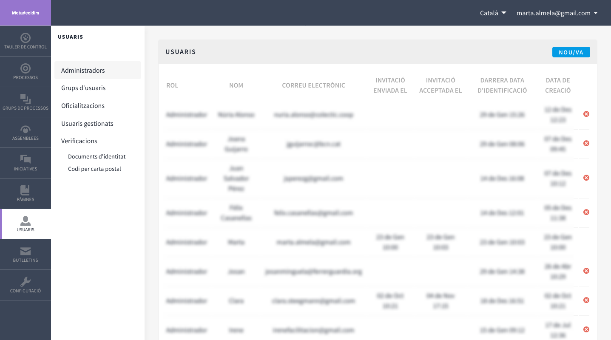

[[h.3fwokq0]]
== Usuaris

La gestió dels usuaris d’administració comprèn tasques com: donar d'alta altres administradors, validar els grups d'usuaris (organitzacions/ col·lectius) que s'han registrat i que s'ha pogut comprovar que efectivament existeixen, gestionar els usuaris temporals que es creïn des de les Oficines d'Atenció al Ciutadà per facilitar que les persones que no tenen internet puguin participar en el Decidim, reconèixer que una persona té una determinada posició en l’organització (_Oficialitzacions_) i autenticar que la persona que participa és qui diu que és (_Verificacions_). footnote:[La funció **Verificacions** es troba en fase de desenvolupament.]

Per a la gestió dels usuaris, clicar **USUARIS** en el menú del **TAULER DE CONTROL**.  S’obre la finestra **USUARIS** (Figura 16).

[#Usuaris.fig]
._Usuaris_.

Per a donar d’alta un administrador, clicar **Administradors** en el submenú **USUARIS**. Apareix un llistat dels que ja són administradors, clicar **Nou**/**Nova** en la part superior dreta de la pantalla. S’obre una pantalla (Figura 17) en la qual s’han d’omplir els camps **Nom** i **Correu** electrònic, i seleccionar el **Rol** en el desplegable (**Administrador** o **Administrador d’usuaris**). En acabar, clicar **Convidar**.

[#Convidar un usuari com a administrador.fig]
._Convidar un usuari com a administrador_.

Per a validar un grup d'usuaris, anar a **Grups d'usuaris** en el submenú **USUARIS**. S'obre una nova finestra (Figura 18) en la qual apareix un llistat amb tots els grups d'usuaris que s'han registrat, els respectius números de documents, telèfons, nombre d'usuaris, la data de creació, l'estat (pendents, rebutjats, verificats o tots) i les accions possibles (**Verificar** o **Rebutjar**).

[#Grups d'usuaris.fig]
._Grups d'usuaris_.

Els grups d’usuaris es poden validar, un cop s'hagi comprovat que existeixen, directament en aquesta finestra clicant la icona **Verificar** corresponent. Per a facilitar la gestió es pot filtrar els grups d'usuaris en funció de si estan verificats, rebutjats o pendents, seleccionant en el desplegable **Filtra per**.

Per acreditar públicament (_oficialitzar_) que una persona té una determinada posició/ càrrec en l’organització, clicar **Oficialitzacions** en el submenú Usuaris. S’obre la finestra **OFICIALITZACIONS** (Figura 19), en la qual apareix un llistat amb algunes de les persones usuàries i les accions que es poden realitzar: **Oficialitza**, i en el cas que la persona ja hagi estat oficialitzada, **Torna a Oficialitzar** o **Inhabilita la oficialització**.

[#Oficialitzacions.fig]
._Oficialitzacions_.

Per oficialitzar una persona i càrrec, filtrar pel nom i clicar sobre l'acció **Oficialitza**. S'obre la finestra OFICIALITZA L'USUARI "X" (Figura 20), en la qual caldrà posar la **Insígnia d'oficialització** (la posició que se li reconeix).

[#Oficialitza l’usuari.fig]
._Oficialitza l’usuari_.

Per a fer la gestió dels **usuaris gestionats** (impersonament temporal amb identificació prèvia), clicar Usuaris gestionats en el submenú **USUARIS** [per a poder realitzar aquesta acció cal atorgar els permisos adients des de la gestió dels administradors].
