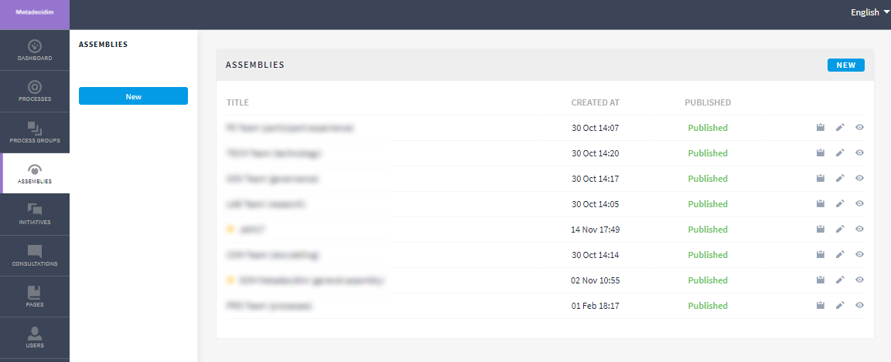
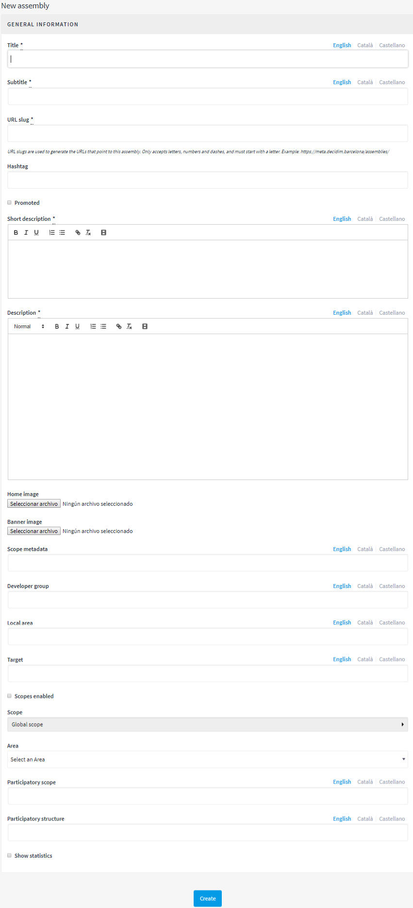
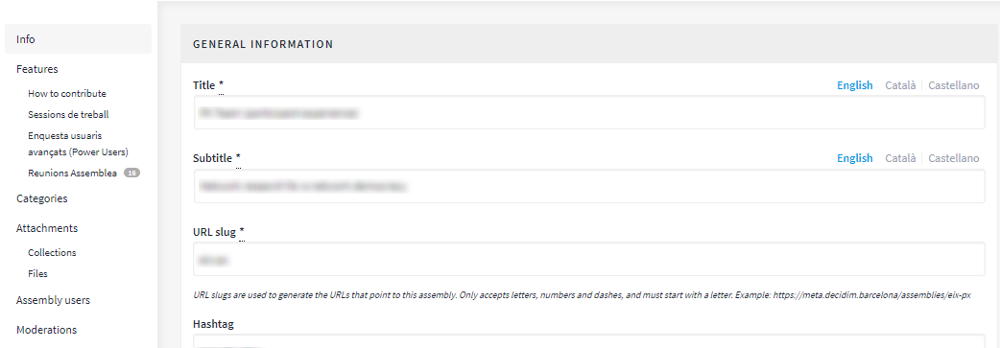
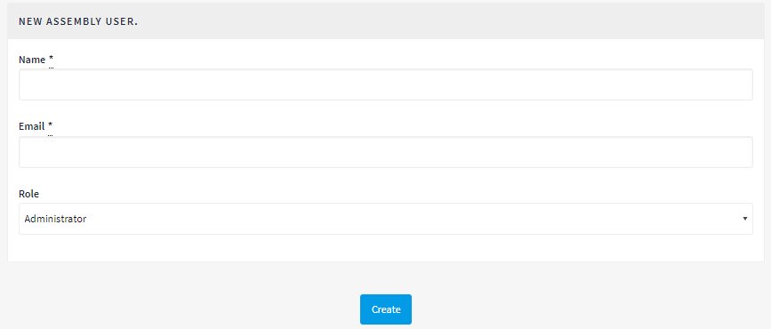

== Assemblies

To configure bodies such as municipal Councils or city Assemblies, click on ASSEMBLIES in the menu on the left of the DASHBOARD (Figure 69).

[[h.45jfvxd]]Figure 69 - Assemblies

Then click on NEW. The NEW ASSEMBLY window will open (Figure 70), where general information on the assembly has to be entered. See 2.5.1 (Information on participatory processes) for filling in the information required there.

Go to the list of assemblies, clicking on the icons corresponding to each of the assemblies; you can duplicate and configure the assembly and preview how it will look once it is published.

Once the bodies/assemblies have been created, functions can be added such as meetings, documents, static pages etc. To do this you will have to follow the same steps as the ones for adding functions to participatory processes (See 2.5 Processes).

Go to ASSEMBLEES where you will find the list of assemblies (Figure 69), and click on the name of the body you want configure. The GENERAL INFORMATION window will open, displaying the body’s submenu on the left, from where you can carry out the configuration.

The options available through the assemblies’ submenu are Info, Features/ Components, Categories, Attachments, Assembly users and Moderations (Figure 71). To configure the various options, see 2.5 (Processes).

[[h.2koq656]]Figure 70 - New assembly

[[h.zu0gcz]]Figure 71 - Assemblies’ submenu

As with processes, several types of role can be configured for users. To register an assembly's users, click on Assembly users from the assemblies’ submenu and click on NEW.

[[h.3jtnz0s]]Figure 72 - New assembly user

You need to fill in the following fields: Name, Email and Role (select from the Administrator, Collaborator or Moderator drop-down menu). Immediately afterwards click on Create (Figure 72)
