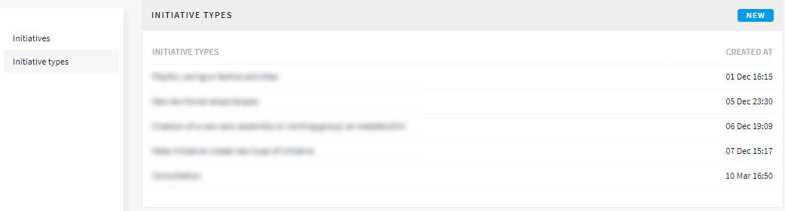
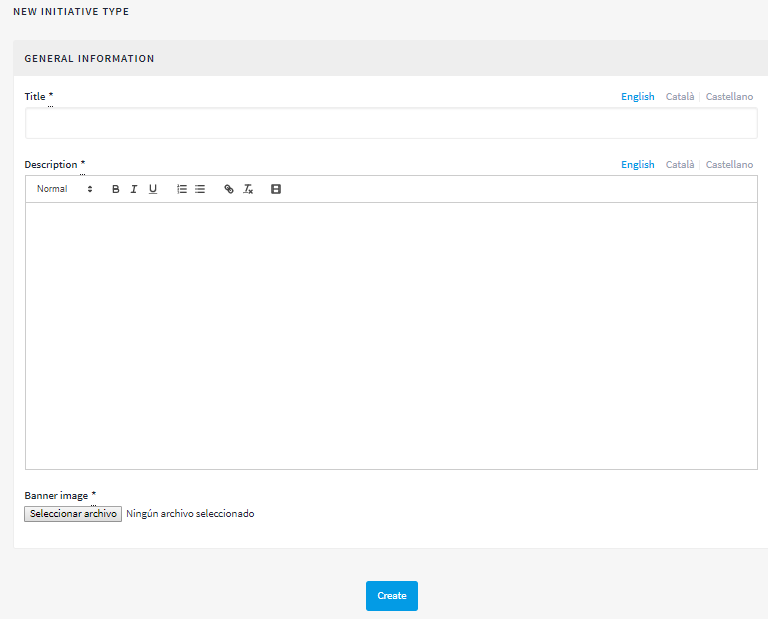
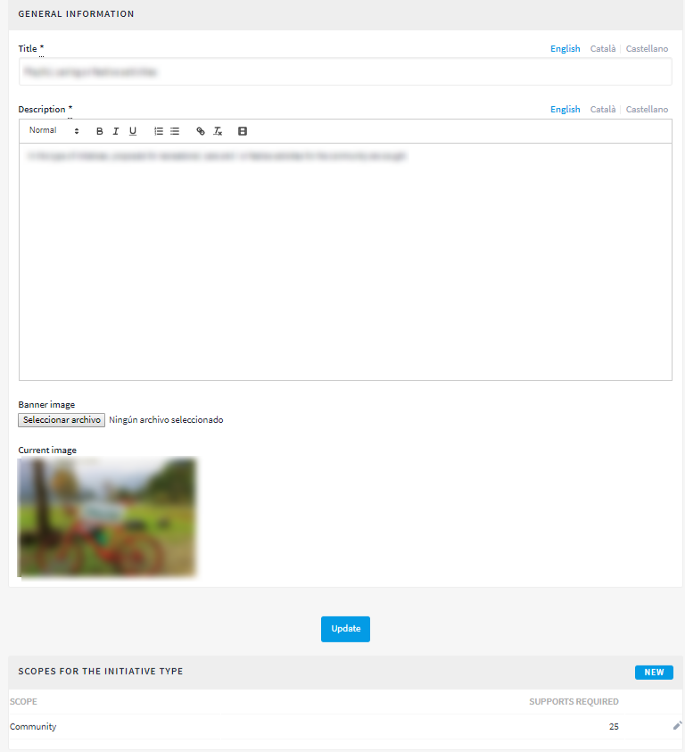
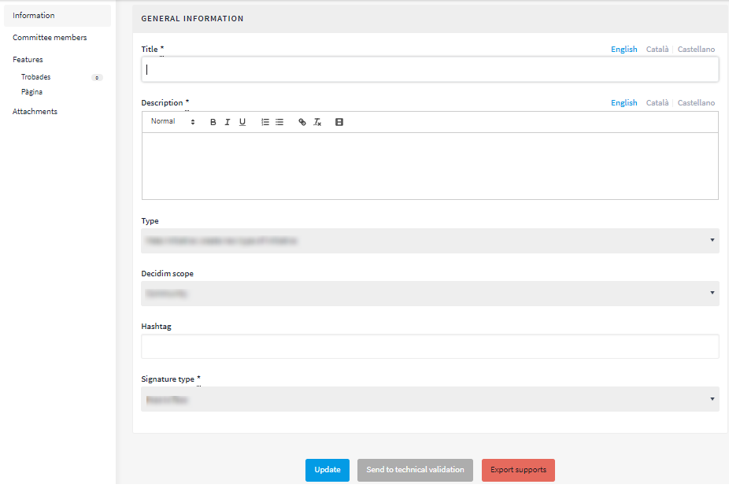

[[h.1yyy98l]]
== Initiatives

Initiatives (in the case of public, citizen and communal authorities) are distinguished from the other participation spaces because they are participatory tools or mechanisms promoted by citizens. In other words, the initiatives are mechanisms for semi-direct democracy through which citizens can promote a certain action of common interest to the authority, by collecting a specific number of signatures.

In this case, what the authority has to do is enable the promotion of these initiatives and offer the necessary technical support and advice to the people concerned. The role of the platform’s administrator, then, is somewhat different from that of the other participation spaces. In the first place, you will have to configure the various forms of initiatives provided for under the regulations (municipal rules), specifying the number of signatures required for processing the various types of citizen initiatives. An initiative for incorporating one or several items into the Municipal Council’s agenda evidently requires fewer signatures than another initiative for promoting a citizen consultation.

To configure the initiative type, click on INITIATIVES on the menu to the left of the DASHBOARD, then click on Initiative types from the Initiative submenu and then on NEW (Figure 73).

[[h.4iylrwe]]Figure 73 - Initiative types

The New initiative type window will open (Figure 74), where you need to enter the Title, Description of the initiative and upload a Banner image. To finish, click on Create.

[[h.2y3w247]]Figure 74 - New initiative type

A window will immediately open with the information just created on the initiative type, where the number of signatures required has to be specified according to possible scopes (city, neighbourhood/ district). (See Figure 75 at the very bottom)

[[h.1d96cc0]]Figure 75 - Initiative type’s window

Second, the administrator will have to monitor the initiatives created by users and check whether all the information presented is correct. Go to the initiative submenu (Figure 73) and click first on Initiatives and then on the corresponding initiative. On the left of the submenu for that initiative (Figure 76), you can: configure the Committee members, the Meetings and create a Page and Attachments. The procedure for configuring these functions is identical to the one used in other participation spaces, such as participatory processes and assemblies.

[[h.3x8tuzt]]
[[h.2ce457m]]Figure 76 - Submenu of a specific initiative

To carry out these monitoring actions click on Information in the initiative's submenu. The following buttons will appear at the very bottom: Update, Send to technical validation, Publish (Unpublish where it has already been published), Discard initiative, Export supports (in .csv, visible when the initiative has been published).

For example, an initiative can be rejected where it limits or restricts fundamental rights and freedoms and, in the case of local authorities, where it does not refer to matters under municipal jurisdiction.
