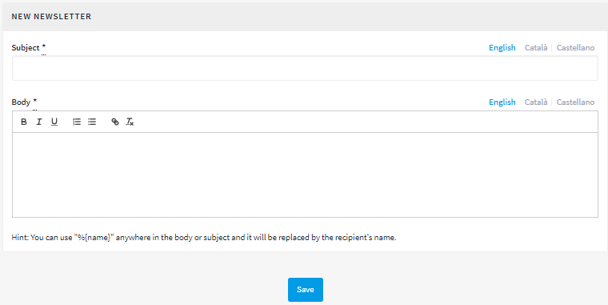

[[h.rjefff]]
== Newsletters

Newsletters are emails with information on the platform (new developments, processes that are sent to everyone who has been registered with the platform and who has ticked the box for receiving relevant information on the processes there are on the platform.

To create a newsletter, click on *NEWSLETTERS* from the menu on the left of the *DASHBOARD*. Click immediately afterwards on *New* in the submenu on the left. The *NEW NEWSLETTER* window will open (Figure 77), where the *Subject* (Title of the newsletter) and *Body* (text) fields have to be filled in, both in Catalan and in Spanish. To finish, click on *Save* on the lower part of the window.

[[h.3bj1y38]]Figure 77 - New newsletter

You can use "%\{name}" in any part of the body or subject and this will be replaced by the addressee's name.
