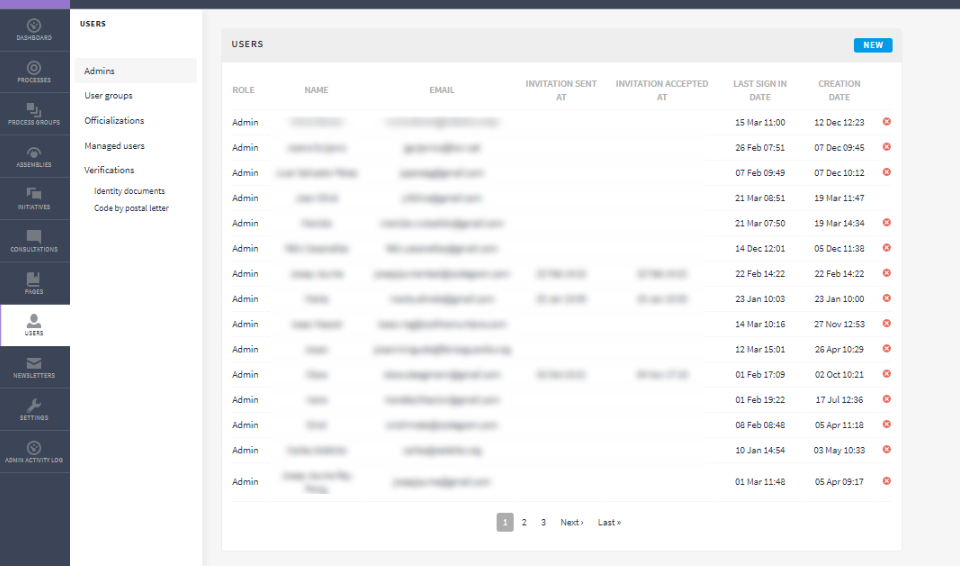
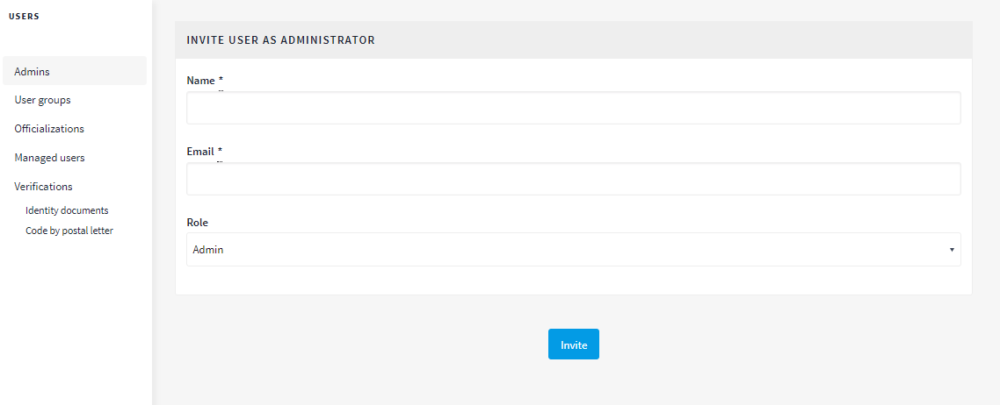
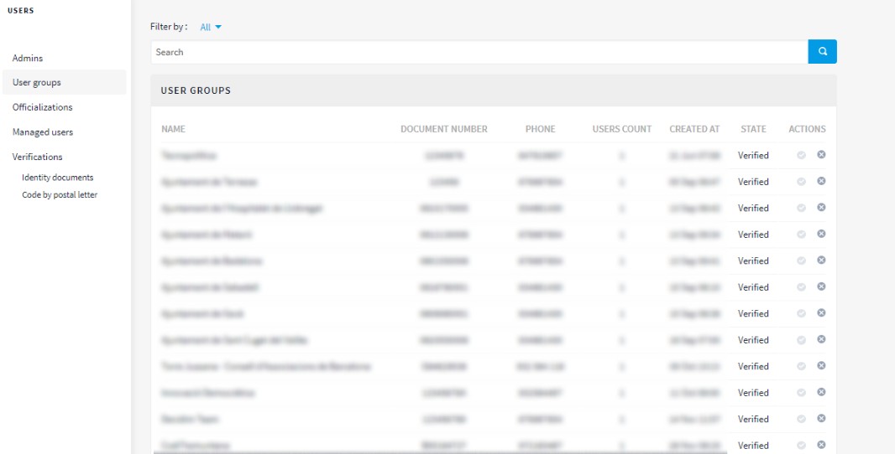
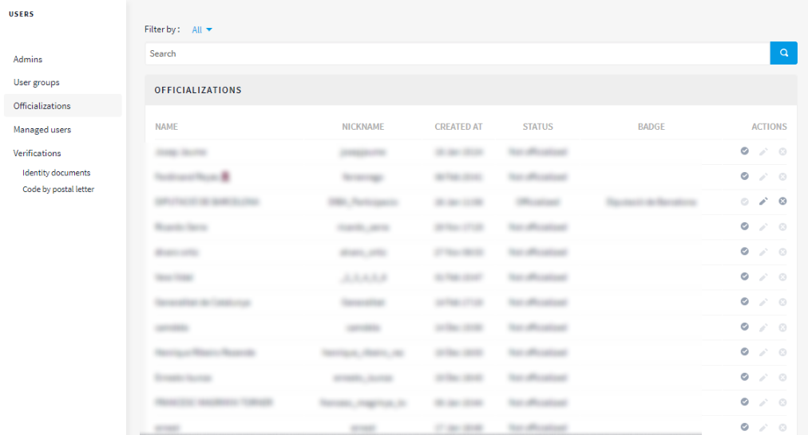
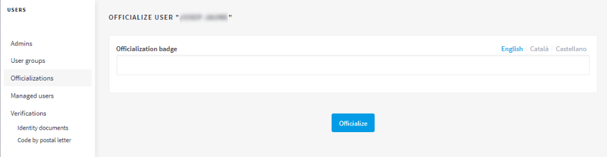

[[h.6r7q6ju1cvac]]
[[h.1v1yuxt]]
== Users

Managing administration users involves such tasks as: registering other administrators; validating user groups (organisations/ collectives) that have been registered and whose effective existence has been confirmed; managing temporary users created from Citizen Help and Information Offices to enable people who have no internet to take part in Decidim: recognising that a person has a certain position in the organisation (Oficializations) and authenticating that the person taking part is who they say they are (Verifications).^link:#ftnt6[[6]]^

To manage users, click on *USERS* in the *DASHBOARD* menu. The *USERS* window will open (Figure 16).

[[h.4f1mdlm]]Figure 16 - Users

To register an administrator, click on *Admins* in the *USERS* submenu. A list of those that are already administrators will appear; click on *New* in the upper right of the screen. A screen will open (Figure 17) whose *Name* and *Email* fields have to be filled in and *Role* selected from the (*Admin* or *User manager*) drop-down menu. To finish, click *Invite*.

[[h.2u6wntf]]Figure 17 - Invite user as administrator

To validate a user group, go to *User groups* in the *USERS* submenu. A new window will open (Figure 18) displaying a list with all the user groups that have been registered, respective numbers of documents, telephone numbers, user numbers, creation date, status (verified, rejected or pending) and possible initiatives (*Verify* or *Reject*).

[[h.19c6y18]]Figure 18 - User groups

User groups can be directly validated in this window, once their existence has been confirmed, by clicking on the corresponding *Verify* icon. To facilitate management the user groups can be filtered according to whether they are verified, rejected or pending, by selecting from the *Filter by* drop-down menu.

To publicly accredit (officialise) that a person has a certain position/ post in the organisation, click on *Oficializations* in the Users submenu. The *OFICIALIZATIONS* window (Figure 19) will open, displaying a list with some of the users and the initiatives that can be carried out: *Officialize*, and where the person has already been officialised, *Reofficialize* or *Unofficialize*.

[[h.3tbugp1]]Figure 19 - Officializations

To officialise a person and post, filter by name and click on the *Officialize* action. The Officialize User “X” window will open (Figure 20), where you will have to insert the *Officialization badge* (the position that is recognised).

[[h.28h4qwu]]Figure 20 - Officialize user

To manage managed users (impersonally temporary with previous identification), click on *Managed Users* in the *USERS* submenu [the appropriate authorisation has to be granted from management of administrators before this action can be carried out.

link:#ftnt_ref6[[6]] The Verifications function is currently under development .
