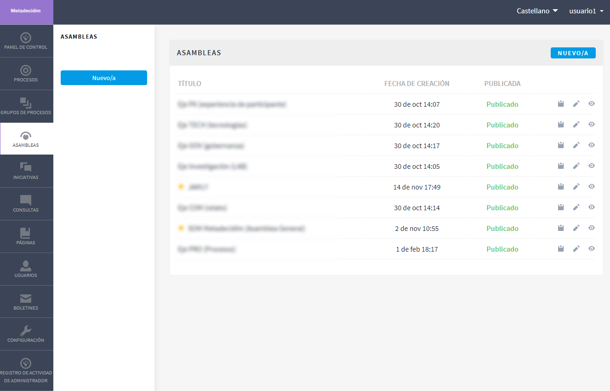
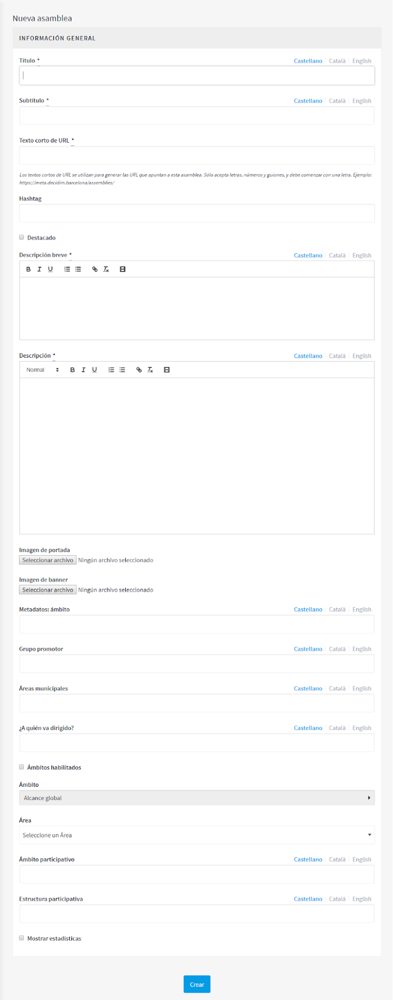
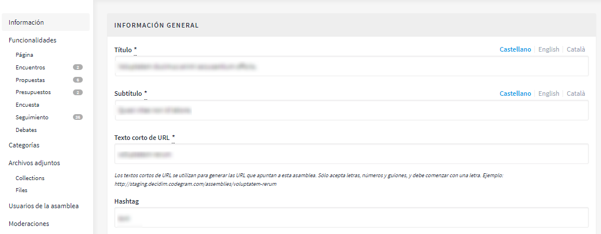
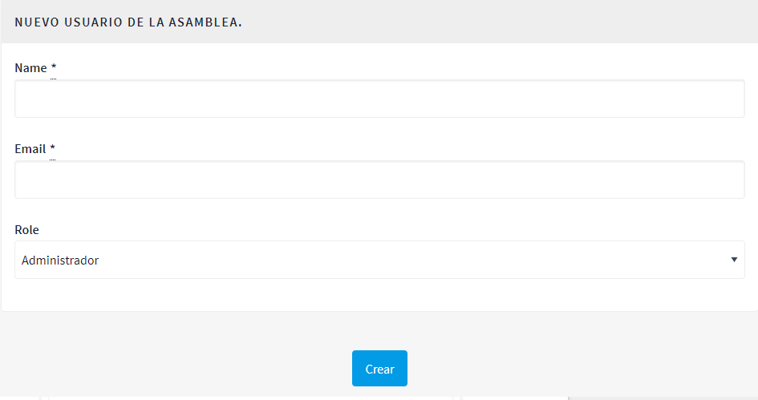

[[h.36ei31r]]
== Asambleas

Para configurar los órganos, como, por ejemplo, los consejos municipales o las asambleas de ciudad, haz clic en *ASAMBLEAS*, en el menú de la izquierda del *PANEL DE CONTROL* (ver <<image7-fig>>).

[#image7-fig]
._Asambleas._

A continuación, haz clic en *NUEVO/A*. Se abrirá la ventana *NUEVA ASAMBLEA* (ver <<image44-fig>>), donde hay que escribir la información general sobre la asamblea. Véase “2.5.1. Información procesos participativos”, para introducir la información necesaria.

Desde la lista de las asambleas, haciendo clic en los iconos que corresponden a cada una, se puede duplicar la asamblea, configurarla y previsualizar cómo quedará una vez que esté publicada.

Una vez creados los órganos o asambleas, se pueden añadir las funcionalidades/ componente, como los encuentros, los documentos, las páginas estáticas, etcétera. Para ello, hay que seguir los mismos pasos que cuando se añaden las funcionalidades/ componentes a los procesos participativos (véase “2.5. Procesos”).

Dirígete a *ASAMBLEAS*, donde se encuentra la lista de las asambleas (ver <<image7-fig>>), y haz clic en el nombre del órgano que deseas configurar. Se abrirá la ventana *INFORMACIÓN GENERAL*, a cuya izquierda se encuentra el submenú del órgano, por medio del cual se puede realizar la configuración.

Las opciones disponibles mediante el submenú *Asambleas* son las siguientes: *Información, Funcionalidades/ Componentes, Categorías, Archivos Adjuntos, Usuarios de la asamblea* y *Moderaciones* (ver <<image18-fig>>). Para configurar las diferentes opciones, véase “2.5. Procesos”.

[#image44-fig]
._Nueva Asamblea._

[#image18-fig]
._Submenú Asambleas._

Igual que con los procesos, se pueden configurar diferentes tipos de rol de las personas usuarias. Para dar de alta a las personas usuarias de la asamblea, haz clic en *Usuarios de la asamblea*, en el submenú de la asamblea, y haz clic en *NUEVO/A*.

[#image45-fig]
._Nuevo usuario de la asamblea._

Hay que completar los siguientes campos: *Nombre, Correo electrónico* y *Rol* (selecciona en el desplegable *Administrador, Colaborador* o *Moderador*). A continuación, haz clic en *Crear* (ver <<image45-fig>>).
