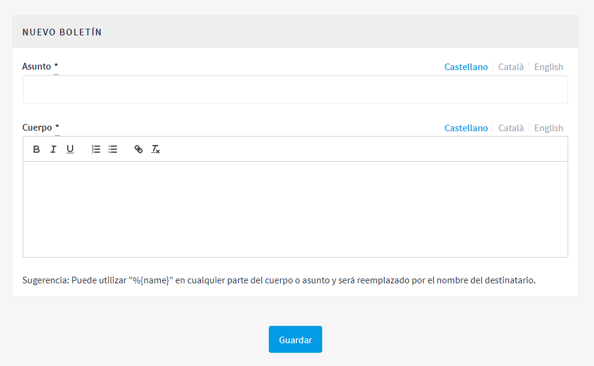

[[h.2ce457m]]
== Boletines

Los boletines son correos electrónicos con información sobre la plataforma (novedades, procesos...) que se envían a todas las personas que se han registrado en la plataforma y que han marcado la casilla para recibir información relevante sobre los procesos que hay en la plataforma.

Para crear un boletín, haz clic en BOLETINES, en el menú de la izquierda del PANEL DE CONTROL. Después, haz clic en Nuevo/a, en el submenú de la izquierda. Se abrirá la ventana NUEVO BOLETÍN (Figura 77), donde se deben completar los campos Asunto (título del boletín) y Cuerpo (texto), ambos en catalán y castellano. Para finalizar, haz clic en Guardar, en la parte inferior de la ventana.

Figura 77. Nuevo boletín.

Se puede utilizar "%\{name}" en cualquier parte del cuerpo o asunto, y será reemplazado por el nombre del destinatario.
