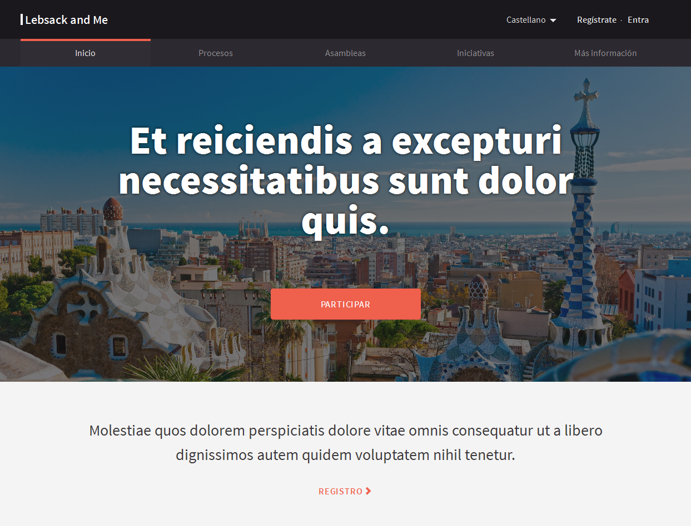
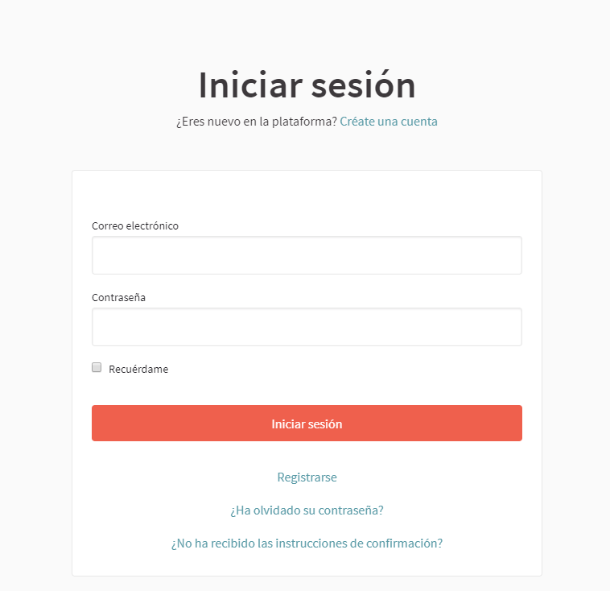
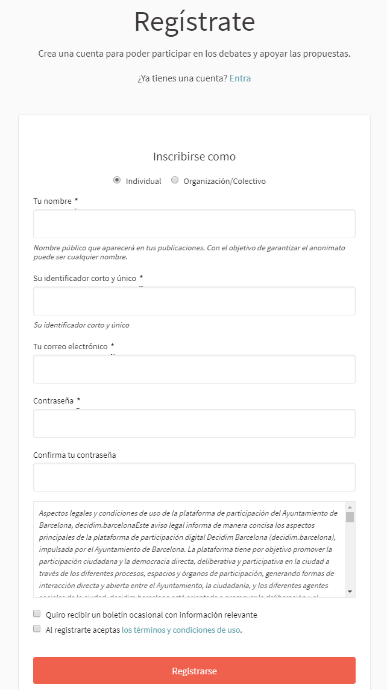
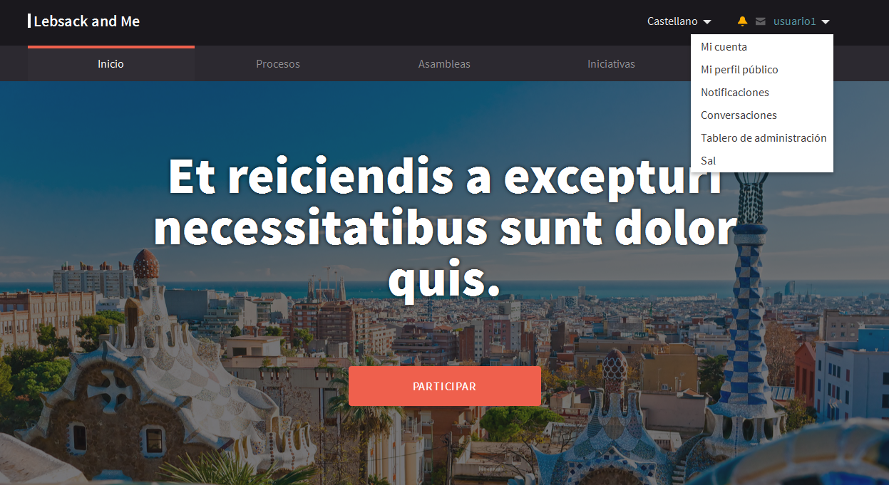
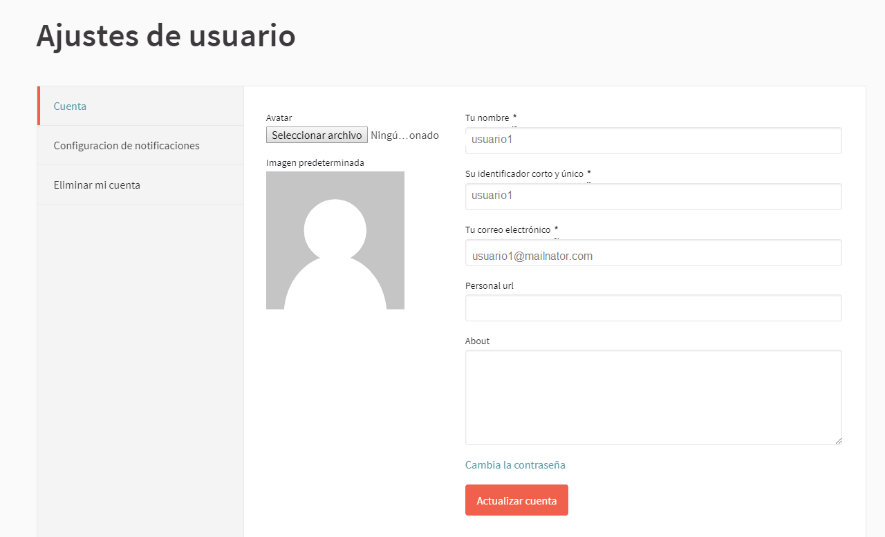
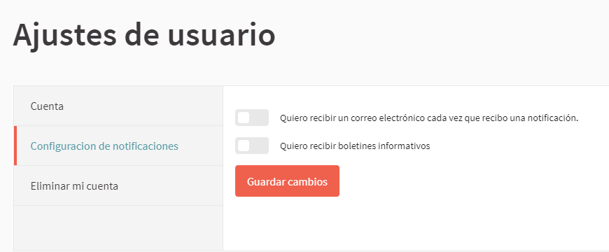
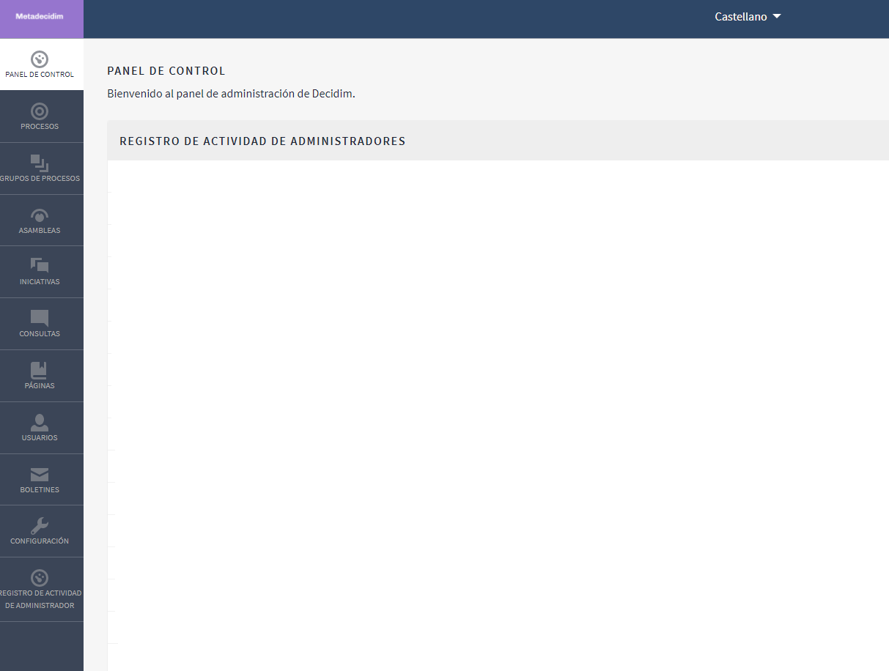

[[h.3whwml4]]
== Cómo acceder al menú de administración

En primer lugar, hay que iniciar sesión. Para ello, dirígete a la parte superior derecha de la página web de Decidim del municipio (Figura 2) y haz clic en Entra. Solo las personas que tienen configurados los permisos de administrador pueden acceder al Panel de administración.

Figura 2. Página principal. Demo Decidim.

Se abrirá la ventana Iniciar sesión (Figura 3), en la que deberán completarse los campos Correo electrónico y Contraseña, y hacer clic en Iniciar sesión. Primero, es necesario que la persona se haya registrado.

Para registrarse, se puede hacer desde esta misma ventana (Figura 3), haciendo clic en Créate una cuenta (en la parte superior de la pantalla) o en Regístrate (en la parte inferior), o bien desde la página principal, haciendo clic en Regístrate.

Figura 3. Entra.

En la ventana Regístrate (Figura 4), hay que marcar si se trata de un individuo o de una organización o colectivo, escribir el nombre (nombre público que aparecerá en las publicaciones; a efectos de garantizar el anonimato, puede ser cualquier nombre), el correo electrónico y la contraseña, y marcar la casilla correspondiente si deseas recibir un boletín ocasional con información relevante.

Para acabar, hay que hacer clic en Al registrarte aceptas los términos y condiciones de uso (disponibles en el enlace), y hacer clic en Registrarse.

Figura 4. Regístrate.

Una vez finalizado el registro, se puede acabar de configurar las opciones del usuario, como la información adicional o las notificaciones. Para ello, haz clic sobre el nombre de usuario (en este caso, usuario1) en la parte superior derecha de la web. Se abrirá un desplegable desde el que se puede acceder a Mi cuenta, Mi perfil público,  ver las Notificaciones, ver las Conversaciones, ir al Tablero de administración o salir haciendo clic en Cerrar sesión (Figura 5).

Figura 5. Acceder al Tablero de administración.

Haz clic en Mi cuenta para acabar de configurar la cuenta: añadir un avatar o una imagen, modificar el nombre o el correo electrónico o definir el nivel de notificaciones que se desean recibir. Se abrirá la ventana Ajustes de usuario (Figura 6).

Figura 6. Mi cuenta: Ajustes de usuario.

Para establecer el nivel de notificaciones, haz clic en Configuración de notificaciones, en el menú de la izquierda de esta pantalla, y selecciona si deseas recibir un correo electrónico cada vez que recibas una notificación y si deseas recibir boletines informativos (Figura 7).

Figura 7. Configuración de notificaciones.

Para acceder al menú de administración, haz clic en el nombre en la parte superior derecha de la web (en este caso, usuario1) y selecciona Tablero de administración en el desplegable. Recuerda que, para acceder al menú de administración, debes tener configurados los permisos de administrador.

Se abrirá el PANEL DE CONTROL (Figura 8). Desde allí (haciendo clic en las opciones que aparecen en el menú de la izquierda), se puede configurar la plataforma Decidim del municipio, las páginas estáticas, los procesos participativos y los grupos de procesos, las asambleas o los consejos, las iniciativas y los boletines, y hacer la gestión de los usuarios.

Figura 8. Panel de control.
