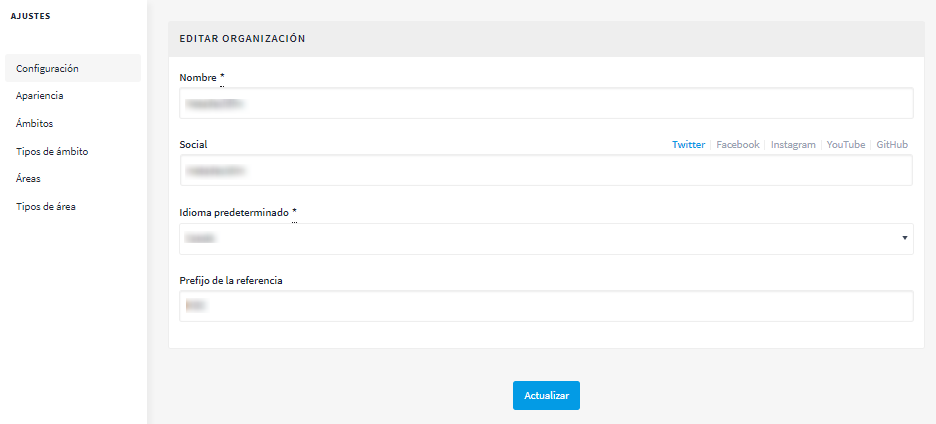
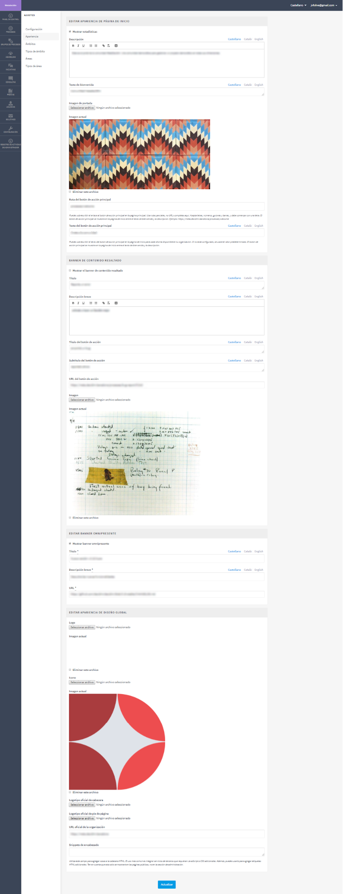
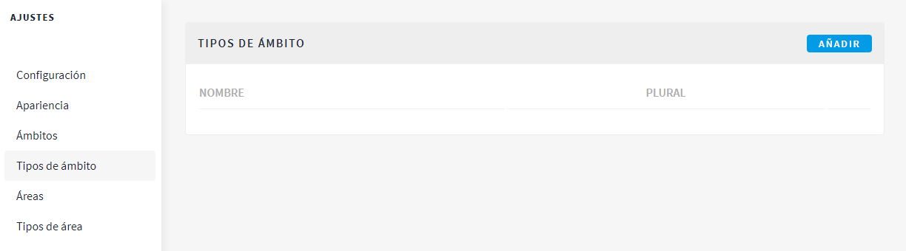
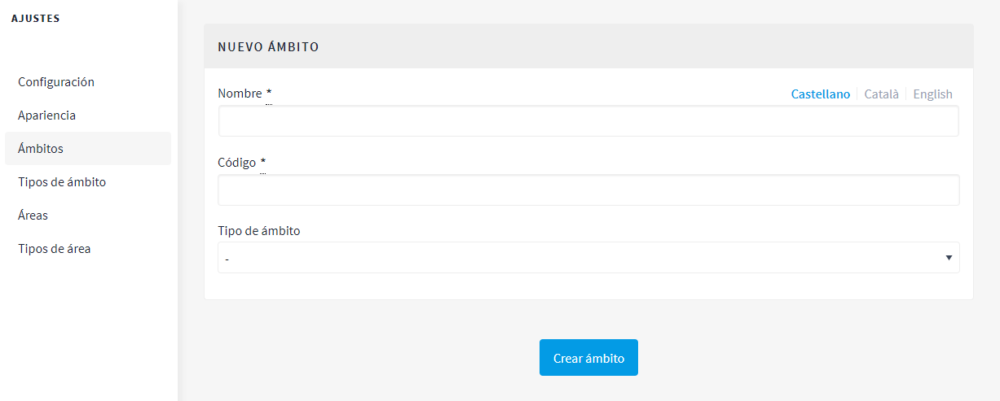
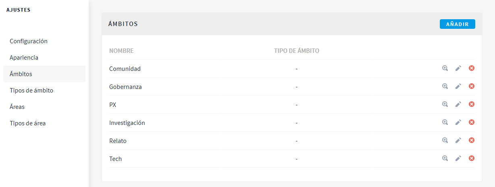

[[h.3o7alnk]]
== Configuración de la plataforma Decidim del municipio

Para configurar la plataforma Decidim del municipio, haz clic en *CONFIGURACIÓN*, en la parte inferior del panel de administración (*PANEL DE CONTROL*). Aparecerá un formulario con la información que hay que añadir y las imágenes que se pueden cargar.

[#image76-fig]
._Configuración de la plataforma Decidim._

[#image77-fig]
._Apariencia de la plataforma Decidim._

La plataforma es multi idioma, aunque la traducción no se realiza automáticamente. Si se ha decidido que la plataforma esté en dos lenguas, por ejemplo, catalán y castellano, deberán completarse los campos en ambos idiomas. Para cada uno de los campos de texto, habrá que hacer clic en *CA* cuando se escriba en catalán y en *CAS* para el texto en castellano.

Los campos que hay que completar son los siguientes:

Apartado *Configuración* (ver <<image76-fig>>):

* *Nombre*: corresponde al nombre de la plataforma, en el ejemplo, *Formación Decidim*.
* *Social*: nombre del perfil de las redes sociales (Twitter, Facebook, Instagram, YouTube, Github). Solo el de las que se utilizan.
* *Idioma por defecto*: selecciona el idioma por defecto con el que se abrirá la plataforma.
* *Prefijo de referencia*: identificador único o acrónimo del nombre del municipio que aparecerá con las propuestas, en las citas presenciales, en los resultados, etcétera.

Apartado *Apariencia* (ver <<image77-fig>>):

* *Mostrar estadísticas*: debe marcarse para mostrar las estadísticas.
* *Descripción*: breve texto de introducción a continuación de la imagen principal.
* *Texto de bienvenida*: eslogan (frase breve) que aparece sobre la imagen principal. En el ejemplo, “¡Bienvenido/a a la Formación Decidim!”.
* *Ruta del botón de acción principal*: puedes sobrescribir el texto del botón de acción principal en la página de inicio para cada idioma disponible en tu organización. Si no está configurado, se usará el valor predeterminado. El botón de acción principal se muestra en la página de inicio entre el texto de bienvenida y la descripción.
* *Texto del botón de acción principal*: puedes sobrescribir el texto del botón de acción principal en la página de inicio para cada idioma disponible en tu organización. Si no está configurado, se usará el valor predeterminado. El botón de acción principal se muestra en la página de inicio entre el texto de bienvenida y la descripción.
* *Banner de contenido resaltado*: puedes clicar *Mostrar el banner de contenido resaltado* y rellenar los siguientes datos: *Título, Descripción breve, Título del botón de acción, Subtítulo del botón de acción, URL del botón de acción, Imagen*, se verá la imagen actual y podrás eliminarla clicando *Eliminar este archivo*.
* *Editar banner omnipresente*: clica *Mostrar banner omnipresente* y rellena los siguientes datos: *Título, Descripción breve* y *URL*.
* *URL oficial de la organización*: dirección web institucional de la institución.
* *Fragmentos de cabecera*: este campo sirve para añadir elementos al head de HTML. El uso más habitual es integrar servicios de terceros que requieren código JavaScript o CSS adicional. Además, puedes utilizarlo para añadir etiquetas meta adicionales al HTML. Hay que tener en cuenta que eso solo se mostrará en las páginas públicas, no en la sección de administración.

Con respecto a las imágenes, se recomienda ver antes su disposición en alguna de las plataformas Decidim. Deben cargarse las siguientes imágenes:

* *Imagen de la portada*: fotografía o imagen de la página principal (dimensiones mínimas: 2.880 px de anchura × 1.800 px de altura).
* *Logotipo*: imagen corporativa de la plataforma Decidim (dimensiones mínimas: 456 px de anchura × 148 px de altura).
* *Icono*: favicono o icono de página que permite identificar la página web (dimensiones mínimas: 80 px de anchura × 74 px de altura).
* *Logotipo oficial de la cabecera*: corresponde al isotipo del Ayuntamiento. Aparecerá en la parte superior derecha de todas las páginas de la plataforma (dimensiones mínimas: 271 px de anchura × 88 px de altura).
* *Logotipo oficial del pie de página*: isotipo del Ayuntamiento. Aparece en la parte inferior izquierda de todas las páginas (dimensiones: 64 px de anchura × 64 px de altura).

Una vez hecho, haz clic en *Actualizar*.

Para acabar de configurar la plataforma, hay que especificar los ámbitos, esto es, las áreas territoriales de organización (distritos, barrios, etc.) o sectoriales a las que se podrán vincular los procesos participativos. Los ámbitos se pueden clasificar según *tipo de ámbito* si se considera oportuno.

Para configurar los tipos de ámbito, en el submenú *CONFIGURACIÓN*, haz clic en *Tipos de ámbito* y, a continuación, haz clic en *AÑADIR*. Completa los campos *Nombre y Plural* (en catalán y en castellano) y *haz clic en Crear tipo de ámbito* (ver <<image6-fig>>)

[#image6-fig]
._Tipos de ámbito._

Para configurar los ámbitos, en el submenú *CONFIGURACIÓN*, haz clic en *Ámbitos*, y añade los ámbitos uno por uno, haciendo clic en *AÑADIR*. Para cada uno de los ámbitos, hay que completar los campos *Nombre y Código* (en catalán y en castellano) y seleccionar el tipo de ámbito en el desplegable *Scope type*. A continuación, haz clic en *Crear ámbito* (ver <<image20-fig>>).

[#image20-fig]
._Nuevo ámbito._

Una vez creados, aparece la lista de los ámbitos que han sido configurados (nombre y tipo de ámbito). Desde esta lista, haciendo clic en los iconos de la derecha, se puede *explorar, editar* y *eliminar* cada uno de los ámbitos (ver <<image5-fig>>).

[#image5-fig]
._Ámbitos._

