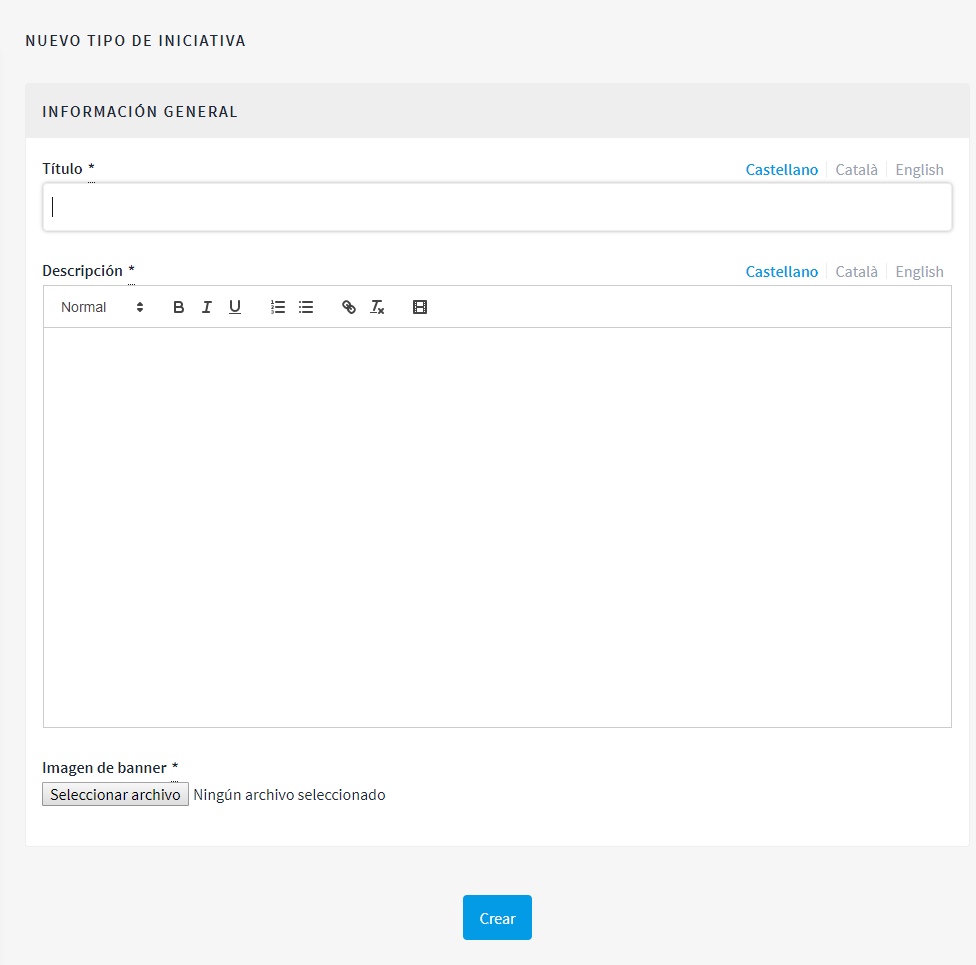

[[h.n6hsqx6ppdk]]
[[h.3jtnz0s]]
== Iniciativas

Las iniciativas (en el caso de las administraciones públicas, ciudadanas o populares) se diferencian del resto de espacios de participación porque son instrumentos o mecanismos de participación promovidos por la ciudadanía. Es decir, las iniciativas son mecanismos de democracia semidirecta mediante los que las ciudadanas y los ciudadanos pueden promover una determinada actuación de interés común por parte de la Administración, a partir de la recogida de un número de firmas específico.

En este caso, la administración debe facilitar la promoción de las iniciativas y ofrecer la asistencia técnica y el asesoramiento necesarios a las personas interesadas. Por lo tanto, el rol del administrador de la plataforma es algo diferente al del resto de los espacios de participación. En primer lugar, hay que configurar las diferentes modalidades de iniciativas previstas por la normativa (reglamento municipal), especificando el número de firmas necesarias para la tramitación de los diferentes tipos de iniciativa ciudadana. Es evidente que una iniciativa que consiste en la incorporación de uno o varios puntos en el orden del día del Consejo Municipal requiere menos firmas que otra iniciativa dirigida a promover la celebración de una consulta ciudadana.

Para configurar el tipo de iniciativas, haz clic en *INICIATIVAS*, en el menú de la izquierda del PANEL DE CONTROL; a continuación, haz clic en *Tipo de iniciativa*, en el submenú de *Iniciativas* y en *NUEVO/A* (ver <<image37-fig>>).

[#image37-fig]
._Submenú Iniciativas._

Se abrirá la ventana *Nuevo tipo de iniciativa* (ver <<image75-fig>>), donde hay que escribir el *título* y la *descripción* de la iniciativa y cargar una *imagen*. Para finalizar, haz clic en *Crear*.

[#image75-fig]
._Nuevo tipo de iniciativa._

A continuación, se abrirá una ventana con la información que se acaba de crear sobre el tipo de iniciativa, en la que se debe especificar el número de firmas que requiere en función de los posibles ámbitos: ciudad, barrio o distrito (ver <<image66-fig>>).

[#image66-fig]
._Número de apoyos de iniciativas._

En segundo lugar, el administrador deberá hacer el seguimiento de las iniciativas creadas por las personas usuarias y revisar que toda la información presentada sea correcta. En el submenú de Iniciativas (ver <<image37-fig>>), haz clic en *Iniciativas* y, a continuación, en la iniciativa que corresponda. A la izquierda, sobre el submenú de aquella iniciativa (ver <<image3-fig>>), se puede hacer lo siguiente: configurar los *miembros del comité* y los *encuentros* y crear una *página* y *adjuntos*. El procedimiento para configurar estas funcionalidades/ componentes es idéntico a cuando se hace en otros espacios de participación, como los procesos participativos o las asambleas.

[#image3-fig]
._Submenú de una iniciativa concreta._

Para hacer las acciones de seguimiento de la iniciativa, haz clic en *Información*, en el submenú de la iniciativa. En la parte inferior, aparecerán los siguientes botones: *Actualizar, Enviar a validación técnica, Publicar* (*Despublicar*, en caso de que ya haya sido publicada), *Descartar la iniciativa* y *Exportar soportes* (en .CSV, visible cuando la iniciativa ha sido publicada).

Por ejemplo, una iniciativa se puede descartar cuando limita o restringe los derechos y las libertades fundamentales y, en el caso de los ayuntamientos, cuando no se refiere a materias de competencia municipal.
