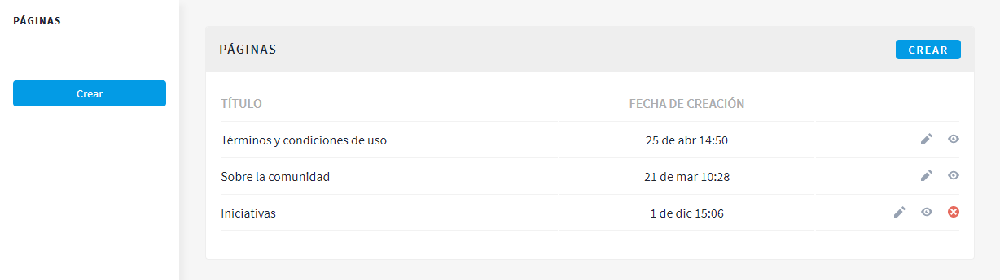
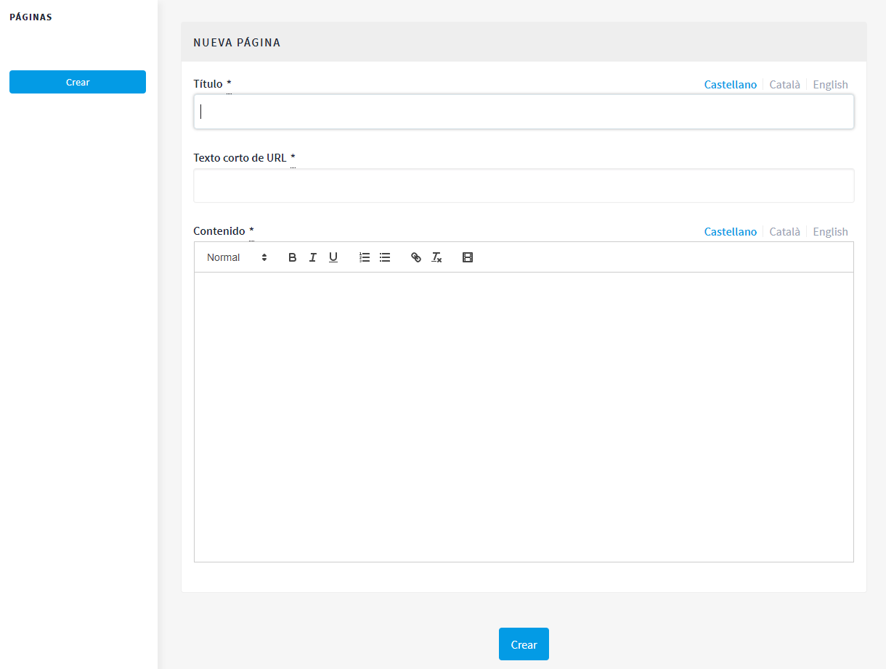

[[h.41mghml]]
== Páginas

Hace referencia a las páginas estáticas que contienen la información general sobre la plataforma Decidim, como las preguntas frecuentes (FAQ) (¿qué es Decidim?, ¿cómo puedo participar?, ¿cómo creo y verifico mi cuenta?, ¿qué son los procesos participativos?, etc.), los términos y las condiciones de uso (informaciones legales y de utilización) y los aspectos relacionados con la accesibilidad de la plataforma. Los usuarios o participantes podrán acceder a estas informaciones desde la pestaña *Más información* (en el menú principal) y desde el _footer_ (a pie de página).

Para crear y editar las páginas estáticas, haz clic en *PÁGINAS*, en el menú del *PANEL DE CONTROL*. A continuación, haz clic en *Crear* en el submenú *PÁGINAS* o directamente en la ventana que se abre y donde aparecerá la lista de páginas estáticas una vez que hayan sido creadas (ver <<image58-fig>>).

[#image58-fig]
._Páginas._

Desde esta lista, haciendo clic en los iconos de la derecha, también se puede *visualizar* cómo quedarán las páginas, así como *editar* y *eliminar* cada una de ellas.

Cuando se configura una página, deben completarse los siguientes campos (ver <<image28-fig>>): el *título* de la página, el *contenido* (el texto al que hace referencia la página) y el *nombre corto de URL* que identificará la página (por ejemplo, si la página es sobre accesibilidad, “accessibility”: la palabra _accessibility_ aparecerá al final de la dirección web de la página, https://decidim.diba.cat/pages/accessibility). Al acabar, haz clic en *Crear*.

Para la redacción del contenido de las páginas estáticas, se pueden ver y utilizar libremente los textos que hay en el anexo I.

[#image28-fig]
._Nueva página_

