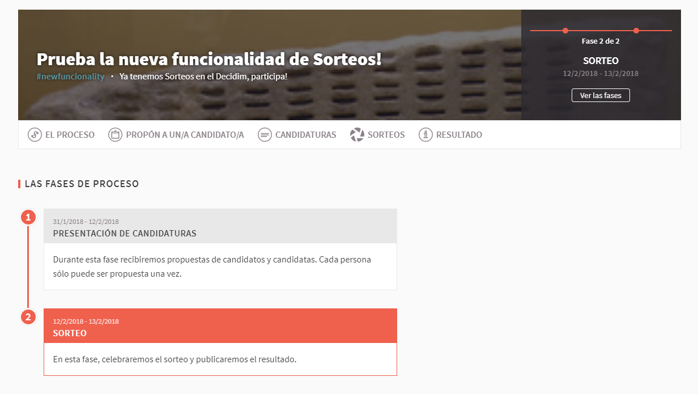
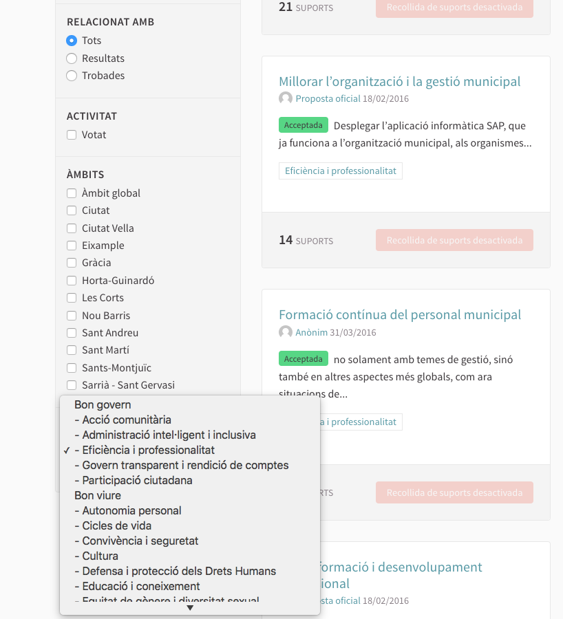
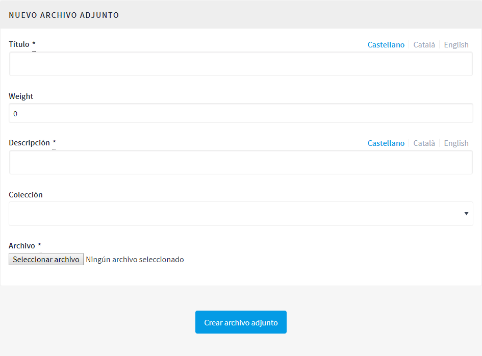
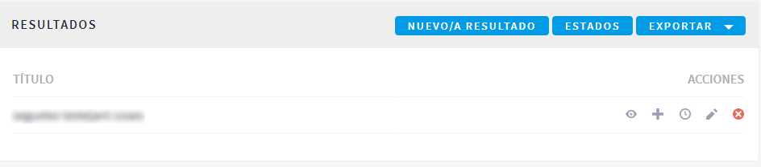
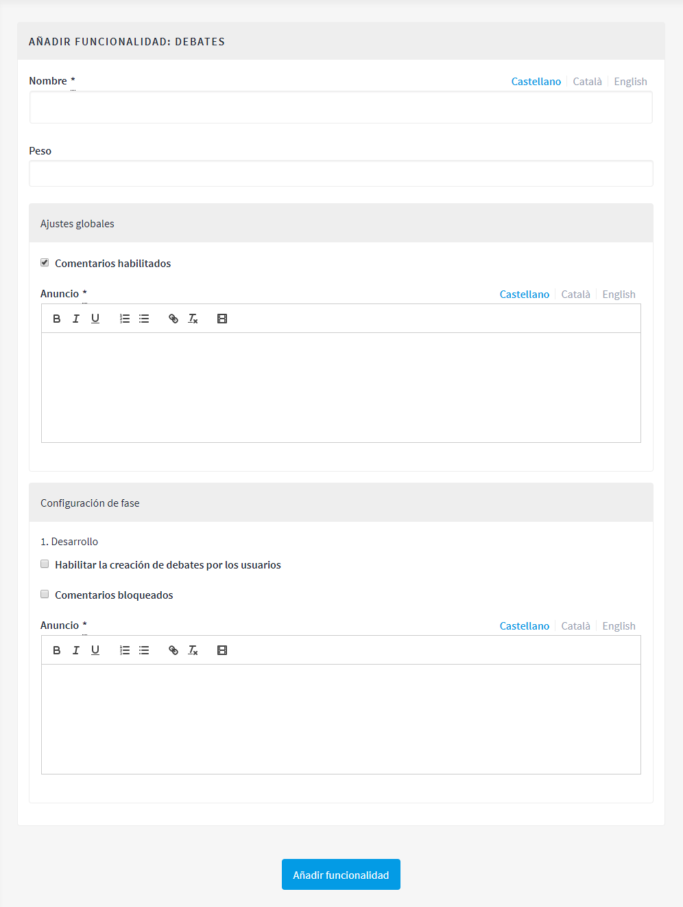

[[h.28h4qwu]]
== Procesos

Para configurar los procesos participativos en la plataforma Decidim, haz clic en *PROCESOS*, en el *PANEL DE CONTROL*. Aparecerá una lista con los procesos, en caso de que los haya (Figura 21).

._Procesos participativos._

Para cada uno de los procesos se muestra la fecha de creación, si está publicado o no, y se permite realizar las siguientes acciones, haciendo clic en los iconos correspondientes: duplicar el proceso, configurarlo y previsualizar cómo quedará una vez publicado. +
Se puede editar la información sobre los procesos haciendo clic en el icono *Configurar* o bien en el nombre del proceso. +
Para crear un nuevo proceso, haz clic en *Nuevo/a*, en el submenú *PROCESOS PARTICIPATIVOS*, o en la parte superior derecha de la ventana (Figura 21). Se abrirá la pantalla donde hay que escribir la información general sobre el proceso (véase “3.5.1. Información”). La configuración del proceso (fases, usuarios, funcionalidades/ componentes, etc.) se realiza a través del submenú del proceso que aparece cuando se hace clic en un proceso en la pantalla de la lista de procesos (Figura 22). Este submenú se encuentra a la izquierda de la ventana del proceso.

._Submenú de proceso participativo._

[[h.mo0ztn8aefux]]
[[h.1mrcu09]]
=== Información

En primer lugar, hay que completar los campos con la información general sobre el proceso. Haz clic en *PROCESOS*, en el *PANEL DE CONTROL*, y haz clic en *Nuevo/a*, en el submenú de *PROCESOS PARTICIPATIVOS* o en la parte superior derecha de la ventana que aparece donde está la lista de procesos. Se abrirá la ventana *NUEVO PROCESO PARTICIPATIVO* (Figura 23).

._Nuevo proceso participativo._

Completa los siguientes campos (cabe recordar que, en caso de que la plataforma esté en dos idiomas o más, hay que completar la información en los diferentes idiomas):

* *Título*: nombre del proceso participativo.
* *Subtítulo*:  nombre del subtítulo.
* *Texto corto de URL*: palabra que identifica la página web donde se encontrará la información general sobre el proceso. Por ejemplo, “nombredelproceso”, https://decidim.nomdelmunicipi.com/processes/nombredelproceso.
* *_Hashtag_*: etiqueta para redes sociales, la misma que se utilizará en las campañas de redes, Twitter, Facebook, Instagram, etcétera (una sola palabra).
* *Fecha de inicio*: selecciona la fecha correspondiente en el calendario que aparece cuando se hace clic en el cuadro Fecha de inicio.
* *Fecha de finalización*: selecciona la fecha correspondiente en el calendario.
* *Destacado*: debe marcarse si se desea destacar el proceso en la página principal de la plataforma.
* *Descripción breve*: debe explicar las acciones de participación en máximo de 600 caracteres.
* *Descripción*: a partir de 1.600 caracteres se mostrará un “Leer más”.
* *Imagen de portada*: imagen asociada al proceso participativo que aparece en la página general de procesos (Figura 24) y en la página principal de la plataforma Decidim, si se ha marcado la opción de destacado (Figura 25) (dimensiones mínimas: 1.015 px de anchura × 667 px de altura).
* *Imagen de banner*: imagen para todas las páginas del proceso. Se publica en la parte superior de las páginas, de izquierda a derecha (figura 26) (dimensiones mínimas: 1200 px de anchura × 300 px de altura).
* *Grupo promotor*: gestor/a y responsable político del proceso participativo. Puede ser solo el Ayuntamiento o un grupo formado por técnicos o políticos del Ayuntamiento, y ciudadanos, asociaciones, empresas u otras entidades.
* *Áreas municipales*: áreas del Ayuntamiento implicadas en el proceso participativo.
* *Metadatos de ámbito*: no se mostrará, pero es información interna sobre el ámbito de la ciudad al que va dirigido el proceso.
* *¿A quién va dirigida?*: personas a quienes está destinado el proceso participativo.
* *Ámbitos habilitados*: debe marcarse si se desea identificar con un ámbito de actuación (municipal, distrito 1, distrito 2...).
* *Ámbito*: selecciona el ámbito correspondiente en el desplegable. Previamente, se deberán haber creado los ámbitos^link:#ftnt7[[7]]^.
* *Ámbito participativo*: explicación del margen o de los límites de decisión que tendrá la ciudadanía en este proceso.
* *Estructura participativa*: grupo motor, comisión de seguimiento, grupo de trabajo, entidades que han participado en los diversos talleres y reuniones del proceso de participación.
* *Grupo de procesos*: en caso de que se trate de un proceso dentro de un grupo, selecciona el grupo de procesos correspondiente en el desplegable. Por ejemplo, un plan de acción por distrito, dentro de un plan de acción municipal. Previamente, debe haberse creado el grupo. Si no forma parte de ningún grupo, selecciona *Ninguno* en el desplegable.
* *Mostrar estadísticas*: debe marcarse si se desean mostrar las estadísticas del proceso (número de encuentros, propuestas...) en la página principal del proceso.
* *Anuncio*: en caso de que se desee que aparezca un párrafo con un anuncio específico (por ejemplo, si empieza una nueva fase en algún proceso de participación).

._Imagen de portada de la página general de procesos._

._Imagen de portada de la página principal de Decidim._

._Imagen de banner._

Para finalizar, haz clic en *Crear*. Se puede ver cómo se visualizará toda esta información haciendo clic en el icono *Previsualizar*, que corresponde al proceso.

Para acabar de configurar el proceso, en la ventana donde está la lista de procesos, haz clic sobre el nombre del proyecto. Se abrirá la ventana con la información general sobre el proceso y, a la izquierda, aparecerá el submenú del proceso, a través del cual se pueden configurar las fases del proceso, las funcionalidades/ componentes, las categorías y las usuarias del proceso, las moderaciones y la información adjunta.

[[h.206ipza]]
=== Fases del proceso

Un proceso participativo se verá reflejado en la plataforma Decidim en fases diferentes, cada una con una fecha de inicio y una de finalización predefinidas al principio, con el objetivo de que la ciudadanía tenga claro en qué momento del proceso se encuentra y cómo puede participar en cada momento.

A título orientativo, la estructura estándar de un proceso participativo puede ser esta: fase 1: presentación; fase 2: diagnosis; fase 3: creación de propuestas y debate; fase 4: priorización de propuestas; fase 5: selección de resultados; fase 6: valoración; fase 7: seguimiento.

Para configurar las fases del proceso, haz clic en *Fases del proceso*, en el submenú del *PROCESO PARTICIPATIVO*. A continuación, haz clic en *NUEVO/A*. Se abrirá la ventana *NUEVA FASE DE PROCESO PARTICIPATIVO* (Figura 27).

Para cada una de las fases, debe escribirse lo siguiente:

* *Título*.
* *Descripción*.
* *Fecha de inicio* y *Fecha de finalización*.

Después, haz clic en *Crear*.

._Nueva fase de proceso participativo._

Para activar la fase en que se encuentra el proceso, en el submenú del *PROCESO PARTICIPATIVO*, haz clic en *Fases del proceso*. Se abrirá la ventana donde están todas las fases del proceso que han sido configuradas y los iconos que permiten *activar*, *editar* y *eliminar* cada una de ellas. Haz clic en *Activar* en la fase correspondiente (Figura 28).

._Fases del proceso._

Las personas usuarias podrán visualizar las diferentes fases y descripciones que han sido configuradas, haciendo clic en *Ver las fases* (en la imagen de bandera, a la derecha). La fase que se encuentra activa se evidenciará marcada en rojo (Figura 29).

._Visualización de las fases del proceso del usuario participante._

[[h.3ygebqi]]
=== Categorías

Las categorías (y subcategorías) sirven para clasificar contenidos en los diferentes espacios o procesos de participación; también facilitan a las personas usuarias filtrar los contenidos. Se definen para cada una de las instancias de los espacios.  Por ejemplo, un proceso de participación puede incluir varias categorías y subcategorías, y los encuentros, las encuestas, las propuestas u otros componentes del proceso se pueden clasificar en estas categorías. Una categoría podría ser “Medio ambiente” y dos subcategorías de esta, “Movilidad” y “Calidad del aire”. En la Figura 30 se pueden ver las categorías y subcategorías que se utilizaron en el proceso participativo para la elaboración del Plan de actuación municipal (PAM) de Barcelona del 2016.

._Categorías y subcategorías en el PAM de Barcelona del 2016._

Es importante tener en cuenta que, una vez definidas las categorías, no conviene cambiarlas porque se convierten en el índice que estructura los contenidos en un espacio de participación. Por ejemplo, en el caso de un proceso participativo para la elección de candidatos, las categorías podrían identificar listas o tipos de candidaturas. Y en caso de que el proceso fuera para definir un plan, las categorías coincidirían con el índice de este plan.

También se debe tener en cuenta que, con respecto a la clasificación de contenidos, Decidim también permite diferenciar y configurar ámbitos y etiquetas (o _tags_). A diferencia de las categorías, los ámbitos (territoriales o temáticos) son generales en toda la plataforma y se definen durante la configuración de la plataforma Decidim del municipio o entidad^link:#ftnt8[[8]]^, mientras que las etiquetas las definen libremente las personas participantes y se pueden aplicar a cualquier instancia o componente. Desde el panel de administración también se pueden crear etiquetas y anidarlas.

Para configurar las categorías, haz clic en *Categorías*, en el submenú del *PROCESO PARTICIPATIVO*. A continuación, haz clic en *NUEVO/A*. Para cada una de las categorías o subcategorías hay que completar los siguientes campos (Figura 31): *Nombre*, *Descripción* y, en caso de que se trate de una subcategoría, debe seleccionarse la categoría a la que corresponde en el desplegable *Superior*. Al acabar, haz clic en *Crear categoría*.

._Nueva categoría._

[[h.v6dehq58nhup]]
[[h.1th6b06t1xzs]]
[[h.3cqmetx]]
=== Adjuntos: Colecciones y Archivos

Cuando se pone en marcha un proceso participativo es importante facilitar a la ciudadanía el máximo de información posible sobre el mismo para que puedan participar con conocimiento. Por eso resulta útil poder añadir archivos (Adjuntos) con la información que se considere relevante.

Estos documentos se pueden clasificar/agrupar en *Colecciones*. Por ejemplo para un proceso de remodelación de una plaza, se podrían crear las colecciones con información sobre los posibles usos, con los planos, con información económica, etc.

En primer lugar se crean las colecciones para más adelante poder adjuntar los archivos. Haz clic en *Colecciones* en el submenú del PROCESO PARTICIPATIVO, se abrirá la ventana *COLECCIONES DE ARCHIVOS ADJUNTOS* (Figura 32).

._Colecciones de archivos adjuntos._

A continuación pulsar *NUEVO/VA* para crear una nueva colección. Añadir *Nombre*, *Peso* (_Weight_) y una *Descripción*. Para finalizar, pulsar Crear (Figura 33).

._Nueva Colección._

Después de haber creado las colecciones, podréis añadir ficheros adjuntos a las carpetas haciendo clic en *Archivos* de los Procesos participativos donde se verán los ficheros adjuntos. Hacer clic en NUEVO/A para adjuntar nuevos archivos (Figura 34) Se abrirá la ventana NUEVO ARCHIVO ADJUNTO. Completa los campos *Título*, *Peso* (_Weight_) y *Descripción, Colección* (selecciona la colección creada anteriormente) y carga el archivo haciendo clic en *Archivo/Seleccionar archivo*. Para finalizar, haz clic en *Crear archivo adjunto*.

Los ficheros adjuntos deben ser documentos en formatos abiertos (.odt, .rtf .pdf, etc.). El sistema no permite subir textos en formatos como .doc (aparecería un mensaje solicitando el cambio de formato, porque se ha intentado subir un texto en formato no libre ni interoperable).

La persona usuaria verá estos documentos en la pantalla de información sobre el proyecto (en la parte de abajo).

._Nuevo archivo adjunto._

[[h.t82i6agvul12]]
[[h.4bvk7pj]]
=== Usuarios del proceso

Además de los administradores generales de la plataforma, se pueden conceder permisos a otras personas para que administren un determinado proceso, para que colaboren o para que moderen cuando haya contenidos que han sido denunciados.

Los *administradores* de un proceso pueden configurar o editar el proceso, mientras que los *colaboradores* solo pueden ver lo que hay en el menú administrador del proceso, pero no pueden configurar o editar.

Para dar de alta a los administradores, colaboradores o moderadores de un proceso, en el submenú del proceso, dirígete a *Usuarios del proceso* y haz clic en *NUEVO/A*.

Se abrirá la pantalla *NUEVO USUARIO DEL PROCESO PARTICIPATIVO* (Figura 35).

._Nuevo usuario del proceso participativo._

Hay que completar los siguientes campos: *Nombre, Correo electrónico* y *Rol* (selecciona en el desplegable *Administrador, Colaborador* o *Moderador*). A continuación, haz clic en *Crear*.

[[h.1664s55]]
=== Moderaciones

La funcionalidad/ componente *Moderaciones* permite moderar los debates para que estos sean democráticos y constructivos. Haciendo uso de esta funcionalidad/ componente, los administradores, los colaboradores o el moderador de un proceso pueden ocultar los contenidos o aportaciones que han sido denunciados, cuando se considere pertinente la denuncia, o deshacer la denuncia.

En general, se consideran contenidos denunciables los que son ofensivos, pueden ser considerados _spam_ (posts publicitarios relacionados o no con el tema de debate, enlaces a páginas web maliciosas, _trolling_, información abusiva o no deseada) o no están relacionados con el tema de discusión.

Para la gestión de los contenidos denunciados, haz clic en *Moderaciones*, en el submenú del proceso. Aparecerá una pantalla con todos los comentarios que han sido denunciados pendientes de moderación y la siguiente información para cada uno de ellos (Figura 36):

* *TIPO*: si se trata de una propuesta (*Proposal*) o de un comentario (*Comment*).
* *URL del contenido reportado*: enlace donde se puede ver el contenido denunciado y las motivaciones que han llevado a denunciarlo.
* *DENUNCIAS*: por qué ha sido denunciado. Puede ser porque no está relacionado con el tema de debate (_does_not_belong_), porque se trata de _spam_ o porque es un comentario ofensivo (_offensive_).
* *RECUENTO*: número de veces que ha sido denunciado por usuarios diferentes.
* *ACCIONES*: haciendo clic en los iconos de la derecha puedes *cancelar denuncia* o *esconder*.

._Moderaciones._

Los contenidos denunciados que ya han sido ocultados se pueden ver haciendo clic en *OCULTAS* (en la parte superior derecha del cuadro de moderaciones). Aparecerá la lista de los contenidos denunciados ocultos y la siguiente información para cada uno (Figura 37): TIPO, CONTENIDO, DENUNCIAS, RECUENTO, FECHA DE OCULTACIÓN (la fecha en que se ha ocultado el contenido), ACCIONES (en este caso, la acción posible es *Deshacer denuncia*).

Para volver a los contenidos denunciados visibles, haz clic en *NO OCULTAS*, en la parte superior derecha del cuadro de moderaciones.

._Contenidos ocultos._

[[h.y22j3ksw0qle]]
[[h.acqirzuol6hj]]
[[h.qxdrdlg3nfmt]]
[[h.kgcv8k]]
=== Funcionalidades/ Componentes

Actualmente, existen las siguientes funcionalidades/ componentes de los procesos participativos:

* *PÁGINA*: páginas estáticas con soporte multi idioma. Opcionalmente, permiten comentarios y agregar _iframes_.
* *ENCUENTROS*: encuentros presenciales, es decir, acontecimientos cara a cara incluidos en un proceso.
* *PROPUESTAS*: contribuciones escritas de los usuarios y las usuarias en la plataforma, que pueden ser objeto de decisión.
* *PRESUPUESTOS*: módulo específico para desplegar un proceso de presupuestos participativos. Permite determinar el porcentaje mínimo sobre el total del presupuesto para dar apoyo a los proyectos presentados.
* *ENCUESTA*: para diseñar, realizar y visualizar los resultados de encuestas.
* *SEGUIMIENTO*: fichas de seguimiento de actuaciones, proyectos, planes, etcétera. Permite la agregación de otros componentes, como las propuestas o las citas presenciales.
* *DEBATES*:  permite abrir debates sobre preguntas o temas específicos definidos por los administradores o por los participantes.
* *SORTEOS*: permite determinar las personas que formarán parte de un grupo (como un comité) de forma aleatoria de entre un grupo más amplio.

Para configurar las funcionalidades/ componentes, haz clic en *Funcionalidades/ Componentes*, en el submenú del *PROCESO*. Aparecerá una lista con las funcionalidades/ componentes que ya han sido configuradas por el proceso, el *NOMBRE DE LA FUNCIONALIDAD/ COMPONENTE* que se le ha dado y el *TIPO DE FUNCIONALIDAD/ COMPONENTE* que se ha utilizado para crearla (Figura 38).

Desde esta lista, mediante los iconos, se pueden realizar las siguientes acciones: *gestionar, publicar/despublicar, configurar*, configurar los *permisos* y *eliminar la funcionalidad/ componente*.

._Funcionalidades/ Componentes del proceso._

Para configurar una nueva funcionalidad/ componente, haz clic en *Añadir funcionalidad/ componente*, en la parte superior derecha de la ventana, y selecciona el tipo de funcionalidad/ componente que se desees configurar en el desplegable (Figura 39).

._Añadir funcionalidad/ componente._

[[h.43ky6rz]]
==== Página

Se trata de páginas con información sobre los diferentes procesos en las que se puede describir el proceso, sus fases, cómo se puede participar en él, sus objetivos, etcétera.

Para añadir una página, haz clic en *Página*, en el desplegable *Añadir funcionalidad/ componente*. Se abrirá la ventana *AÑADIR FUNCIONALIDAD/ COMPONENTE: PÁGINA*, en la que se deben completar los siguientes campos (Figura 40):

* *Nombre*: nombre de la página.
* *Peso*: corresponde al orden en el que los componentes (en este caso, la página) se muestran en el menú del proceso participativo.
* En *Ajustes globales*, solo si deseas mostrar un *aviso* en la *página* (mensaje destacado), escribe el contenido del mensaje.
* En *Configuración de fase*, solo si deseas mostrar un *aviso* en la *página* (mensaje destacado) durante la ejecución de una fase, escribe el contenido del mensaje en la fase en la que debería aparecer.

A continuación, haz clic en *Añadir funcionalidad/ componente*.

._Añadir página._

Para crear o editar los contenidos de la página configurada, en el submenú de la izquierda del proceso de participación, en *Funcionalidades/ Componentes*, haz clic sobre el *Nombrepágina* (el nombre que se le ha dado a la página).

Se abrirá la ventana Editar página. En el cuadro *Cuerpo*, escribe el contenido de la página. Después, haz clic en *Actualizar* (Figura 41).

._Editar página._

También se puede editar la página o cambiar su configuración desde la ventana *Funcionalidades/ Componentes* (Figura 38), haciendo clic en los iconos correspondientes (*Gestionar* y *Configurar*). Asimismo, desde esta ventana se puede *publicar/despublicar* o *eliminar* la página.

[[h.3hv69ve]]
==== Encuentros

Para añadir los actos presenciales, en primer lugar, hay que configurar la funcionalidad/ componente *Encuentros*. En el desplegable *Añadir funcionalidad/ componente* (Figura 39), haz clic en *Encuentros*; se abrirá la ventana *AÑADIR FUNCIONALIDAD/ COMPONENTE: ENCUENTROS* (Figura 42).

Hay que dar un *nombre* a la funcionalidad/ componente Encuentros, seleccionar el *peso* (posición en el menú del proceso) y, en *Ajustes globales* y *Configuración de fase*, escribir los *avisos*, en su caso, y marcar (haciendo clic) *Comentarios habilitados* para que los participantes del proceso puedan hacer comentarios en los encuentros o *comentarios bloqueados*.

A continuación, haz clic en *Añadir funcionalidad/ componente*.

Una vez configurada la funcionalidad/ componente *Encuentros*, se pueden crear los encuentros. En el submenú de la izquierda del proceso de participación, en *Funcionalidades/ Componentes*, haz clic en *NombreEncuentros* (el nombre que se le ha dado a la funcionalidad/ componente). Se abrirá la ventana *ENCUENTROS* con la lista de encuentros que se han creado previamente (Figura 42).

._Encuentros._

Desde esta ventana, haciendo clic sobre los iconos, se pueden realizar las siguientes acciones:

* *Previsualizar* cómo quedará la publicación del encuentro.
* *Editar*.
* Configurar *Inscripciones*.
* *Cerrar* el encuentro una vez realizado.
* *Adjuntar* colecciones.
* *Adjuntar* archivos.
* *Borrar* (eliminar el encuentro).

Para crear un encuentro, haz clic en *NUEVO*, en la parte superior derecha de la ventana *ENCUENTROS* (Figura 43). Se abrirá la ventana *AÑADIR FUNCIONALIDAD/ COMPONENTE: ENCUENTROS*.

._Añadir funcionalidad/ componente: Encuentros._

La información que debe editarse cuando se crea un encuentro es la siguiente (Figura 44):

* *Título*.
* *Descripción*.
* *Dirección*: nombre de la vía, número, código postal, ciudad.
* *Ubicación*: nombre del edificio, sala donde se realizará, etcétera.
* *Pistas de ubicación*: en su caso, cómo llegar, piso, bloque, etcétera.
* *Hora de inicio*: selecciona la fecha y los horarios en el calendario que aparece haciendo clic en el campo.
* *Hora de finalización*: idem.
* *Ámbito*: selecciona el ámbito en el desplegable (ciudad, barrio o distrito).
* *Categoría*: en su caso, selecciona la categoría en el desplegable.

._Crear encuentro._

Para activar las inscripciones del encuentro, en la ventana *ENCUENTROS* (Figura 42), haz clic en el icono *Inscripciones*. Se abrirá la ventana *Inscripciones* (Figura 45), en la que hay que hacer clic en *Inscripciones abiertas*, seleccionar en el desplegable *Espacios disponibles para este encuentro* el aforo disponible (dejar en 0 si los espacios disponibles son ilimitados) y escribir los plazos de inscripción en *Términos y condiciones de inscripción*. Al acabar, haz clic en *Guardar*. Desde esta ventana se pueden exportar las inscripciones a los formatos CSV, JSON o EXCEL seleccionando el formato en el desplegable *Exportar*.

._Inscripciones._

Si deseas adjuntar un archivo a la información sobre el encuentro, en la ventana *ENCUENTROS* (Figura 42), haz clic en el icono *Adjuntos*. Se abrirá la ventana *ADJUNTOS* (Figura 46), donde aparecerá la lista si hay otros archivos adjuntos, desde la que, además, se pueden *editar* o *eliminar* los archivos adjuntos.

._Adjuntos._
image::images/image21.png[]

Hacer clic en *NUEVO/A* para adjuntar un archivo. A continuación, en la ventana *NUEVO ARCHIVO ADJUNTO* (Figura 47), escribe el *título* y la *descripción*, carga el archivo (haciendo clic en *“Seleccionar archivo”* , en *Archivo*) y, finalmente, haz clic en *Crear archivo adjunto*.

._Nuevo archivo adjunto._

[[h.pkwqa1]]
==== Propuestas

Para configurar la funcionalidad/ componente *Propuestas*, en el submenú del *PROCESO*, haz clic en *Funcionalidades/ Componentes*. A continuación, haz clic en *Añadir funcionalidad/ componente*, en la parte superior derecha de la ventana, y selecciona *Propuestas*. Se abrirá la ventana *AÑADIR FUNCIONALIDAD/ COMPONENTE: PROPUESTAS* (Figura 48). La información que se debe escribir cuando se configura la funcionalidad/ componente Propuestas es la siguiente:

* *Nombre*.
* *Peso*: el orden en que el componente *Propuestas* se mostrará en el menú del proceso participativo.
* *Ajustes globales*:

** *Límite de votos por usuario*: selecciona, en su caso, el límite de apoyos que puede dar un usuario.
** *Límite de propuestas por usuario*: número máximo de propuestas que pueden realizar los usuarios
** *Longitud máxima del cuerpo de la propuesta*: seleccionar en el desplegable el número máximo de caracteres que puede tener el texto de la propuesta. Por defecto son 500 caracteres.
** *Las propuestas pueden ser editadas por los autores antes de que pasen estos minutos*: límite de tiempo durante el cual los autores de las propuestas pueden modificarlas. Por defecto son 5 minutos, es aconsejable no dejar mucho tiempo para que si alguien apoya la propuesta o hace algún comentario ya no sea modificable.
** *Umbral por propuesta/ Máximo de votos por propuesta*: número máximo de apoyos que pueden recibir las propuestas.
** Marca las opciones que deseas activar para la configuración general de la funcionalidad/ componente Propuestas: *Puede acumular apoyos más allá del umbral, Respuesta oficial a propuestas habilitadas, Propuestas oficiales habilitadas, Comentarios habilitados, Geocodificación habilitada, Permitir archivos adjuntos*.
** *Aviso*: escribir si se quiere mostrar un aviso.
** *Texto de ayuda al crear una propuesta*: escribir si se quiere mostrar cuando la usuaria esté realizando una propuesta.
** *Texto de ayuda para el paso "Crear" del asistente de propuesta*: ídem.
** *Texto de ayuda para el paso "Comparar" del asistente de propuesta*: escribir cuando se muestren propuestas similares.
** *Texto de ayuda para el paso "Publicar" del asistente de propuesta*: aviso que sale antes de publicar la propuesta, por si se quiere editar.

* *Configuración de fase*:

** Marca las opciones que se desea activar para cada una de las fases: Reivindicaciones habilitadas, *Reivindicaciones bloqueadas, Votos habilitados, Votación bloqueada, Votos ocultos* (si los votos están habilitados, marcando esta opción se oculta el número de votos), *Comentarios bloqueados, Habilitar creación de propuestas, Respuesta a propuestas activadas*.
** *Aviso*: debe añadirse texto si se desea mostrar un aviso cuando la usuaria esté realizando una propuesta.

Finalmente, haz clic en *Añadir funcionalidad/ componente*.

._Añadir funcionalidad/ componente: Propuestas._

Para la gestión de las propuestas, es decir, aceptar o rechazar las propuestas que han hecho los participantes durante el proceso, haz clic en *PROPUESTAS*, en el submenú del *PROCESO*. Se abrirá la ventana *PROPUESTAS* (Figura 49), donde se encuentra la lista con todas las propuestas y una serie de información para cada una de ellas (*IDENTIFICADOR, TÍTULO, CATEGORÍA, ESTADO*, es decir, si está *aceptada, rechazada, en evaluación, no contestada, VOTOS, COMENTARIOS, NOTAS, FECHA DE CREACIÓN* y las posibles *ACCIONES* (*notas privadas, responder* y *previsualizar*).

._Propuestas._

Para responder las propuestas, haz clic en el icono *Respuesta*; se abrirá la ventana *RESPONDER A LA PROPUESTA* (Figura 50), donde se debe marcar *Aceptada, Rechazada* o *En evaluación* y escribir el motivo o la respuesta en el cuadro *Respuesta*.

._Responder a la propuesta._

También se pueden exportar las propuestas o los comentarios en los formatos CSV JSON o EXCEL, haciendo clic en *EXPORTAR*, en la parte superior derecha.

Para crear una nueva propuesta, es decir, hacer propuestas oficiales, haz clic en *NUEVA*, en la parte superior derecha de la ventana *PROPUESTAS* (Figura 49); se abrirá la ventana *CREAR PROPUESTA* (Figura 51), donde se debe indicar el *título* y el *cuerpo* (descripción) y seleccionar la *categoría* en el desplegable, en su caso. A continuación, haz clic en *Crear*.

._Crear propuesta._

[[h.1n73ombmdzrp]]
[[h.1302m92]]
==== Presupuestos

Para configurar la funcionalidad/ componentes de presupuestos participativos, en el submenú del *PROCESO*, haz clic en *Funcionalidades/ Componentes*; a continuación, haz clic en *Añadir funcionalidad/ componente*, en la parte superior derecha de la ventana, y selecciona *PRESUPUESTOS*. Se abrirá la ventana *AÑADIR FUNCIONALIDAD/ COMPONENTE: PRESUPUESTOS* (Figura 52). Deben completarse los siguientes campos:

* *Nombre*: nombre de la funcionalidad/ componente.
* *Peso*: el orden en que se tiene que mostrar el componente *Presupuestos* en el menú del proceso participativo.
* En *Ajustes globales*:

** *Presupuesto total*: selecciona la cifra en el desplegable.
** *Porcentaje mínimo del presupuesto*: selecciona el porcentaje en el desplegable.
** *Comentarios habilitados*: debe marcarse para que se puedan hacer comentarios.
** *Aviso*: debe rellenarse si se desea mostrar un aviso.

* En *Configuración por defecto*, para cada fase, marca las opciones pertinentes:

** *Comentarios bloqueados*: debe marcarse si no se desea habilitar la opción de hacer comentarios.
** *Votos habilitados*: se permiten recoger apoyos (votos) para los proyectos.
** *Mostrar votos*: se muestra el número de veces que un proyecto ha sido seleccionado.
** *Aviso*: debe rellenarse si se desea mostrar un aviso en alguna fase.

Para finalizar, haz clic en *Añadir funcionalidad/ componente*.

._Añadir funcionalidad/ componente: Presupuestos._

Una vez configurada la funcionalidad/ componente *Presupuestos*, deben crearse los proyectos que irán a votación. En el submenú del proceso participativo, en *Funcionalidades/ Componentes*, selecciona *Nombrepresupuestos* (el nombre que se haya dado a la funcionalidad/ componente), y haz clic en *Nuevo*.

Se abrirá la ventana *NUEVO RESULTADO* (Figura 53). Los campos que aparecen en la ficha son los siguientes:

* *Título*.
* *Descripción*.
* *Presupuesto*.
* *Ámbito*: selecciona el ámbito en el menú desplegable.
* *Categoría*: selecciona la categoría del menú desplegable, en su caso.
* *Propuestas relacionadas*: selecciona las propuestas que tienen relación con el proyecto.

._Nuevo resultado de los presupuestos._

Para editar los proyectos en votación, en el submenú del proceso participativo, en *Funcionalidades/ Componentes*, selecciona *Nombrepresupuestos* (el nombre que se ha dado a la funcionalidad/ componente). Se abrirá la ventana *PROYECTOS* (Figura 54). Haz clic en los iconos correspondientes: *Previsualizar*, para ver cómo quedará; *Editar, Colecciones, Archivos adjuntos*, para añadir documentos; o *Borrar*. Desde esta ventana, también se pueden ver los apoyos que han recibido los diferentes proyectos (*Número de votos*) y los votos totales (*Votos terminados* y *Votos pendientes*; estos últimos indican que el participante ha empezado a votar pero todavía no ha emitido el voto).

._Lista de proyectos a votación._

Además de crear los proyectos, hay que especificar quién podrá darles apoyo. En el submenú del *PROCESO*, haz clic en *Funcionalidades/ Componentes* y en el icono *Permisos* de *Nombrepresupuestos* (Figura 55).

._Icono permisos de presupuestos._

Se abrirá la ventana *Editar permisos* donde hay que seleccionar en el desplegable el criterio para que las personas puedan votar. Estos criterios varían en función de la instancia y se definen cuando se instala el Decidim, aunque pueden ser modificados posteriormente por un programador. En el ejemplo (Figura 56), los criterios son: *Todo el mundo, Documentos de identidad (con varios pasos), Código por carta postal (Con varios pasos), Autorización de ejemplo (Directo)*.

._Permisos de edición de apoyos de presupuestos._

[[h.oqe2divkiecx]]
==== Encuestas

Este componente permite diseñar y realizar encuestas, así como visualizar los resultados de las encuestas. Es útil para poder conocer la opinión de la ciudadanía.

Para configurar el componente (funcionalidad) de encuestas, en el submenú de *PROCESOS*, haz clic en *Funcionalidades/ Componentes*; a continuación, haz clic en *Añadir funcionalidad/ componente* en la parte superior derecha de la ventana, y selecciona *Encuesta*. Se abrirá la ventana *AÑADIR FUNCIONALIDAD/ COMPONENTE: ENCUESTA* (Figura 57).

Deben completarse los siguientes campos:

* *Nombre*:  nombre de la encuesta.
* *Peso*: el orden en que el componente *Encuestas* se mostrará en el menú del proceso participativo.
* *Ajustes globales*: sirve para mostrar un *Aviso* (mensaje destacado) en todas las páginas del proceso. Escribir el contenido del mensaje cuando proceda.
* *Configuración de fase*: marca *Permitir respuestas* cuando se abra la encuesta. Si se quiere mostrar un mensaje destacado en alguna de las fases haciendo referencia a la encuesta, escribe, el contenido del mensaje en *Aviso* en la fase que corresponda.

Finalmente, haz clic en *Añadir funcionalidad/ componente*.

._Añadir funcionalidad/ componente: Encuesta._

Para editar la encuesta, haz clic en *Encuesta* en el submenú de *Funcionalidades/ Componentes* del proceso participativo. Se abrirá la ventana en la que se debe poner la información general sobre la encuesta (Figura 58):

* *Título* (_Title_)
* *Descripción*
* *Términos de servicio*: información sobre cómo se tratarán los datos de la encuesta, etc.

Desde esta ventana también se podrán exportar los resultados de la encuesta en los formatos CSV, JSON o EXCEL, clicando *EXPORTAR* en la parte superior derecha.

A continuación, haz clic en *Añadir pregunta*. Para cada una de las preguntas se tienen que rellenar los siguientes campos:

* *Enunciado*: primero se rellena el campo de enunciado.
* *Obligatorio*: clicar si la pregunta se tiene que responder obligatoriamente.
* *Tipo*: seleccionar en el desplegable el tipo de respuesta (respuesta corta, respuesta larga, opción individual, opción múltiple). En el caso de opción múltiple, se tendrán que escribir los *Enunciados* de las diferentes *OPCIONES DE RESPUESTA* clicando sucesivamente *Agregar Opción de respuesta*.

Haz clic de nuevo en *Añadir pregunta* para configurar el resto de preguntas. Se repite el mismo procedimiento para cada una de las preguntas de la encuesta. Al terminar pulsar *Guardar*.

._Crear Encuesta._

[[h.40ew0vw]]
==== Seguimiento de Resultados

La funcionalidad/ componente *Seguimiento/ Responsabilidad* permite a las personas que visitan la plataforma la visualización del nivel de ejecución (global, por categorías y / o subcategorías), de los resultados de un proceso participativo. Es decir, las propuestas que han acabado siendo el resultado de la toma de decisión en el Decidim, ya sea de forma directa (mediante el resultado de la aplicación de un sistema de voto) o mediada por encuentros, asambleas o el equipo técnico o político, y su grado de ejecución.

Los resultados pueden convertirse en proyectos o derivar en subproyectos, que pueden ser descritos con más detalle y para los que se puede definir el estado de ejecución, en tramos que van desde 0% de ejecución al 100%. Los resultados, proyectos y estados se puede actualizar mediante un CVS y manualmente mediante la interfaz de administración.

Para configurar la funcionalidad/ componente *Seguimiento*, en el submenú del *PROCESO*, haz clic en *Funcionalidades/ Componentes*; a continuación, haz clic en *Añadir funcionalidad/ componente*, en la parte superior derecha de la ventana, y selecciona *Seguimiento/ Responsabilidad*. Se abrirá la ventana *AÑADIR FUNCIONALIDAD/ COMPONENTE: SEGUIMIENTO/ RESPONSABILIDAD* (Figura 59).

Deben completarse los siguientes campos:

* *Nombre*
* *Peso*: el orden en que el componente Seguimiento/ Responsabilidad se mostrará en el menú del proceso participativo.
* *Ajustes globales*:

** Marcar *Comentarios habilitados* si se han de poder comentar los resultados.
** Y rellenar los campos: *Introducción, Nombre para “Categorías”, Nombre para “Subcategorías”, Nombre para “Resultados”, Nombre para “Proyectos”*.
** *Haz clic en Mostrar progreso* para mostrar el estado de ejecución.

* *Configuración de fase*: haz clic en *Comentarios bloqueados* sólo cuando no se permitan hacer comentarios en las diferentes fases.

Finalmente, haz clic en *Añadir funcionalidad/ componente*.

._Añadir funcionalidad/ componente: Seguimiento/ Responsabilidad._

Para crear un nuevo resultado, haz clic en *NUEVO/A RESULTADO*, en la ventana *SEGUIMIENTO* (para acceder, haz clic en *Seguimiento*, en el submenú *Funcionalidades/ Componentes* del proceso participativo). Se abrirá la ventana *NUEVO RESULTADO* (Figura 60).

._Nuevo resultado._

En esta ventana se encuentran los siguientes campos:

* *Título*.
* *Descripción*.
* *Ámbito*: debe seleccionarse en el desplegable, en su caso.
* *Categoría*: debe seleccionarse en el desplegable, en su caso.
* *Inicio*: seleccionar la fecha en que está previsto iniciar el proyecto.
* *Fin*: seleccionar la fecha en que está previsto finalizar el proyecto.
* *Estado*: seleccionar el estado en el desplegable del estado.
* *Progreso*: definir el grado de ejecución del proyecto.
* *Propuestas incluidas*: selecciona en el desplegable las propuestas que incluye (utiliza la función *Ctrl* para seleccionar más de una propuesta).
* *Proyectos incluidos*: ídem.

Para la gestión de los *Resultados*, haz clic en *NombreResultados*, en el submenú del *PROCESO*. Se abrirá la ventana *SEGUIMIENTO*, donde aparece la lista de los resultados y las posibles *ACCIONES* (*Previsualizar, Nuevo/a Resultado, Evolución del proyecto, Editar* y *Borrar*) (Figura 61).

._Resultados._

[[h.a5xs3egcwcej]]
==== Debates

La funcionalidad/ componente *Debates* permite crear preguntas o debates sobre temas específicos definidos por los administradores o por los participantes.

Para configurar la funcionalidad/ componente *Debates*, en el submenú de *PROCESOS PARTICIPATIVOS*, haz clic en *Funcionalidades/ Componentes*. A continuación clica Añadir funcionalidad/ componente en la parte superior derecha de la ventana y seleccionar *Debates*. Se abre la ventana *AÑADIR FUNCIONALIDAD/ COMPONENTE: DEBATES* (Figura 62).

._Añadir funcionalidad/ componente: Debates._

Se deben rellenar los siguientes campos:

* *Nombre*: Nombre del debate.
* *Peso*: el orden en que el componente *Debate* se mostrará en el menú del proceso participativo.
* *Ajustes globales*: marcar *Comentarios habilitados* para que puedan hacer comentarios.
* *Configuración de fase*: para cada fase, haz clic en *Habilitar la creación de debates por los usuarios* (cuando se quiera que las personas usuarias puedan abrir debates), y sólo si es necesario, clicar *Comentarios bloqueados*.

Finalmente, haz clic en *Añadir funcionalidad/ componente*.

Para abrir un nuevo debate, haz clic en *NUEVO DEBATE* en la ventana *DEBATES* (para acceder pulsar *Debates* en el submenú *funcionalidades/ componentes* del proceso participativo). Se abre la ventana NUEVO DEBATE (Figura 63).

Los campos que se deben rellenar para configurar un nuevo debate son:

* *Título*: título del debate.
* *Descripción*: descripción del debate.
* *Instrucciones para participar*: pasos a seguir para poder participar en el debate.
* *Fecha de inicio*: fecha en la que se inicia el debate.
* *Fecha de fin*: fecha en la que finaliza el debate.
* *Categoría*: seleccionar la categoría del desplegable si es necesario.

Finalmente, haz clic en *Crear debate*.

._Nuevo debate._

Una vez creado, para ver la lista de debates se debe hacer clic en *Debates* del menú de *Funcionalidades/ Componentes* del *Proceso participativo* correspondiente. De este modo accedemos a la ventana *Debates* (Figura 64).

._Debates._

Para cada uno de los debates se muestra el título, la fecha de inicio, la de finalización y las acciones que se pueden realizar en cada debate (*Editar* y *Borrar*).

[[h.1tuee74]]
==== Sorteos

La funcionalidad/ componente *Sorteos* permite elegir de forma aleatoria un número determinado de propuestas respecto a un conjunto; por ejemplo, determinar a las personas que formarán parte de un grupo (como un comité) aleatoriamente de entre un grupo más amplio, donde cada persona es una propuesta de candidatura.

Para configurar la funcionalidad/ componente *Sorteos*, en el submenú del *PROCESO*, haz clic en *Funcionalidades/ Componentes*; a continuación, haz clic en *Añadir funcionalidad/ componente*, en la parte superior derecha de la ventana, y selecciona *Sorteos*. Se abrirá la ventana *AÑADIR FUNCIONALIDAD/ COMPONENTE: SORTEOS* (Figura 65).

._Añadir funcionalidad/ componente: Sorteos._

Deben completarse los siguientes campos:

* *Nombre*.
* *Peso*: el orden en que el componente *Sorteo* se mostrará en el menú del proceso participativo.
* *Configuración global*: marca *Comentarios habilitados* si deseas habilitar la opción de hacer comentarios.

Finalmente, haz clic en *Añadir funcionalidad/ componente*.

Para realizar un sorteo, haz clic en *NUEVO*, en la ventana *SORTEOS* (para acceder, haz clic en *Sorteos*, en el submenú *Funcionalidades/ Componentes* del proceso participativo). Se abrirá la ventana *NUEVO SORTEO* (Figura 66).

Los campos que hay que completar para configurar un nuevo sorteo son los siguientes:

* *Título*.
* *Conjunto de propuestas*: selecciona el conjunto de propuestas (en este caso, las personas susceptibles de formar parte del grupo o comité) para las que se hará el sorteo.
* *Categorías*: selecciona, en su caso, las categorías del conjunto de propuestas a las que deseas aplicar el sorteo.
* *Número de propuestas que seleccionar*: selecciona el número de propuestas (en el desplegable) que deseas habilitar para que se elijan mediante sorteo del conjunto de propuestas seleccionado previamente.
* *Testigos*: escribe los nombres de las personas que serán testigos.
* *Información adicional*: debe completarse si se considera relevante incluir otra información.
* *Resultado de la tirada de dados*: para ampliar las garantías de la aleatoriedad del resultado, hay que tirar un dado de 6 caras (o buscar otra manera aleatoria de generar un número del 1 al 6) ante los testigos e introducir el número resultante en el desplegable.

._Nuevo sorteo._

[[h.3s49zyc]]
=== Grupos de procesos

Un grupo de procesos resulta útil para subdividir grandes procesos participativos en subprocesos en función de los ámbitos (áreas territoriales de organización, como distritos y barrios, o ámbitos sectoriales). Un caso ilustrativo son los planes de acción municipales (PAM), que pueden agrupar planes de acción por distrito.

Para configurar grupos de procesos participativos, haz clic en *GRUPOS DE PROCESOS*, en el menú de la izquierda del *PANEL DE CONTROL*.

._Grupos de procesos._

A continuación, haz clic en *Nuevo/a*, en la ventana *GRUPOS DE PROCESOS PARTICIPATIVOS* (Figura 67), donde aparecerá la lista de *Grupos de procesos* cuando hayan sido creados.

Se abrirá la ventana *NUEVO GRUPO DE PROCESOS* (Figura 68), donde se debe indicar lo siguiente:

* *Nombre*.
* *Descripción*.
* *Procesos relacionados*: selecciona los procesos que debe agrupar (utiliza la función *Ctrl*).
* *Imagen*: carga la imagen que desees asociar al grupo de procesos.

Para finalizar, haz clic en *Crear*.

._Nuevo grupo de procesos._

