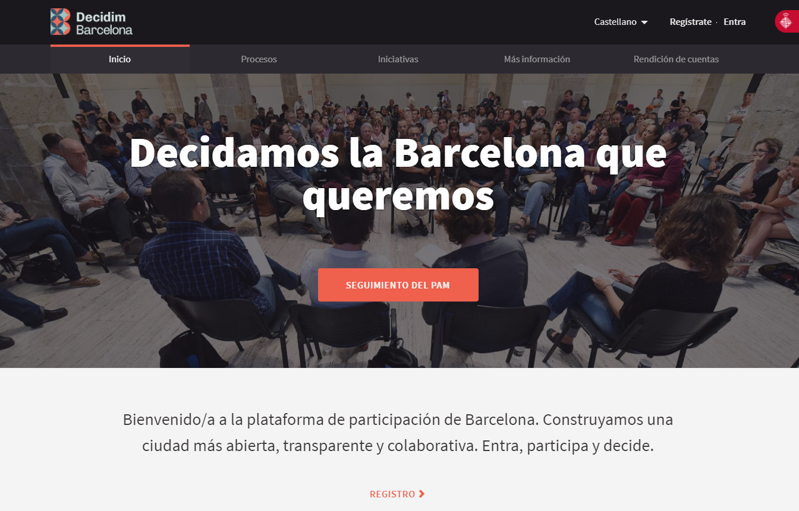

[[h.2et92p0]]
[[h.tyjcwt]]
= ¿QUÉ ES DECIDIM?

Decidim es un proyecto tecnopolítico. Una plataforma digital de participación ciudadana para una ciudad democrática, hecha en código libre, de manera abierta y colaborativa. Es una infraestructura público-común. Pública porque tiene un impulso claramente institucional y común porque el código es abierto y libre, es decir, cualquiera lo puede ver, utilizar, copiar o modificar. Es una plataforma diseñada para la articulación de procesos y espacios de participación ciudadana, con los objetivos de ampliar y facilitar el acceso a la participación ciudadana, abrir nuevos espacios para la deliberación y la colaboración en el codiseño y la coproducción de políticas públicas y de nuevos espacios de participación y democracia directa, facilitando así la desintermediación y la cooperación entre ciudadanía, instituciones y organizaciones de la sociedad civil.

[#image69-fig]
._decidim.barcelona._

[[h.1t3h5sf]]
== Principios

La plataforma Decidim está diseñada y desarrollada a partir de una serie de principios que promueven la profundización y la innovación democrática en la era digital y las posibilidades de mejora, apertura y desarrollo de las políticas de participación ciudadana y de las formas de gobierno democráticas en diferentes ámbitos, con especial énfasis en el ámbito municipal. A continuación, se listan estos principios:

[[h.4d34og8]]
=== Hibridación tecnopolítica

Es clave evitar lo que podríamos definir como _reduccionismo digital_ (Calleja-López, 2017), una variante de tecnocentrismo que pone el énfasis, principal o exclusivamente, en los aspectos y las infraestructuras digitales de las nuevas formas de participación, sin atender a las necesarias y pluripotentes innovaciones en términos de prácticas, procesos y cultura participativa que resultan de la hibridación de lo presencial y lo digital. La aproximación híbrida trata de conectar espacios y actividades que tienen lugar en decidim.barcelona con espacios y actividades presenciales, y de pensar las múltiples variantes que pueden producirse con el fin de potenciar nuevas formas de acción colectiva.

[[h.2s8eyo1]]
=== Participación aumentada y multimodal

El resultado del reduccionismo digital es el de alimentar el _clic-participación_ o _participación de clic_ (Calleja-López, 2017), en el que la participación pasa a ser un fenómeno definido, en primer lugar, por su aspecto digital y, más específicamente, por la comodidad, la rapidez y la no interacción con otros actores e ideas. En este sentido, es necesario potenciar formas enriquecidas de interacción entre personas en decidim.barcelona, ​​así como entre estas, los contenidos de la plataforma y los procesos híbridos de participación en un sentido más amplio. Eso implica, por una parte, enriquecer los procesos de participación con funcionalidades más allá del voto (información y visualización de datos, deliberación, etc.) y, por otra, diseñar procesos híbridos (por ejemplo, encuentros presenciales conectados a la plataforma), que hagan de la participación una participación aumentada, integral y multimodal, en lugar de reducida y “cliqueada”.

[[h.17dp8vu]]
=== Transparencia y trazabilidad

Exceptuando los datos que puedan afectar a la privacidad de la persona usuaria, los detalles de la actividad en los procesos participativos en medios digitales deben ser absolutamente trazables y públicos, para potenciar un nuevo grado de transparencia en la participación. La participación transparente y la trazabilidad son condiciones necesarias para la confianza en estos nuevos procesos.

[[h.anzup7cyn57p]]
[[h.3rdcrjn]]
=== Apertura/ liberación

Los principios de liberación y apertura hacen referencia, en primer lugar, al código y las funcionalidades de la plataforma; en segundo lugar, a los datos y contenidos de los procesos; y, en tercer lugar, de una forma más genérica, a los propios procesos. En los dos primeros casos, eso implica utilizar las licencias y los estándares más exigentes en materia de compartición entre iguales (por ejemplo, Affero GPLv3 para el código, Creative Commons para el contenido u Open Access Database Licences para los datos). Decidim tiene que ser una plataforma de _software_ libre, que permita a cualquiera ver, modificar y reutilizar el código en que se basa. En el caso de los procesos, estos principios conectan con otros que mencionamos en esta lista, como el de transparencia o el de accesibilidad, y apuntan a hacer estos procesos lo más participativos y reapropiables posible en múltiples aspectos.

[[h.26in1rg]]
=== Transversalidad de la participación

Atendiendo a muchas de las claves del éxito de iniciativas recientes como las del 15M, las estrategias de despliegue y comunicación de decidim.barcelona y los procesos de medios para ella deben orientarse a conseguir, primero, una legitimidad y, segundo, una participación al alcance del máximo de grupos sociales y políticos.

[[h.lnxbz9]]
=== Conocimiento, tecnociencia e inteligencia colectiva

Las nuevas formas de participación se tienen que beneficiar de las posibilidades que ofrecen tanto el conocimiento popular como el conocimiento experto de la ciudadanía y de la ciencia de datos (datos, en ocasiones, de los propios procesos participativos) para mejorar la toma de decisiones y la participación. Una participación informada y experta, capaz de catalizar el conocimiento social.

[[h.35nkun2]]
=== Participación colectiva y en red

Un reto central de una participación “aumentada”, esto es, intervenida digitalmente, es potenciar su dimensión colectiva frente a las tendencias atomizadoras, con frecuencia resultado de las condiciones de la participación a distancia. Esto implica habilitar funcionalidades que potencien la interacción entre personas usuarias en procesos colectivos, sean en la plataforma o también presenciales. Espacios de debate y deliberación, digitales o presenciales, son necesarios para articular una participación mejorada.

[[h.orcvlheviwh6]]
[[h.1ksv4uv]]
=== Orientación público-común, reapropiación y participación recursiva

Las nuevas infraestructuras digitales de la democracia deben ser un espacio por y para lo común. Para avanzar la democracia, las infraestructuras tienen que ser, ellas mismas, radicalmente democráticas. Eso implica plantear un modelo innovador y alternativo al de la privatización de lo público. A este efecto, Decidim debe ser una infraestructura digital de construcción, propiedad y uso público-común, es decir, lo que definimos como un _procomún tecnopolítico_, tecnología abierta a la participación de todas y de cualquiera en su diseño y gestión, gobernada de forma distribuida y con modelos de producción colectivos y entre iguales. Ante las plataformas cerradas privativas, controladas por grandes corporaciones, Decidim es una infraestructura democrática para la democracia.

[[h.44sinio]]
=== Accesibilidad y formación tecnopolítica

Tiene que ser también un servicio público, por lo que es fundamental garantizar el acceso y la formación de la ciudadanía para participar y explotar todo su potencial. Promover su uso empoderado desde abajo y por grupos sociales excluidos es un reto clave. Tanto decidim.barcelona como los procesos de participativos digitales deben regirse por los estándares más exigentes de accesibilidad —por ejemplo, los de la Web Accessibility Initiative (WAI)—.

[[h.2jxsxqh]]
=== Autonomía, empoderamiento y vinculación

Si algo han mostrado los movimientos sociales en los últimos años es la centralidad de la acción colectiva autoorganizada a la hora de iniciar y orientar procesos de cambio. En este sentido, decidim.barcelona y los procesos que utilizan la plataforma deben potenciar la autonomía y la autoorganización social. De manera complementaria, hay que exigir que la vinculación política sea un elemento presente en muchos de los procesos de la plataforma, ya que este es un elemento clave de la legitimidad pública y operativa de la plataforma a medio y largo plazo. Es decir, hay que potenciar tanto procesos sociales autónomos como procesos de abajo arriba (_bottom-up_) que vinculen a las instituciones públicas.

[[h.z337ya]]
== Breve historia

En setiembre del 2015 se presentó públicamente Decide Madrid, la plataforma digital de participación impulsada por el Ayuntamiento de Madrid y basada en el _software_ Consul, que empezaba a experimentar con diferentes procesos de participación, como los debates públicos y las propuestas ciudadanas. En febrero del 2016, basado en Consul, con importantes modificaciones y adaptándose a las nuevas necesidades, se presentaba el proyecto Decidim Barcelona, impulsado por el Ayuntamiento de Barcelona, ​​con el objetivo inicial de articular el proceso participativo para la elaboración del PAM y poder coordinar y articular futuros procesos de participación en la ciudad. En poco más de dos meses se registraron casi 25.000 personas, se presentaron 10.860 propuestas, se realizaron 410 citas y se recogieron más de 160.000 apoyos. De esta manera, se abría un espacio de colaboración y deliberación entre la ciudadanía, las organizaciones sociales y el Ayuntamiento de Barcelona.

En paralelo, en muchos municipios ha surgido un enorme interés por sacar adelante procesos similares aprovechando la tecnología puesta en marcha, tanto por su éxito como por su carácter libre y reutilizable. En concreto, el Ayuntamiento de La Coruña, con la plataforma A Porta Oberta para el proceso de presupuestos participativos; el Ayuntamiento ovetense, a través de Consulta Oviedo, con el espacio de propuestas ciudadanas; y el Ayuntamiento de Valencia, a través de decidimVLC, para la elaboración de los presupuestos participativos. También fueron numerosos los casos de ayuntamientos u otras instituciones que mostraron un gran interés por el proyecto decidim.barcelona y por su despliegue, como son los ayuntamientos de L’Hospitalet, Badalona, ​​Terrassa y Gavà, así como la Diputación de Barcelona o el Consorcio Localret.

A su vez, esta serie de modificaciones y adaptaciones ha dado lugar a una nueva necesidad tecnológica, que ha sido la adecuación de la tecnología a la diversidad de municipios, la autonomía y la sostenibilidad de la plataforma a medio plazo. Por eso, se ha establecido una estrategia de desarrollo escalable y descentralizado (o modular) que permite al conjunto del proyecto ser flexible y crecer a lo largo del tiempo, así como generar una comunidad de desarrollo, diseño funcional y acompañamiento que lo sostenga, tanto en el ámbito municipal como —lo que es más importante— en el intermunicipal.

Esto hizo que el Ayuntamiento de Barcelona se replanteará de raíz la arquitectura de la plataforma y realizará una reescritura completa del _software_ a partir de los principios y las necesidades anteriormente mencionados. Esta reescritura originó el proyecto Decidim, un _framework_ de la democracia participativa, basado en Ruby on Rails, y genérico, para que cualquier grupo, organización o institución que desee utilizarlo pueda hacerlo con unos mínimos requisitos técnicos.

[[h.3j2qqm3]]
== Desarrollo en abierto y software libre

El proyecto de la plataforma Decidim —tanto en la fase inicial basada en Consul como tras la reescritura completa del código— está desarrollado en _software_ libre, mediante un proceso realizado en abierto, lo que hace que se pueda rastrear y seguir todo su desarrollo desde el momento cero de la plataforma.

Cuando se afirma que está hecho en _software_ libre, significa que el código fuente de la plataforma tiene una licencia AGPL v3 o una GNU Affero General Public License,footnote:[https://github.com/decidim/decidim/blob/master/LICENSE-AGPLv3.txt] lo que implica que el código debe ofrecer la posibilidad de ser consultable, reproducible, modificable y reutilizable siempre y cuando se mantenga la misma licencia en cualquier trabajo u obra derivada. Esta licencia, que se incluye en el _copyleft_,footnote:[Como _copyleft_ se conoce todo un conjunto de licencias que pueden aplicarse a creaciones informáticas, artísticas, etcétera. Los defensores del _copyleft_ consideran las leyes de derechos de autor (_copyright_) como una forma de restringir el derecho de hacer y redistribuir copias de un trabajo. De hecho, una licencia _copyleft_ utiliza la legislación propia de los derechos de autor para asegurar que cada persona que recibe una copia u obra derivada pueda utilizar, modificar y también redistribuir tanto el trabajo como sus versiones derivadas. Así pues, en un sentido estrictamente no legal, el _copyleft_ es lo contrario del
_copyright_ (Wikipedia, 2017).] es una de las que más libertad otorga. En este sentido, tiene una gran coherencia que las administraciones públicas hagan una clara apuesta por este tipo de software, ya que, a través de estas licencias, se obtiene un retorno social de las inversiones públicas.

Que el _software_ ha sido desarrollado en abierto significa que todo el proceso es transparente y accesible, es decir, cualquier persona puede ver desde el inicio del desarrollo del _software_ todas las modificaciones y contribuciones, la comunidad de desarrolladores involucrada, etcétera. En esta misma dirección, la transparencia no solo se convierte en un principio fundamental de la participación ciudadana, sino que también lo hace en el caso del desarrollo del _software_.

Todo eso se ha hecho en una plataforma diseñada para la colaboración abierta en el desarrollo de _software_ denominada Github.footnote:[https://github.com/] Desde esta plataforma se puede acceder al código y hacer el seguimiento del desarrollo del _software_. Github está diseñado para alojar repositorios Git, pero hay otras alternativas a Github, como por ejemplo Gitlab.

[[h.1y810tw]]
== Decidim Barcelona

Decidim Barcelona es la primera instancia de Decidim y origen del proyecto. Decidim Barcelona nace a partir de las necesidades del Ayuntamiento de Barcelona de abrir un proceso de participación ciudadana mediado tecnológicamente en torno al PAM con tres grandes objetivos: hacer un proceso transparente y trazable, ampliar la participación a través de la plataforma digital e integrar la participación presencial con la digital.

Este proceso recibió más de 10.000 propuestas y más de 160.000 apoyos, con un balance final del 71% de propuestas ciudadanas aceptadas e incluidas en el PAM mediante más de 1.600 actuaciones. Inicialmente, Decidim fue diseñado exclusivamente para acoger este proceso, pero rápidamente se vio la necesidad de extender la plataforma a otros procesos de participación.

A partir de ahí surgió la semilla del actual Decidim, una plataforma de participación que permitía tener tantos procesos como se deseara, divididos en fases y con la posibilidad de configurar diferentes funcionalidades/ componentes en cada una de las fases. De este modo, quedaba abierta la posibilidad de poder diseñar nuevas funcionalidades integrables en los procesos (encuestas, elaboración de textos colaborativos, seguimiento de resultados, etc.), así como la integración de nuevos espacios de participación, como pueden ser las iniciativas ciudadanas o los consejos de participación.

Actualmente (julio del 2017), Decidim Barcelona acoge 12 procesos de participación y cuenta ya con 26.600 participantes, casi 12.000 propuestas recogidas, 1.700 resultados, 670 encuentros presenciales y 185.000 apoyos. Los buenos resultados de la plataforma en la ciudad de Barcelona han llevado a la extensión de esta a otros municipios, como L’Hospitalet de Llobregat, Sabadell, Badalona, Terrassa, Gavà, Sant Cugat, Mataró o Vilanova i la Geltrú.

[[h.4i7ojhp]]
== Decidim municipios

Decidim es una plataforma _multitenant_, es decir, que con una sola instalación se pueden servir tantas instancias como se necesiten. En el mundo del _software_ existen numerosos ejemplos de éxito de arquitectura _multitenant_, como el proyecto de _software_ libre para blogs Wordpress. Es especialmente útil para aquellas instituciones que quieran proporcionar Decidim como servicio a terceros. El caso de la Diputación es especialmente relevante, porque una única instalación mantenida, actualizada y sostenida por un solo ente puede ser utilizada para tantos municipios como se desee, lo que reduce los costes de instalación y mantenimiento y proporciona soluciones tecnológicas para la mejora de la participación ciudadana en municipios medianos o pequeños que, de otra manera, tendrían un acceso muy reducido a este tipo de recursos.
