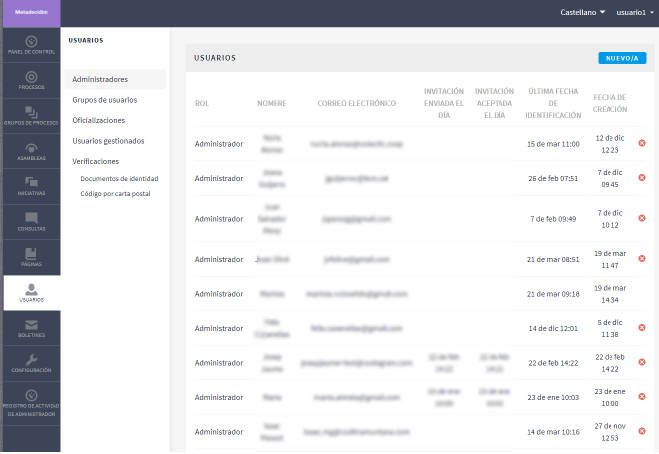
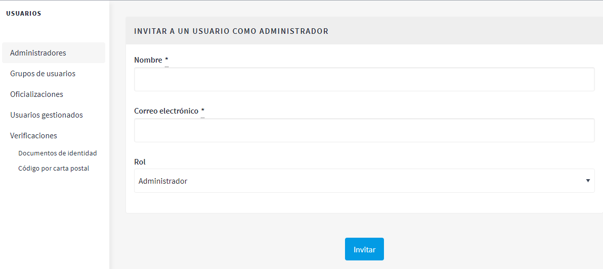
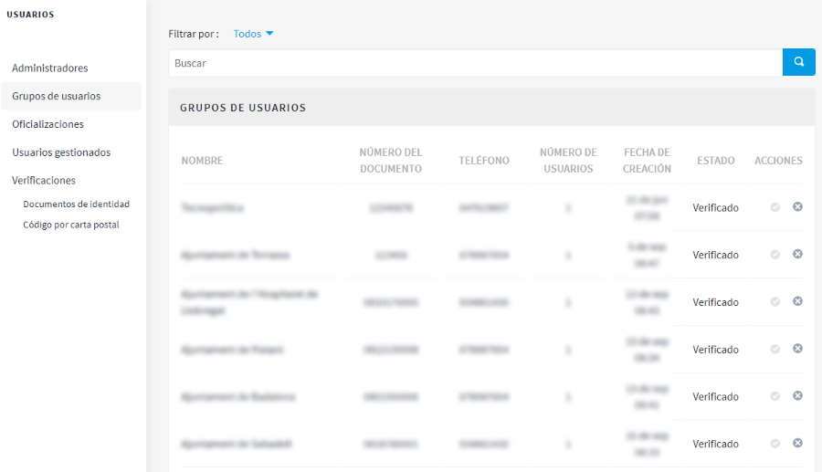
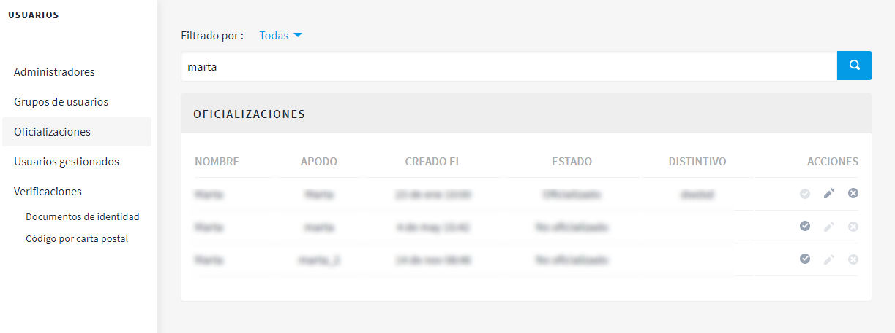
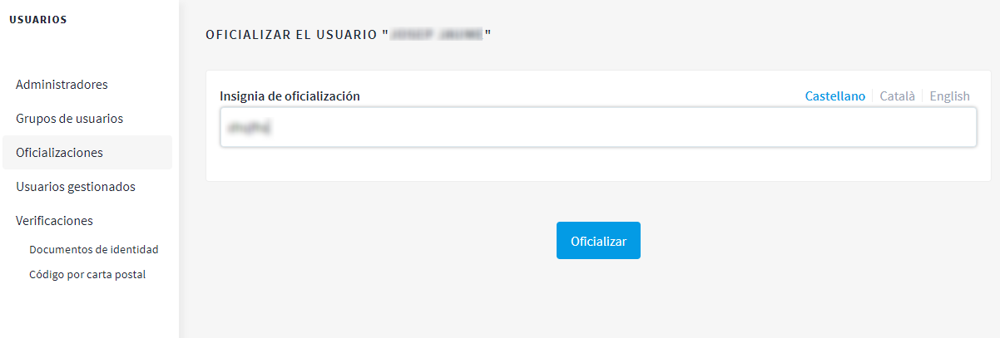

[[h.3fwokq0]]
== Usuarios

La gestión de los usuarios de administración comprende tareas como dar de alta a otros administradores; validar los grupos de usuarios (organizaciones/colectivos) que se han registrado y que se ha podido comprobar que efectivamente existen; gestionar a los usuarios temporales que se creen desde las oficinas de atención ciudadana para facilitar que las personas que no tienen internet puedan participar en la plataforma Decidim; reconocer que una persona tiene una determinada posición en la organización (Oficializaciones); y autentificar que la persona que participa es quien dice que es (Verificaciones).^link:#ftnt6[[6]]^

Para la gestión de los usuarios, haz clic en USUARIOS, en el menú del PANEL DE CONTROL.  Se abrirá la ventana USUARIOS (Figura 16).

Figura 16. Usuarios.

Para dar de alta a un administrador, haz clic en Administradores, en el submenú USUARIOS. Aparecerá una lista de quienes ya son administradores; haz clic en Nuevo/a, en la parte superior derecha de la pantalla. Se abrirá una pantalla (Figura 17) en la que deben completarse los campos Nombre y Correo electrónico y seleccionar el rol en el desplegable (Administrador o Administrador de usuarios). Cuando termines, haz clic en Invitar.

Figura 17. Invitar a un usuario como administrador.

Para validar un grupo de usuarios, dirígete a Grupos de usuarios, en el submenú USUARIOS. Se abrirá una nueva ventana (Figura 18), en la que aparecerá una lista con todos los grupos de usuarios que se han registrado, sus respectivos números de documentos, teléfonos, número de usuarios, la fecha de creación, el estado (pendiente, rechazados, verificados o todos) y las acciones posibles (Verificar o Rechazar).

Figura 18. Grupos de usuarios.

Los grupos de usuarios se pueden validar, una vez que se haya comprobado que existen, directamente en esta ventana, haciendo clic en el icono Verificar correspondiente. Para facilitar la gestión, se pueden filtrar los grupos de usuarios en función de si están verificados, rechazados o pendientes, seleccionando en el desplegable Filtrar por.

Para acreditar públicamente (oficializar) que una persona tiene una determinada posición o cargo en la organización, haz clic en Oficializaciones, en el submenú USUARIOS. Se abrirá la ventana OFICIALIZACIONES (Figura 19), en la que aparece una lista con algunas de las personas usuarias y las acciones que se pueden realizar, como Oficializar, y, en caso de que la persona ya haya sido oficializada, Volver a oficializar “Re-oficializar” o Inhabilitar la oficialización “Des-oficializar”

Figura 19. Oficializaciones.

Para oficializar una persona y cargo, filtra por el nombre y haz clic en la acción Oficializar. Se abrirá la ventana OFICIALIZAR AL USUARIO X (Figura 20), en la que habrá que indicar la insignia de oficialización (la posición que se le reconoce).

Figura 20. Oficializar al usuario.

Para la gestión de los usuarios gestionados (impersonar temporalmente con identificación previa), haz clic en Usuarios gestionados en el submenú USUARIOS (para poder realizar esta acción es necesario conceder los permisos adecuados desde la gestión de los administradores).
